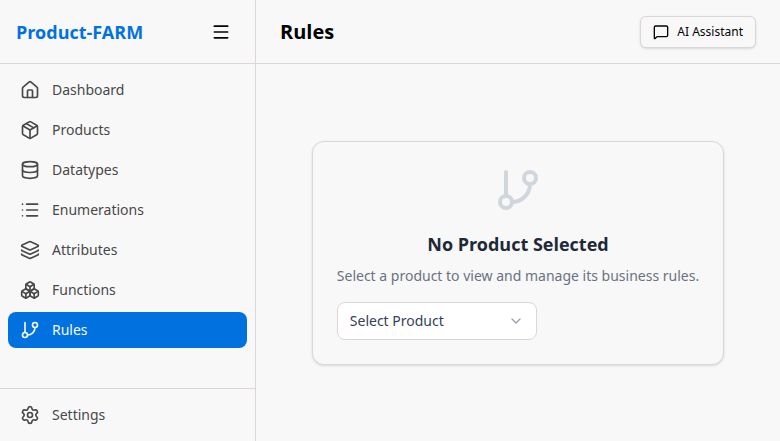
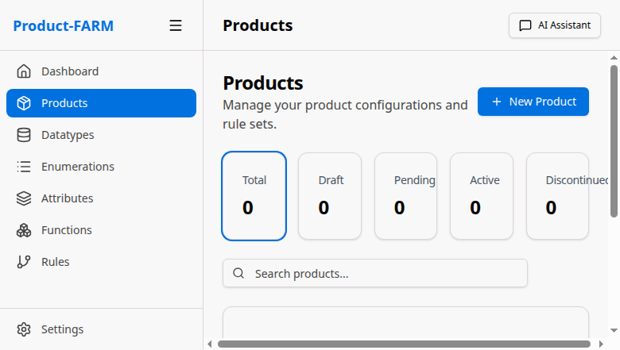
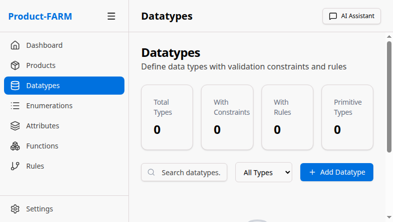
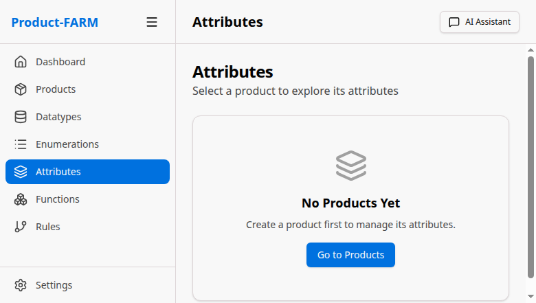
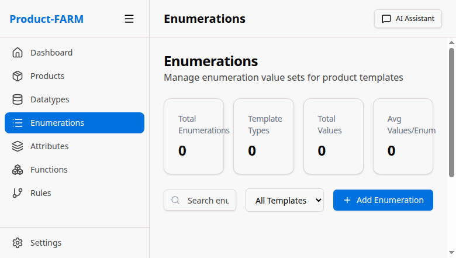

<p align="center">
  
</p>

<h1 align="center">Product-FARM</h1>

<p align="center">
  <strong>High-Performance Domain-Agnostic Rule Engine with AI-Powered Configuration</strong>
</p>

<p align="center">
  Configure complex business rules with visual DAG editing, AI assistance, and sub-millisecond execution
</p>

<p align="center">
  <!-- Build & Quality -->
  
  
  
  
</p>

<p align="center">
  <!-- Test Coverage -->
  
  
  
</p>

<p align="center">
  <!-- Performance & Tech -->
  
  
  
  
</p>

---

## Why Product-FARM?

Product-FARM (**F**unctionality, **A**ttribute, and **R**ule **M**anagement) is a **domain-agnostic rule engine** that lets you configure complex business logic without writing code. Whether you're calculating insurance premiums, generating trading signals, or evaluating loan eligibility, Product-FARM provides:

- **Visual Rule Builder** - Drag-and-drop JSON Logic blocks, no coding required
- **AI Assistant** - Create rules from natural language descriptions
- **Sub-millisecond Execution** - 3.5x faster with tiered bytecode compilation
- **DAG Visualization** - See rule dependencies and execution flow
- **Real-time Simulation** - Test rules instantly with live feedback

---

## Table of Contents

- [Features](#features)
- [Screenshots](#screenshots)
- [Architecture](#architecture)
- [Quick Start](#quick-start)
- [Use Cases](#use-cases)
- [Performance](#performance)
- [API Reference](#api-reference)
- [Testing](#testing)
- [Project Structure](#project-structure)
- [Contributing](#contributing)
- [License](#license)

---

## Features

<table>
<tr>
<td width="50%">

### Rule Engine
- **JSON Logic Expressions** - Industry-standard rule format
- **Tiered Compilation** - AST → Bytecode VM (3.5x speedup)
- **DAG Execution** - Automatic dependency resolution
- **Parallel Processing** - Rules without dependencies run concurrently
- **Cycle Detection** - Prevents infinite loops

</td>
<td width="50%">

### Visual Interface
- **Block-based Editor** - Build rules visually
- **Interactive DAG Canvas** - Drag, zoom, and explore
- **Real-time Simulation** - Test with live feedback
- **AI Chat Assistant** - Natural language to rules
- **Impact Analysis** - See what changes affect

</td>
</tr>
<tr>
<td width="50%">

### Data Management
- **Product Lifecycle** - Draft → Pending → Active → Discontinued
- **Abstract Attributes** - Reusable templates
- **Custom DataTypes** - With constraints and validation
- **Enumerations** - Type-safe value sets
- **Tag Organization** - Filter and group attributes

</td>
<td width="50%">

### Enterprise Ready
- **REST + gRPC APIs** - Dual protocol support
- **DGraph Database** - Graph-native storage
- **LRU Caching** - Hot data performance
- **Batch Evaluation** - Process multiple inputs
- **Streaming Support** - Real-time evaluation

</td>
</tr>
</table>

---

## Screenshots

<details>
<summary><b>Dashboard</b> - Overview with metrics and quick actions</summary>
<p align="center">
  
</p>
</details>

<details>
<summary><b>Rule Canvas</b> - Visual DAG editor with execution levels</summary>
<p align="center">
  
</p>
</details>

<details>
<summary><b>Products</b> - Lifecycle management and configuration</summary>
<p align="center">
  
</p>
</details>

<details>
<summary><b>Datatypes</b> - Type system with constraints</summary>
<p align="center">
  
</p>
</details>

<details>
<summary><b>Attributes</b> - Hierarchical attribute management</summary>
<p align="center">
  
</p>
</details>

<details>
<summary><b>Enumerations</b> - Type-safe value definitions</summary>
<p align="center">
  
</p>
</details>

---

## Architecture

```
┌─────────────────────────────────────────────────────────────────────────────┐
│                           PRESENTATION LAYER                                 │
├─────────────────────────────────────────────────────────────────────────────┤
│  React 19 + TypeScript + Vite + TailwindCSS + shadcn/ui                     │
│  ┌──────────────┐ ┌──────────────┐ ┌──────────────┐ ┌──────────────┐       │
│  │  Dashboard   │ │ Rule Canvas  │ │  Simulation  │ │ AI Assistant │       │
│  │              │ │  (@xyflow)   │ │    Panel     │ │    (Chat)    │       │
│  └──────────────┘ └──────────────┘ └──────────────┘ └──────────────┘       │
└────────────────────────────────┬────────────────────────────────────────────┘
                                 │ HTTP/REST (Port 8081)
┌────────────────────────────────▼────────────────────────────────────────────┐
│                            API LAYER (Rust)                                  │
├─────────────────────────────────────────────────────────────────────────────┤
│  ┌──────────────────────────┐  ┌──────────────────────────┐                 │
│  │    REST API (Axum)       │  │    gRPC API (Tonic)      │                 │
│  │    Port: 8081            │  │    Port: 50051           │                 │
│  └────────────┬─────────────┘  └────────────┬─────────────┘                 │
│               │                              │                               │
│  ┌────────────▼──────────────────────────────▼─────────────┐                │
│  │                    Service Layer                         │                │
│  │  ProductService │ RuleService │ AttributeService │ ...   │                │
│  └────────────────────────────┬────────────────────────────┘                │
└───────────────────────────────┼─────────────────────────────────────────────┘
                                │
┌───────────────────────────────▼─────────────────────────────────────────────┐
│                          CORE ENGINE (Rust)                                  │
├─────────────────────────────────────────────────────────────────────────────┤
│  ┌──────────────────┐  ┌──────────────────┐  ┌──────────────────┐          │
│  │   JSON Logic     │  │   Rule Engine    │  │    AI Agent      │          │
│  │   ┌──────────┐   │  │   ┌──────────┐   │  │   ┌──────────┐   │          │
│  │   │ Parser   │   │  │   │DAG Builder│  │  │   │Translator│   │          │
│  │   │ Compiler │   │  │   │Topo Sort  │  │  │   │Explainer │   │          │
│  │   │ VM       │   │  │   │Executor   │  │  │   │Validator │   │          │
│  │   └──────────┘   │  │   └──────────┘   │  │   └──────────┘   │          │
│  └──────────────────┘  └──────────────────┘  └──────────────────┘          │
│                                                                              │
│  Performance: Tier 0 (AST) ~1.15µs → Tier 1 (Bytecode) ~330ns (3.5x faster) │
└───────────────────────────────┬─────────────────────────────────────────────┘
                                │
┌───────────────────────────────▼─────────────────────────────────────────────┐
│                         PERSISTENCE LAYER                                    │
├─────────────────────────────────────────────────────────────────────────────┤
│  ┌──────────────────┐  ┌──────────────────┐  ┌──────────────────┐          │
│  │    DGraph        │  │   LRU Cache      │  │  File Storage    │          │
│  │    (Graph DB)    │  │   (Hot Data)     │  │  (Development)   │          │
│  │    Port: 9080    │  │                  │  │                  │          │
│  └──────────────────┘  └──────────────────┘  └──────────────────┘          │
└─────────────────────────────────────────────────────────────────────────────┘
```

### Tiered Compilation

Product-FARM uses a tiered compilation strategy for optimal performance:

```
                    JSON Logic Expression
                            │
                            ▼
                    ┌───────────────┐
                    │    Parser     │
                    │  (JSON → AST) │
                    └───────┬───────┘
                            │
              ┌─────────────┼─────────────┐
              │             │             │
              ▼             ▼             ▼
        ┌─────────┐   ┌─────────┐   ┌─────────┐
        │ Tier 0  │   │ Tier 1  │   │ Tier 2  │
        │  (AST)  │   │(Bytecode│   │  (JIT)  │
        │ ~1.15µs │   │  ~330ns │   │ Future  │
        └─────────┘   └─────────┘   └─────────┘
              │             │
              │   Auto-promote after
              │   100 evaluations
              └─────────────┘
```

### DAG Execution Model

Rules are organized into execution levels based on dependencies:

```
Input Variables
      │
      ▼
┌─────────────────────────────────────┐
│           Level 0 (Parallel)         │
│  ┌─────┐  ┌─────┐  ┌─────┐          │
│  │Rule1│  │Rule2│  │Rule3│          │
│  └──┬──┘  └──┬──┘  └──┬──┘          │
└─────┼────────┼───────┼──────────────┘
      │        │       │
      ▼        ▼       ▼
┌─────────────────────────────────────┐
│           Level 1 (Parallel)         │
│       ┌─────┐    ┌─────┐            │
│       │Rule4│    │Rule5│            │
│       └──┬──┘    └──┬──┘            │
└──────────┼──────────┼───────────────┘
           │          │
           ▼          ▼
┌─────────────────────────────────────┐
│           Level 2                    │
│            ┌─────┐                   │
│            │Rule6│                   │
│            └──┬──┘                   │
└───────────────┼─────────────────────┘
                │
                ▼
          Final Output
```

### Data Model

```
┌─────────────────────────────────────────────────────────────────────────────┐
│                              PRODUCT                                         │
│  ┌─────────────────────────────────────────────────────────────────────┐    │
│  │  id: "insurance-premium-calculator"                                  │    │
│  │  name: "Life Insurance Premium Calculator"                           │    │
│  │  status: ACTIVE                                                      │    │
│  │  template_type: INSURANCE                                            │    │
│  └─────────────────────────────────────────────────────────────────────┘    │
│         │                    │                    │                          │
│         │ has_many           │ has_many           │ uses                     │
│         ▼                    ▼                    ▼                          │
│  ┌────────────┐      ┌────────────┐      ┌──────────────────────────────┐   │
│  │   RULES    │      │ ATTRIBUTES │      │  ABSTRACT ATTRIBUTES         │   │
│  │────────────│      │────────────│      │  (Templates)                 │   │
│  │ base_prem  │      │ age        │      │──────────────────────────────│   │
│  │ age_factor │      │ coverage   │      │ customer_age → Integer       │   │
│  │ smoker_adj │      │ smoker     │      │ coverage_amount → Currency   │   │
│  │ final_prem │      │ premium    │      │ is_smoker → Boolean          │   │
│  └────────────┘      └────────────┘      └──────────────────────────────┘   │
│                             │                       │                        │
│                             │ typed_by              │ has_type               │
│                             ▼                       ▼                        │
│                      ┌────────────┐          ┌──────────────┐               │
│                      │ DATATYPES  │          │ ENUMERATIONS │               │
│                      │────────────│          │──────────────│               │
│                      │ Integer    │          │ RiskLevel    │               │
│                      │ Decimal    │          │   LOW        │               │
│                      │ Currency   │          │   MEDIUM     │               │
│                      │ Boolean    │          │   HIGH       │               │
│                      │ String     │          │ Status       │               │
│                      └────────────┘          │   APPROVED   │               │
│                                              │   REJECTED   │               │
│                                              └──────────────┘               │
└─────────────────────────────────────────────────────────────────────────────┘
```

### Product Lifecycle

```
┌──────────────────────────────────────────────────────────────────────────────┐
│                         PRODUCT LIFECYCLE                                     │
├──────────────────────────────────────────────────────────────────────────────┤
│                                                                               │
│    ┌─────────┐       ┌──────────────┐       ┌─────────┐       ┌───────────┐ │
│    │  DRAFT  │──────►│   PENDING    │──────►│ ACTIVE  │──────►│DISCONTINUED│ │
│    │         │       │   APPROVAL   │       │         │       │           │ │
│    └─────────┘       └──────────────┘       └─────────┘       └───────────┘ │
│         │                   │                    │                   │       │
│         │                   │                    │                   │       │
│    ┌────▼────┐         ┌────▼────┐         ┌────▼────┐         ┌────▼────┐  │
│    │• Create │         │• Submit │         │• Approve│         │• Archive│  │
│    │• Edit   │         │• Review │         │• Deploy │         │• Retire │  │
│    │• Test   │         │• Comment│         │• Monitor│         │         │  │
│    │• Simulate         │• Reject │         │• Update │         │         │  │
│    └─────────┘         └─────────┘         └─────────┘         └─────────┘  │
│                              │                                               │
│                              │ (rejected)                                    │
│                              ▼                                               │
│                         Back to DRAFT                                        │
│                                                                               │
└──────────────────────────────────────────────────────────────────────────────┘
```

### JSON Logic Operations

```
┌──────────────────────────────────────────────────────────────────────────────┐
│                      SUPPORTED JSON LOGIC OPERATIONS                          │
├──────────────────────────────────────────────────────────────────────────────┤
│                                                                               │
│  ARITHMETIC          COMPARISON         LOGIC            DATA ACCESS         │
│  ┌────────────┐      ┌────────────┐     ┌────────────┐   ┌────────────┐     │
│  │ +  add     │      │ == equals  │     │ and        │   │ var        │     │
│  │ -  subtract│      │ != not eq  │     │ or         │   │ missing    │     │
│  │ *  multiply│      │ <  less    │     │ !  not     │   │ missing_   │     │
│  │ /  divide  │      │ <= less eq │     │ !! truthy  │   │   some     │     │
│  │ %  modulo  │      │ >  greater │     │ if/else    │   │            │     │
│  │ min        │      │ >= greater │     │            │   │            │     │
│  │ max        │      │    eq      │     │            │   │            │     │
│  └────────────┘      └────────────┘     └────────────┘   └────────────┘     │
│                                                                               │
│  ARRAY               STRING             TYPE              SPECIAL            │
│  ┌────────────┐      ┌────────────┐     ┌────────────┐   ┌────────────┐     │
│  │ map        │      │ cat concat │     │ typeof     │   │ log debug  │     │
│  │ filter     │      │ substr     │     │ coerce     │   │ throw err  │     │
│  │ reduce     │      │ in contains│     │            │   │            │     │
│  │ all        │      │            │     │            │   │            │     │
│  │ some       │      │            │     │            │   │            │     │
│  │ none       │      │            │     │            │   │            │     │
│  │ merge      │      │            │     │            │   │            │     │
│  │ in member  │      │            │     │            │   │            │     │
│  └────────────┘      └────────────┘     └────────────┘   └────────────┘     │
│                                                                               │
└──────────────────────────────────────────────────────────────────────────────┘
```

---

## Quick Start

### Prerequisites

- **Rust** 1.75+ ([rustup.rs](https://rustup.rs))
- **Node.js** 20+ ([nodejs.org](https://nodejs.org))
- **DGraph** v25 (included in `infrastructure/`)

### Option 1: One-Command Start

```bash
# Clone the repository
git clone https://github.com/yourusername/product-farm.git
cd product-farm

# Start all services (DGraph, Backend, Frontend)
./start-all.sh
```

Services will be available at:
- **Frontend**: http://localhost:5173
- **Backend REST**: http://localhost:8081
- **Backend gRPC**: localhost:50051
- **DGraph**: http://localhost:8080

### Option 2: Manual Start

```bash
# Terminal 1: Start DGraph
cd infrastructure
./dgraph zero --my=localhost:5080 &
./dgraph alpha --my=localhost:7080 --zero=localhost:5080 &

# Terminal 2: Start Backend
cd backend
cargo run -p product-farm-api -- 8081

# Terminal 3: Start Frontend
cd frontend
npm install
npm run dev
```

### Your First Rule

1. Open http://localhost:5173
2. Click **"New Product"** → **"From Scratch"**
3. Name it `my-first-product`
4. Go to **Rules** tab
5. Click **"New Rule"**
6. Use the block editor to create:
   ```json
   {"*": [{"var": "price"}, {"var": "quantity"}]}
   ```
7. Click **"Simulate"** and enter: `{"price": 10, "quantity": 5}`
8. See the result: `50`

---

## Use Cases

### Insurance Premium Calculation

Configure insurance products with complex pricing rules:

```
┌─────────────────────────────────────────────────────────────┐
│                    INSURANCE PRODUCT                         │
├─────────────────────────────────────────────────────────────┤
│                                                              │
│  Inputs:                        Rules:                       │
│  ┌─────────────────┐           ┌──────────────────────────┐ │
│  │ customer_age: 65│           │ base_premium =            │ │
│  │ coverage: 250000│     ──►   │   coverage × 0.02         │ │
│  │ smoker: false   │           │                           │ │
│  └─────────────────┘           │ age_factor =              │ │
│                                │   if(age > 60) 1.2 else 1 │ │
│                                │                           │ │
│                                │ smoker_factor =           │ │
│  Output:                       │   if(smoker) 1.5 else 1   │ │
│  ┌─────────────────┐           │                           │ │
│  │ premium: $6,000 │     ◄──   │ premium = base × age ×    │ │
│  └─────────────────┘           │           smoker          │ │
│                                └──────────────────────────┘ │
└─────────────────────────────────────────────────────────────┘
```

**JSON Logic Rules:**

```json
// Rule 1: Base Premium
{"*": [{"var": "coverage"}, 0.02]}

// Rule 2: Age Factor
{"if": [{">": [{"var": "age"}, 60]}, 1.2, 1.0]}

// Rule 3: Smoker Factor
{"if": [{"var": "smoker"}, 1.5, 1.0]}

// Rule 4: Final Premium
{"*": [{"var": "base_premium"}, {"var": "age_factor"}, {"var": "smoker_factor"}]}
```

### Trading Signal Generation

Build algorithmic trading strategies:

```
┌─────────────────────────────────────────────────────────────┐
│                    TRADING STRATEGY                          │
├─────────────────────────────────────────────────────────────┤
│                                                              │
│  Market Data:                   Signal Rules:                │
│  ┌─────────────────┐           ┌──────────────────────────┐ │
│  │ rsi_14: 28      │           │ oversold = rsi < 30       │ │
│  │ price: 150      │     ──►   │ above_trend = price > sma │ │
│  │ sma_50: 145     │           │                           │ │
│  └─────────────────┘           │ entry_signal =            │ │
│                                │   if(oversold AND         │ │
│                                │      above_trend)         │ │
│  Signal Output:                │     "BUY"                 │ │
│  ┌─────────────────┐           │   else                    │ │
│  │ signal: "BUY"   │     ◄──   │     "HOLD"               │ │
│  └─────────────────┘           └──────────────────────────┘ │
└─────────────────────────────────────────────────────────────┘
```

### Loan Eligibility

Evaluate loan applications with multiple criteria:

```
┌─────────────────────────────────────────────────────────────┐
│                    LOAN ELIGIBILITY                          │
├─────────────────────────────────────────────────────────────┤
│                                                              │
│  Application:                   Eligibility Rules:           │
│  ┌─────────────────┐           ┌──────────────────────────┐ │
│  │ credit: 720     │           │ score_ok = credit >= 680  │ │
│  │ income: 75000   │     ──►   │ income_ok = income >= 50k │ │
│  │ debt_ratio: 0.3 │           │ debt_ok = ratio <= 0.4    │ │
│  └─────────────────┘           │                           │ │
│                                │ eligible = score_ok AND   │ │
│  Decision:                     │            income_ok AND  │ │
│  ┌─────────────────┐           │            debt_ok        │ │
│  │ eligible: true  │     ◄──   │                           │ │
│  └─────────────────┘           └──────────────────────────┘ │
└─────────────────────────────────────────────────────────────┘
```

---

## Performance

### Benchmark Results

| Operation | Time | Notes |
|-----------|------|-------|
| Simple arithmetic (cached) | **~300ns** | Bytecode compiled |
| Complex condition (5 branches) | ~18µs | Full evaluation |
| Insurance premium (5 rules) | ~7.8µs | DAG execution |
| Trading strategy (10 rules) | ~19µs | With dependencies |
| 50-rule chain | ~347µs | Sequential chain |

### Tiered Compilation Performance

| Tier | Evaluation Time | Speedup |
|------|-----------------|---------|
| Tier 0 (AST Interpretation) | ~1.15µs | Baseline |
| Tier 1 (Bytecode VM) | **~330ns** | **3.5x faster** |
| RuleCache (auto-promoted) | ~366ns | ~3.1x faster |

### Running Benchmarks

```bash
# JSON Logic benchmarks
cd backend
cargo bench -p product-farm-json-logic

# Rule engine benchmarks
cargo bench -p product-farm-rule-engine
```

---

## API Reference

### REST API (Port 8081)

| Endpoint | Method | Description |
|----------|--------|-------------|
| `/api/products` | GET, POST | List/create products |
| `/api/products/{id}` | GET, PUT, DELETE | Product CRUD |
| `/api/products/{id}/rules` | GET, POST | List/create rules |
| `/api/products/{id}/evaluate` | POST | Evaluate rules |
| `/api/products/{id}/batch-evaluate` | POST | Batch evaluation |
| `/api/abstract-attributes` | GET, POST | Attribute templates |
| `/api/datatypes` | GET, POST | Custom datatypes |
| `/api/enumerations` | GET, POST | Enum definitions |

### gRPC Services (Port 50051)

```protobuf
service ProductFarmService {
  rpc Evaluate(EvaluateRequest) returns (EvaluateResponse);
  rpc BatchEvaluate(BatchEvaluateRequest) returns (BatchEvaluateResponse);
  rpc ValidateRules(ValidateRulesRequest) returns (ValidateRulesResponse);
  rpc GetExecutionPlan(GetExecutionPlanRequest) returns (ExecutionPlanResponse);
}

service ProductService {
  rpc CreateProduct(CreateProductRequest) returns (Product);
  rpc GetProduct(GetProductRequest) returns (Product);
  rpc ListProducts(ListProductsRequest) returns (ListProductsResponse);
}
```

### Example: Evaluate Rules

```bash
curl -X POST http://localhost:8081/api/products/my-product/evaluate \
  -H "Content-Type: application/json" \
  -d '{
    "inputs": {
      "price": 100,
      "quantity": 5
    }
  }'
```

Response:
```json
{
  "outputs": {
    "total": 500
  },
  "execution_time_ns": 1250,
  "rules_evaluated": 1
}
```

---

## Testing

### Backend Tests (234 passing)

```bash
cd backend

# Run all tests
cargo test --workspace

# Run specific crate tests
cargo test -p product-farm-json-logic
cargo test -p product-farm-rule-engine
cargo test -p product-farm-api

# Run with output
cargo test --workspace -- --nocapture
```

### E2E Tests (9 test suites)

```bash
cd frontend

# Install Playwright
npm install
npx playwright install

# Run E2E tests
npm run test:e2e

# Run with UI
npm run test:e2e:ui

# Run headed (see browser)
npm run test:e2e:headed
```

### Test Coverage by Module

| Module | Tests | Coverage |
|--------|-------|----------|
| product-farm-core | 68 | ~90% |
| product-farm-json-logic | 93 | ~85% |
| product-farm-rule-engine | 15 | ~80% |
| product-farm-api | 21 | ~75% |
| product-farm-persistence | 18 | ~80% |
| product-farm-ai-agent | 19 | ~70% |

---

## Project Structure

```
product-farm/
├── backend/                    # Rust backend
│   ├── crates/
│   │   ├── core/              # Domain types (Product, Rule, Attribute)
│   │   ├── json-logic/        # JSON Logic parser, compiler, VM
│   │   ├── rule-engine/       # DAG builder, executor
│   │   ├── persistence/       # Storage backends (DGraph, file, memory)
│   │   ├── api/               # REST + gRPC services
│   │   └── ai-agent/          # AI tools for rule management
│   └── Cargo.toml
│
├── frontend/                   # React frontend
│   ├── src/
│   │   ├── components/        # React components
│   │   ├── pages/             # Route pages
│   │   ├── services/          # API client
│   │   ├── store/             # Zustand state
│   │   └── types/             # TypeScript types
│   ├── e2e/                   # Playwright E2E tests
│   └── package.json
│
├── infrastructure/             # DGraph database
│   ├── dgraph                 # DGraph binary
│   └── dgraph-data/           # Data directory
│
├── docs/                       # Documentation
│   ├── screenshots/           # UI screenshots
│   ├── ARCHITECTURE.md
│   ├── QUICK_START.md
│   └── USE_CASES.md
│
├── start-all.sh               # Start all services
├── stop-all.sh                # Stop all services
└── README.md
```

---

## Contributing

We welcome contributions! Please see our [Contributing Guide](CONTRIBUTING.md) for details.

### Development Setup

```bash
# Clone and setup
git clone https://github.com/yourusername/product-farm.git
cd product-farm

# Backend development
cd backend
cargo build
cargo test

# Frontend development
cd frontend
npm install
npm run dev
```

### Code Style

- **Rust**: Follow `rustfmt` and `clippy` recommendations
- **TypeScript**: ESLint + Prettier configuration included
- **Commits**: Use conventional commits format

---

## Roadmap

- [ ] Docker Compose deployment
- [ ] Kubernetes Helm chart
- [ ] OAuth2/OIDC authentication
- [ ] Audit logging
- [ ] Rate limiting
- [ ] Prometheus metrics
- [ ] Rule versioning and rollback
- [ ] Import/export functionality
- [ ] Multi-tenant support

---

## License

This project is licensed under the Apache License 2.0 - see the [LICENSE](LICENSE) file for details.

---

<p align="center">
  Made with Rust + React
  <br/>
  <a href="https://github.com/yourusername/product-farm">GitHub</a> ·
  <a href="docs/QUICK_START.md">Documentation</a> ·
  <a href="docs/USE_CASES.md">Examples</a>
</p>
