# Product-FARM Architecture

This document provides a comprehensive overview of Product-FARM's system architecture, component design, and data flow.

## Table of Contents

- [System Overview](#system-overview)
- [Component Architecture](#component-architecture)
- [Data Model](#data-model)
- [Rule Engine](#rule-engine)
- [API Layer](#api-layer)
- [Persistence Layer](#persistence-layer)
- [Frontend Architecture](#frontend-architecture)
- [Security Considerations](#security-considerations)
- [Scalability](#scalability)

---

## System Overview

Product-FARM is built as a layered architecture with clear separation of concerns:


---

## Component Architecture

### Backend Crates

The Rust backend is organized as a Cargo workspace with the following crates:

```
backend/crates/
├── core/           # Domain types and business logic
├── json-logic/     # JSON Logic expression engine
├── rule-engine/    # DAG execution engine
├── persistence/    # Storage abstraction layer
├── api/            # REST + gRPC services
└── ai-agent/       # AI-powered rule management tools
```

#### product-farm-core

Core domain types that are shared across all crates:

```rust
// Product with lifecycle management
pub struct Product {
    pub id: ProductId,
    pub name: String,
    pub status: ProductStatus,  // Draft → PendingApproval → Active → Discontinued
    pub template_type: String,
    pub effective_from: DateTime,
    pub expiry_at: Option<DateTime>,
    pub version: u32,
}

// Rule with JSON Logic expression
pub struct Rule {
    pub id: RuleId,
    pub product_id: ProductId,
    pub rule_type: String,
    pub input_attributes: Vec<RuleInputAttribute>,
    pub output_attributes: Vec<RuleOutputAttribute>,
    pub compiled_expression: String,  // JSON Logic
    pub display_expression: String,   // Human-readable
    pub order_index: i32,
    pub enabled: bool,
}

// Abstract attribute template
pub struct AbstractAttribute {
    pub abstract_path: String,
    pub product_id: ProductId,
    pub component_type: String,
    pub component_id: Option<String>,
    pub datatype_id: String,
    pub display_names: Vec<DisplayName>,
    pub tags: Vec<Tag>,
    pub immutable: bool,
}

// Dynamic value type
pub enum Value {
    Null,
    Bool(bool),
    Int(i64),
    Float(f64),
    Decimal(Decimal),
    String(String),
    Array(Vec<Value>),
    Object(HashMap<String, Value>),
}
```

#### product-farm-json-logic

High-performance JSON Logic implementation with tiered compilation:


**Supported Operations:**

| Category | Operations |
|----------|------------|
| Arithmetic | `+`, `-`, `*`, `/`, `%`, `min`, `max` |
| Comparison | `==`, `!=`, `<`, `<=`, `>`, `>=`, `===`, `!==` |
| Logic | `and`, `or`, `!`, `!!`, `if` |
| Arrays | `map`, `filter`, `reduce`, `all`, `some`, `none`, `merge`, `in` |
| Strings | `cat`, `substr`, `in` |
| Data | `var`, `missing`, `missing_some` |

#### product-farm-rule-engine

DAG-based execution engine:

```rust
pub struct RuleDag {
    graph: DiGraph<RuleNode, ()>,
    nodes: HashMap<RuleId, NodeIndex>,
}

impl RuleDag {
    // Build DAG from rules
    pub fn build(rules: &[Rule]) -> Result<Self, DagError>;

    // Detect cycles
    pub fn has_cycles(&self) -> bool;

    // Get topologically sorted execution order
    pub fn execution_order(&self) -> Vec<RuleId>;

    // Get parallel execution levels
    pub fn execution_levels(&self) -> Vec<Vec<RuleId>>;

    // Generate visualization
    pub fn to_dot(&self) -> String;
    pub fn to_mermaid(&self) -> String;
    pub fn to_ascii(&self) -> String;
}
```

**Execution Flow:**


#### product-farm-persistence

Multi-backend storage abstraction:

```rust
// Repository traits
#[async_trait]
pub trait ProductRepository {
    async fn save(&self, product: &Product) -> Result<Product>;
    async fn find_by_id(&self, id: &ProductId) -> Result<Option<Product>>;
    async fn find_all(&self) -> Result<Vec<Product>>;
    async fn delete(&self, id: &ProductId) -> Result<()>;
}

// Similar traits for Rule, Attribute, DataType, etc.

// Storage backends
pub enum StorageBackend {
    InMemory,       // HashMap-based, for testing
    File,           // JSON files in directory
    DGraph,         // Graph database
    Hybrid,         // DGraph + LRU cache
}
```

#### product-farm-api

Dual-protocol API layer:


#### product-farm-ai-agent

AI-powered rule management tools:

```rust
pub struct RuleAgent {
    translator: RuleTranslator,   // NL → JSON Logic
    explainer: RuleExplainer,     // JSON Logic → NL
    validator: RuleValidator,     // Syntax + semantic validation
    visualizer: RuleVisualizer,   // DAG visualization
}

impl RuleAgent {
    // Translate natural language to rule
    pub async fn create_rule(&self, description: &str) -> Result<Rule>;

    // Explain rule in plain English
    pub fn explain_rule(&self, rule: &Rule) -> String;

    // Validate rule integrity
    pub fn validate_rule(&self, rule: &Rule) -> ValidationResult;

    // Test rule with sample inputs
    pub fn test_rule(&self, rule: &Rule, inputs: &Value) -> TestResult;
}
```

---

## Data Model

### Entity Relationships


### Product Lifecycle

```mermaid
stateDiagram-v2
    [*] --> Draft

    Draft --> PendingApproval: submit()
    PendingApproval --> Draft: reject()
    PendingApproval --> Active: approve()

    Active --> Discontinued: discontinue()

    Draft --> Draft: clone()
    Active --> Draft: clone()

    note right of Active: Immutable\n(read-only)
    note right of Discontinued: Preserved for\naudit purposes
```



---

## Rule Engine

### JSON Logic Processing Pipeline


**Detailed Execution Flow:**

| Step | Instruction | Stack State | Notes |
|------|-------------|-------------|-------|
| 1 | `LoadVar(0)` | `[65]` | Load `age` from context |
| 2 | `LoadConst(60)` | `[65, 60]` | Push constant 60 |
| 3 | `Gt` | `[true]` | 65 > 60 = true |
| 4 | `JumpIfFalse(3)` | `[true]` | No jump (condition true) |
| 5 | `LoadConst(1.2)` | `[1.2]` | Push result |
| 6 | `Return` | `[]` | Return 1.2 |

### DAG Execution

**Rules:**
- R1: `base_premium = coverage * 0.02`
- R2: `age_factor = if(age > 60) 1.2 else 1.0`
- R3: `smoker_factor = if(smoker) 1.5 else 1.0`
- R4: `premium = base_premium * age_factor * smoker_factor`


**Execution Timeline:**

| Level | Rules | Execution Mode | Results |
|-------|-------|----------------|---------|
| 0 | R1, R2, R3 | **Parallel** | 5000, 1.2, 1.0 |
| 1 | R4 | Sequential | 6000 |

---

## API Layer

### REST API Endpoints

| Endpoint | Method | Description |
|----------|--------|-------------|
| `/api/products` | GET | List all products |
| `/api/products` | POST | Create product |
| `/api/products/{id}` | GET | Get product by ID |
| `/api/products/{id}` | PUT | Update product |
| `/api/products/{id}` | DELETE | Delete product |
| `/api/products/{id}/clone` | POST | Clone product |
| `/api/products/{id}/submit` | POST | Submit for approval |
| `/api/products/{id}/approve` | POST | Approve product |
| `/api/products/{id}/reject` | POST | Reject product |
| `/api/products/{id}/rules` | GET | List product rules |
| `/api/products/{id}/rules` | POST | Create rule |
| `/api/products/{id}/evaluate` | POST | Evaluate rules |
| `/api/products/{id}/batch-evaluate` | POST | Batch evaluation |
| `/api/abstract-attributes` | GET, POST | Attribute templates |
| `/api/datatypes` | GET, POST | Custom datatypes |
| `/api/enumerations` | GET, POST | Enumerations |

### gRPC Services

```protobuf
// Evaluation Service
service ProductFarmService {
  rpc Evaluate(EvaluateRequest) returns (EvaluateResponse);
  rpc BatchEvaluate(BatchEvaluateRequest) returns (BatchEvaluateResponse);
  rpc EvaluateStream(stream EvaluateRequest) returns (stream EvaluateResponse);
  rpc ValidateRules(ValidateRulesRequest) returns (ValidateRulesResponse);
  rpc GetExecutionPlan(GetExecutionPlanRequest) returns (ExecutionPlanResponse);
  rpc HealthCheck(HealthCheckRequest) returns (HealthCheckResponse);
}

// Product Management
service ProductService {
  rpc CreateProduct(CreateProductRequest) returns (Product);
  rpc GetProduct(GetProductRequest) returns (Product);
  rpc UpdateProduct(UpdateProductRequest) returns (Product);
  rpc DeleteProduct(DeleteProductRequest) returns (Empty);
  rpc ListProducts(ListProductsRequest) returns (ListProductsResponse);
  rpc CloneProduct(CloneProductRequest) returns (Product);
  rpc SubmitProduct(SubmitProductRequest) returns (Product);
  rpc ApproveProduct(ApproveProductRequest) returns (Product);
  rpc RejectProduct(RejectProductRequest) returns (Product);
}

// Rule Management
service RuleService {
  rpc CreateRule(CreateRuleRequest) returns (Rule);
  rpc GetRule(GetRuleRequest) returns (Rule);
  rpc UpdateRule(UpdateRuleRequest) returns (Rule);
  rpc DeleteRule(DeleteRuleRequest) returns (Empty);
  rpc ListRules(ListRulesRequest) returns (ListRulesResponse);
}
```

---

## Persistence Layer

### Storage Backends


### Hybrid Storage (Production)


---

## Frontend Architecture

### Component Structure

```
frontend/src/
├── components/
│   ├── RuleBuilder.tsx        # Block-based rule editor
│   ├── RuleCanvas.tsx         # DAG visualization (@xyflow)
│   ├── RuleValidator.tsx      # Rule validation UI
│   ├── SimulationPanel.tsx    # Rule testing interface
│   ├── BatchEvaluator.tsx     # Batch evaluation UI
│   ├── AIChat.tsx             # AI assistant chat
│   ├── AttributeExplorer.tsx  # Attribute browser
│   └── ProductCreationWizard.tsx
│
├── pages/
│   ├── Dashboard.tsx          # Overview page
│   ├── Products.tsx           # Product management
│   ├── Rules.tsx              # Rule management
│   ├── Attributes.tsx         # Attribute management
│   ├── Datatypes.tsx          # Datatype management
│   └── Enumerations.tsx       # Enumeration management
│
├── services/
│   └── api.ts                 # REST API client
│
├── store/
│   └── index.ts               # Zustand state management
│
└── types/
    └── index.ts               # TypeScript type definitions
```

### State Management (Zustand)

```typescript
interface AppState {
  // Products
  products: Product[];
  selectedProduct: Product | null;

  // Rules
  rules: Rule[];
  selectedRule: Rule | null;

  // Attributes
  abstractAttributes: AbstractAttribute[];

  // UI State
  isLoading: boolean;
  error: string | null;

  // Actions
  fetchProducts: () => Promise<void>;
  createProduct: (product: CreateProductRequest) => Promise<void>;
  evaluateRules: (inputs: Record<string, any>) => Promise<EvaluationResult>;
}
```

---

## Security Considerations

### Input Validation

- All API inputs validated with regex patterns
- Product IDs: alphanumeric, no leading digits
- Rule types: strict pattern matching
- JSON Logic expressions: syntax validation before execution

### Product Lifecycle Protection

- Active products are immutable (read-only)
- Modification requires cloning to new Draft
- Version tracking for optimistic locking

### API Security (Future)

- [ ] OAuth2/OIDC authentication
- [ ] Role-based access control
- [ ] API rate limiting
- [ ] Audit logging

<div class="callout callout-warning">
<strong>Security Note:</strong> In production deployments, always enable authentication, validate all inputs at API boundaries, and use TLS for all connections. Product-FARM validates JSON Logic expressions before execution to prevent injection attacks.
</div>

---

## Scalability

### Horizontal Scaling


### Performance Optimizations

1. **Tiered Compilation**: Auto-promote hot rules to bytecode
2. **LRU Caching**: Cache frequently accessed data
3. **Parallel Execution**: Rules without dependencies run concurrently
4. **Batch Evaluation**: Process multiple inputs efficiently
5. **Connection Pooling**: Reuse database connections

<div class="callout callout-performance">
<strong>Production Deployment:</strong> For maximum throughput, deploy multiple stateless API nodes behind a load balancer. Each node maintains its own LRU cache, with DGraph providing the shared source of truth.
</div>

---

## Summary

Product-FARM's architecture is designed for:

- **Performance**: Sub-millisecond rule evaluation with tiered compilation
- **Scalability**: Horizontal scaling with stateless API nodes
- **Flexibility**: Domain-agnostic design supports any business domain
- **Maintainability**: Clean separation of concerns across crates
- **Extensibility**: Pluggable storage backends and API protocols
