# Core Concepts

This guide explains the fundamental building blocks of Product-FARM and how they work together to create a powerful rule engine system.

---

## Entity Overview

```mermaid
flowchart TB
    subgraph Product["📦 PRODUCT<br/><small>Root container for all business logic</small>"]
        direction LR
        Components["🗂️ COMPONENTS<br/><small>Logical groupings</small>"]
        Attributes["📋 ATTRIBUTES<br/><small>Variables with types</small>"]
        Rules["⚡ RULES<br/><small>Business logic</small>"]
        Functionalities["🎯 FUNCTIONALITIES<br/><small>Feature bundles</small>"]
    end

    subgraph Shared["📚 SHARED DEFINITIONS"]
        direction LR
        Datatypes["🔢 DATATYPES<br/><small>Type definitions</small>"]
        Enumerations["📝 ENUMERATIONS<br/><small>Fixed value sets</small>"]
        Tags["🏷️ TAGS<br/><small>Organization labels</small>"]
    end

    Product --> Shared

    style Product fill:#1e3a5f,stroke:#3b82f6,color:#fff
    style Shared fill:#312e81,stroke:#6366f1,color:#fff
    style Components fill:#065f46,stroke:#10b981,color:#fff
    style Attributes fill:#065f46,stroke:#10b981,color:#fff
    style Rules fill:#065f46,stroke:#10b981,color:#fff
    style Functionalities fill:#065f46,stroke:#10b981,color:#fff
```



---

## Products

A **Product** is the root container that holds all business logic for a specific domain or capability.

### What is a Product?

Think of a Product as a complete, self-contained business capability. Examples:
- **Insurance Premium Calculator** - Calculates insurance premiums based on customer data
- **Loan Eligibility Engine** - Determines if a customer qualifies for a loan
- **Pricing Engine** - Computes product prices with discounts and promotions
- **Risk Assessment Tool** - Evaluates risk levels for various scenarios

### Product Structure

```mermaid
graph LR
    subgraph Product["📦 insurance-premium-v1"]
        subgraph Comp["🗂️ Components"]
            C1["customer"]
            C2["policy"]
            C3["premium"]
        end
        subgraph Attr["📋 Attributes"]
            A1["customer_age"]
            A2["coverage_amount"]
            A3["base_premium"]
            A4["final_premium"]
        end
        subgraph Rules["⚡ Rules"]
            R1["calculate_base_premium"]
            R2["apply_age_factor"]
            R3["calculate_final_premium"]
        end
        subgraph Func["🎯 Functionalities"]
            F1["quote"]
            F2["underwrite"]
        end
    end

    style Product fill:#1e3a5f,stroke:#3b82f6,color:#fff
    style Comp fill:#065f46,stroke:#10b981,color:#fff
    style Attr fill:#065f46,stroke:#10b981,color:#fff
    style Rules fill:#7c2d12,stroke:#f59e0b,color:#fff
    style Func fill:#4c1d95,stroke:#8b5cf6,color:#fff
```



### Product Lifecycle

Products go through a defined lifecycle to ensure quality and control:


| State | Description |
|-------|-------------|
| **Draft** | Work in progress. Can be freely modified. Not accessible to external systems. |
| **Pending Approval** | Submitted for review. Changes locked until approved or rejected. |
| **Active** | Live and serving requests. Read-only. Clone to make changes. |
| **Discontinued** | No longer in use. Preserved for audit purposes. |

<div class="callout callout-info">
<strong>Immutability Guarantee:</strong> Active products are immutable by design. To make changes, clone the product to create a new Draft version. This ensures production stability and enables instant rollback.
</div>

### Creating a Product


```json
{
  "product_id": "insurance-premium-v1",
  "name": "Insurance Premium Calculator",
  "description": "Calculate insurance premiums based on customer risk factors",
  "status": "DRAFT"
}
```

---

## Components

**Components** are logical groupings that organize attributes within a product.

### Why Components?

As products grow, they can have dozens or hundreds of attributes. Components help you:
- **Organize** related attributes together
- **Namespace** attributes to avoid conflicts
- **Model** real-world entities (customer, policy, account)

### Common Component Patterns

| Component | Purpose | Example Attributes |
|-----------|---------|-------------------|
| `customer` | Customer-related data | age, income, credit_score |
| `policy` | Policy configuration | coverage_amount, term_length |
| `premium` | Premium calculations | base_premium, discount, final_premium |
| `risk` | Risk assessment | risk_score, risk_level |
| `loan` | Loan-specific data | principal, interest_rate, monthly_payment |

### Component in Context


---

## Datatypes

**Datatypes** define the structure, validation, and constraints for attribute values.

### Built-in Datatypes

| Datatype | Description | Example Values |
|----------|-------------|----------------|
| `integer` | Whole numbers | 1, 42, -100 |
| `decimal` | Decimal numbers | 3.14, 100.50, -0.001 |
| `string` | Text values | "hello", "policy_123" |
| `boolean` | True/false | true, false |
| `date` | Calendar dates | "2024-01-15" |
| `datetime` | Date and time | "2024-01-15T14:30:00Z" |

### Custom Datatypes

You can create custom datatypes that extend built-in types with specific constraints:


**Example: Currency Datatype**
```json
{
  "name": "currency",
  "base_type": "decimal",
  "description": "Monetary values with 2 decimal precision",
  "constraints": {
    "precision": 2,
    "min": 0
  }
}
```

**Example: Age Datatype**
```json
{
  "name": "age",
  "base_type": "integer",
  "description": "Human age in years",
  "constraints": {
    "min": 0,
    "max": 150
  }
}
```

**Example: Percentage Datatype**
```json
{
  "name": "percentage",
  "base_type": "decimal",
  "description": "Percentage values from 0 to 100",
  "constraints": {
    "min": 0,
    "max": 100,
    "precision": 4
  }
}
```

### Viewing Datatypes


---

## Enumerations

**Enumerations** define fixed sets of allowed values for categorical data.

### When to Use Enumerations

Use enumerations when:
- Values come from a **fixed, known set**
- You need **type-safe** categorical data
- You want to **prevent invalid values**

### Creating Enumerations


**Example: Risk Level**
```json
{
  "name": "risk_level",
  "description": "Customer risk classification",
  "values": ["LOW", "MEDIUM", "HIGH", "CRITICAL"]
}
```

**Example: Policy Type**
```json
{
  "name": "policy_type",
  "description": "Insurance policy tiers",
  "values": ["BASIC", "STANDARD", "PREMIUM", "ENTERPRISE"]
}
```

**Example: Smoker Status**
```json
{
  "name": "smoker_status",
  "description": "Customer smoking classification",
  "values": ["NON_SMOKER", "OCCASIONAL", "REGULAR"]
}
```

### Using Enumerations

Once created, enumerations become available as datatypes for attributes:


### Viewing Enumerations


---

## Attributes

**Attributes** are the variables used in your rules—inputs, outputs, and intermediate calculations.

### Abstract vs Concrete Attributes

| Type | Description | Example |
|------|-------------|---------|
| **Abstract Attribute** | Template definition with type and constraints | `customer_age: integer` |
| **Concrete Attribute** | Instance with an actual value | `customer_age = 35` |

Think of it like classes vs instances:
- **Abstract Attribute** = Class definition (what it is)
- **Concrete Attribute** = Instance with value (what it holds)

<div class="callout callout-tip">
<strong>Design Tip:</strong> Create abstract attributes first to establish your data schema, then rules can reference them. This ensures type safety and validation across all evaluations.
</div>

### Attribute Categories

**Input Attributes**
- Values provided when evaluating rules
- Example: `customer_age`, `coverage_amount`, `smoker_status`

**Calculated Attributes**
- Values computed by rules during evaluation
- Example: `base_premium`, `age_factor`, `risk_level`

**Output Attributes**
- Final results returned after evaluation
- Example: `final_premium`, `monthly_payment`

### Creating Attributes


**Example: Customer Age (Input)**
```json
{
  "name": "customer_age",
  "component": "customer",
  "datatype": "age",
  "description": "Customer's age in years",
  "category": "INPUT"
}
```

**Example: Final Premium (Output)**
```json
{
  "name": "final_premium",
  "component": "premium",
  "datatype": "currency",
  "description": "Final calculated premium amount",
  "category": "OUTPUT"
}
```

### Viewing Attributes


---

## Rules

**Rules** are the heart of Product-FARM—they define the business logic that transforms inputs into outputs.

### Rule Anatomy

Every rule has:

| Property | Description | Example |
|----------|-------------|---------|
| **Name** | Unique identifier | `calculate_base_premium` |
| **Expression** | JSON Logic formula | `{"*": [{"var": "coverage"}, 0.02]}` |
| **Inputs** | Required attributes | `["coverage_amount"]` |
| **Outputs** | Computed attributes | `["base_premium"]` |
| **Display Expression** | Human-readable form | `base_premium = coverage_amount * 0.02` |

### JSON Logic Expressions

Rules use [JSON Logic](https://jsonlogic.com/) for expressions—a portable, JSON-based format for expressing business logic.

**Simple Calculation**
```json
{
  "expression": {"*": [{"var": "coverage_amount"}, 0.02]},
  "display": "base_premium = coverage_amount × 0.02"
}
```

**Conditional Logic**
```json
{
  "expression": {
    "if": [
      {">": [{"var": "age"}, 60]}, 1.5,
      {">": [{"var": "age"}, 40]}, 1.2,
      1.0
    ]
  },
  "display": "IF age > 60 THEN 1.5, ELSE IF age > 40 THEN 1.2, ELSE 1.0"
}
```

**Boolean Logic**
```json
{
  "expression": {
    "and": [
      {">": [{"var": "income"}, 50000]},
      {"<": [{"var": "debt_ratio"}, 0.4]}
    ]
  },
  "display": "income > 50000 AND debt_ratio < 0.4"
}
```

### Creating Rules


Use the visual rule builder or JSON mode:


### Rule Types

| Type | Purpose | Example |
|------|---------|---------|
| **CALCULATION** | Compute numeric values | Premium = base × factor |
| **CLASSIFICATION** | Categorize into groups | Risk = HIGH if score > 7 |
| **VALIDATION** | Check conditions | Eligible = income > minimum |
| **DERIVATION** | Derive from other values | Age = today - birthdate |

<div class="callout callout-performance">
<strong>Performance:</strong> Rules are automatically organized into a DAG and executed in parallel where possible. Rules at the same dependency level run concurrently, achieving up to 22M evaluations/second.
</div>

---

## Functionalities

**Functionalities** define business features by specifying which attributes are required and which are computed.

### What is a Functionality?

A Functionality answers: "What does the user need to provide, and what will they get back?"

Think of it as an **API contract** for your business logic:
- **Required Inputs**: What data must be provided
- **Optional Inputs**: What data can be provided
- **Outputs**: What results will be returned

### Functionality Examples

**Quote Functionality**
```json
{
  "name": "quote",
  "description": "Get a price quote",
  "required_inputs": ["customer_age", "coverage_amount"],
  "optional_inputs": ["smoker_status", "policy_type"],
  "outputs": ["base_premium", "final_premium", "monthly_payment"]
}
```

**Underwriting Functionality**
```json
{
  "name": "underwrite",
  "description": "Full underwriting assessment",
  "required_inputs": [
    "customer_age",
    "coverage_amount",
    "smoker_status",
    "medical_history",
    "occupation"
  ],
  "outputs": [
    "risk_level",
    "final_premium",
    "approval_status",
    "conditions"
  ]
}
```

### How Functionalities Work

When you evaluate a functionality:

1. **Input Validation**: System checks all required inputs are provided
2. **Rule Selection**: Only rules needed for the requested outputs are executed
3. **DAG Execution**: Rules run in dependency order, parallelized where possible
4. **Output Delivery**: Requested outputs are returned


---

## Tags

**Tags** are labels that help organize and filter attributes.

### Using Tags

Tags allow you to:
- **Group** related attributes across components
- **Filter** attributes by category
- **Query** attributes by tag via API

**Example Tags**

```mermaid
graph LR
    subgraph PII["🔒 Tag: pii"]
        P1["customer_name"]
        P2["customer_email"]
        P3["customer_ssn"]
        P4["customer_phone"]
    end

    subgraph Pricing["💰 Tag: pricing"]
        PR1["base_premium"]
        PR2["discount_amount"]
        PR3["final_premium"]
        PR4["monthly_payment"]
    end

    subgraph Risk["⚠️ Tag: risk"]
        R1["risk_score"]
        R2["risk_level"]
        R3["risk_factors"]
    end

    style PII fill:#4a1a1a,stroke:#ef4444,color:#fff
    style Pricing fill:#065f46,stroke:#10b981,color:#fff
    style Risk fill:#7c2d12,stroke:#f59e0b,color:#fff
```



### Tag-Based Queries

```bash
# Get all PII attributes
GET /api/products/{id}/abstract-attributes/by-tag/pii

# Get all pricing attributes
GET /api/products/{id}/abstract-attributes/by-tag/pricing
```

---

## How Everything Connects

Here's how all the concepts work together:

```mermaid
flowchart TB
    subgraph Product["📦 PRODUCT: insurance-premium-v1"]
        subgraph Shared["📚 SHARED DEFINITIONS"]
            direction LR
            DT["🔢 DATATYPES<br/>currency, percentage, age"]
            EN["📝 ENUMERATIONS<br/>risk_level, policy_type, smoker_status"]
        end

        subgraph Attrs["📋 ABSTRACT ATTRIBUTES"]
            subgraph Customer["customer"]
                A1["customer_age: age"]
                A2["smoker_status: enum"]
            end
            subgraph Premium["premium"]
                A3["base_premium: currency"]
                A4["final_premium: currency"]
                A5["age_factor: percentage"]
            end
            subgraph Policy["policy"]
                A6["coverage: currency"]
                A7["policy_type: enum"]
            end
        end

        subgraph Rules["⚡ RULES"]
            R1["calculate_base_premium<br/>coverage × 0.02"]
            R2["calculate_age_factor<br/>IF age > 60 THEN 1.5"]
            R3["calculate_final_premium<br/>base × age_factor"]
        end

        subgraph Funcs["🎯 FUNCTIONALITIES"]
            F1["quote<br/>required: age, coverage<br/>outputs: premium, payment"]
            F2["underwrite<br/>required: age, coverage, smoker<br/>outputs: risk, approval"]
        end
    end

    Shared -->|"types"| Attrs
    Attrs -->|"inputs/outputs"| Rules
    Rules -->|"groups"| Funcs

    style Product fill:#0f172a,stroke:#3b82f6,color:#fff
    style Shared fill:#312e81,stroke:#6366f1,color:#fff
    style Attrs fill:#1e3a5f,stroke:#3b82f6,color:#fff
    style Rules fill:#7c2d12,stroke:#f59e0b,color:#fff
    style Funcs fill:#4c1d95,stroke:#8b5cf6,color:#fff
```



---

## Entity Relationships


---

## Next Steps

Now that you understand the core concepts:

- [Quick Start Guide](QUICK_START) - Build your first product
- [How It Works](HOW_IT_WORKS) - Technical deep-dive into rule evaluation
- [Architecture](ARCHITECTURE) - System design and components
