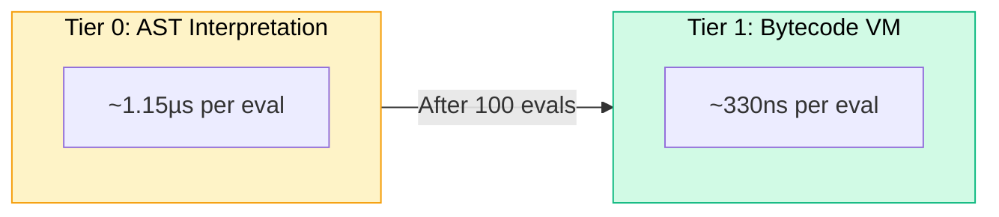
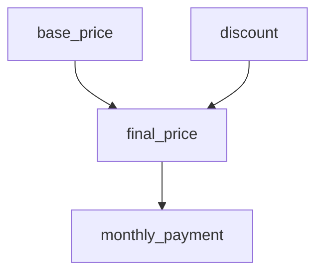
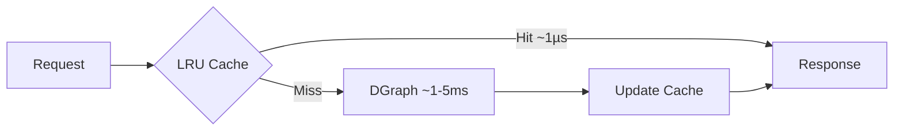
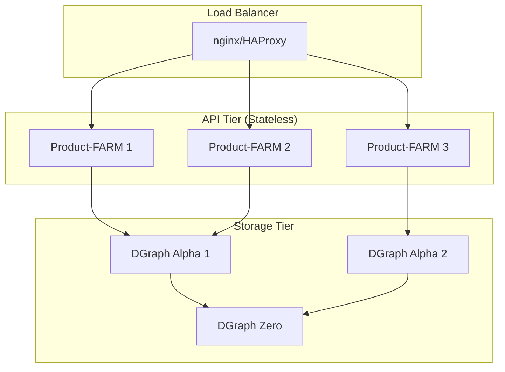

# Frequently Asked Questions

A comprehensive guide to common questions, edge cases, and best practices for Product-FARM.

---

## Table of Contents

- [General Questions](#general-questions)
- [Getting Started](#getting-started)
- [AI Assistant](#ai-assistant)
- [Rule Engine & JSON Logic](#rule-engine--json-logic)
- [Performance & Optimization](#performance--optimization)
- [Data Model & Validation](#data-model--validation)
- [API & Integration](#api--integration)
- [Security](#security)
- [Deployment & Operations](#deployment--operations)
- [Troubleshooting](#troubleshooting)
- [Advanced Topics](#advanced-topics)

---

## General Questions

### What exactly is Product-FARM?

Product-FARM is a **domain-agnostic rule engine platform** that allows you to define, manage, and evaluate business rules without writing code. It combines:

- **Visual Rule Builder**: Drag-and-drop interface for creating rules
- **High-Performance Engine**: Sub-microsecond rule evaluation with tiered compilation
- **DAG Execution**: Automatic parallel execution of independent rules
- **Graph Persistence**: DGraph-backed storage with LRU caching
- **AI Assistance**: Natural language to rule translation

Think of it as a "database for business logic" that can power pricing engines, eligibility checks, risk assessments, and any other rule-based system.

### How is Product-FARM different from other rule engines?

| Feature | Product-FARM | Drools | Easy Rules | JSON Logic |
|---------|--------------|--------|------------|------------|
| **Performance** | ~330ns (bytecode) | ~10-50µs | ~5-20µs | ~1-5µs |
| **Visual Builder** | ✅ Full | ❌ | ❌ | ❌ |
| **Parallel Execution** | ✅ DAG-based | Limited | ❌ | ❌ |
| **AI Assistance** | ✅ Built-in | ❌ | ❌ | ❌ |
| **Graph Storage** | ✅ DGraph | External | External | External |
| **Language** | Rust + React | Java | Java | JavaScript |

Key differentiators:
1. **Tiered compilation** automatically optimizes hot paths
2. **DAG-based execution** parallelizes independent rules
3. **Visual interface** enables business users to manage rules
4. **Immutable versioning** provides audit trail and safe experimentation

### What types of problems is Product-FARM best suited for?

**Ideal Use Cases:**
- Insurance premium calculations
- Loan eligibility and pricing
- E-commerce dynamic pricing
- Risk scoring and assessment
- Tax calculations
- Discount and promotion logic
- Compliance rule checking
- Feature flag evaluation

**Less Suitable For:**
- Real-time streaming (sub-100µs requirements)
- Simple if/else that doesn't change
- Machine learning model inference
- Workflow orchestration (use Temporal, Airflow)

### What's the learning curve like?

| Role | Time to Productivity |
|------|---------------------|
| Business Analyst | 2-4 hours (visual builder) |
| Developer (integration) | 1-2 days (API usage) |
| Developer (self-hosting) | 3-5 days (deployment) |
| DevOps (production) | 1-2 weeks (scaling, monitoring) |

---

## Getting Started

### What are the system requirements?

**Minimum Requirements:**
- **CPU**: 2 cores
- **RAM**: 4GB
- **Disk**: 10GB
- **OS**: Linux, macOS, or Windows (with WSL2)

**Recommended for Production:**
- **CPU**: 8+ cores
- **RAM**: 16GB+
- **Disk**: 100GB+ SSD
- **OS**: Linux (Ubuntu 22.04+ or RHEL 8+)

**Software Dependencies:**
- Rust 1.75+ (for building)
- Node.js 18+ (for frontend)
- DGraph v25+ (for persistence)

### Why won't DGraph start?

Common causes and solutions:

**1. Port Already in Use:**
```bash
# Check what's using the ports
lsof -i :5080  # Zero
lsof -i :8080  # Alpha HTTP
lsof -i :9080  # Alpha gRPC

# Kill existing processes
pkill -f dgraph
```

**2. Permission Issues:**
```bash
# DGraph needs write access to data directory
chmod -R 755 /path/to/dgraph/data
```

**3. Previous Unclean Shutdown:**
```bash
# Remove WAL files and restart
rm -rf /path/to/dgraph/w /path/to/dgraph/zw
```

**4. Memory Issues:**
```bash
# Check available memory
free -h

# DGraph needs at least 2GB RAM
# Set memory limit if containerized
```

### Can I run Product-FARM without DGraph?

Yes! Product-FARM supports multiple storage backends:

```rust
// In-Memory (development/testing)
StorageBackend::InMemory

// File-based (single instance, simple deployment)
StorageBackend::File

// DGraph (production, scalable)
StorageBackend::DGraph

// Hybrid (DGraph + LRU cache)
StorageBackend::Hybrid
```

For local development or small deployments, the file-based backend is sufficient. DGraph is recommended for production workloads requiring horizontal scaling.

### How do I configure the backend?

Key environment variables:

```bash
# Server configuration
RUST_LOG=info                    # Log level (trace, debug, info, warn, error)
API_HOST=0.0.0.0                 # Bind address
API_PORT=8081                    # REST API port
GRPC_PORT=50051                  # gRPC port

# DGraph connection
DGRAPH_ENDPOINT=http://localhost:9080

# Cache configuration
CACHE_PRODUCTS_SIZE=100          # Max cached products
CACHE_ATTRIBUTES_SIZE=10000      # Max cached attributes
CACHE_RULES_SIZE=10000           # Max cached rules
CACHE_COMPILED_SIZE=10000        # Max cached bytecode
```

---

## AI Assistant

### What can the AI assistant do?

The AI assistant is a built-in feature that helps you work with rules more efficiently:

| Capability | Description | Example |
|-----------|-------------|---------|
| **Create Rules** | Generate rules from natural language | "Create a rule that adds 20% if age > 60" |
| **Explain Rules** | Get plain English explanations | "Explain how the premium calculation works" |
| **Analyze Impact** | See what's affected by changes | "What would change if I modify vehicle_value?" |
| **Optimize** | Get improvement suggestions | "Suggest optimizations for my rules" |

### How do I create a rule using AI?

Simply describe your rule in plain English:

```text
You: "Create a rule: if customer_age > 65 AND income < 50000, apply senior discount of 15%"

AI: I've created a rule based on your description:

    Name: apply_senior_discount
    Expression: IF (age > 65 AND income < 50000) THEN price * 0.85 ELSE price
    Inputs: [customer_age, income, price]
    Outputs: [discounted_price]
```

**Tips for better results:**
- Be specific about conditions and values
- Mention input and output names if you have preferences
- Use common business terms (discount, premium, rate, factor)

### How accurate is the AI rule generation?

The AI understands common patterns well:

| Pattern | Accuracy | Example |
|---------|----------|---------|
| Simple conditions | High | "if age > 30" |
| Percentages | High | "add 20%", "discount by 15%" |
| AND/OR logic | High | "if A and B or C" |
| Nested conditions | Medium | "if A then (if B then X else Y)" |
| Complex math | Medium | "calculate compound interest" |

**Always review generated rules** in the visual editor before activating.

### Can AI explain my existing rules?

Yes! The AI can explain any rule or the entire DAG:

```text
You: "Explain how premium calculation works"

AI: The premium calculation follows a multi-step process:

    1. **Base Premium** (Level 0)
       - Calculated from coverage_amount × rate_per_1000

    2. **Risk Factors** (Level 0, parallel)
       - age_factor: 0.9x (under 30), 1.0x (30-50), 1.2x (over 50)
       - smoker_factor: 1.3x if smoker, 1.0x otherwise

    3. **Final Premium** (Level 1)
       - base_premium × age_factor × smoker_factor

    4. **Monthly Payment** (Level 2)
       - final_premium ÷ 12
```

### How does impact analysis work?

When you ask about changing an attribute, the AI traces all dependencies:

```text
You: "What would be affected if I change base_rate?"

AI: Changing base_rate would impact:

    ┌─ Direct Dependencies ─────────────────────┐
    │ • calculate_base_premium (uses base_rate) │
    │ • calculate_tier_premium (uses base_rate) │
    └───────────────────────────────────────────┘

    ┌─ Downstream Effects ──────────────────────┐
    │ • final_premium (depends on base_premium) │
    │ • monthly_payment (depends on final)      │
    │ • annual_cost (depends on final)          │
    └───────────────────────────────────────────┘

    ⚠️ Total: 5 rules affected across 3 DAG levels
```

### What optimization suggestions does the AI provide?

The AI analyzes your rules and identifies:

**Performance Issues:**
- Rules that could be combined
- Duplicate calculations
- Unnecessary dependencies

**Maintainability Issues:**
- Missing descriptions
- Duplicate logic patterns
- Confusing naming

**Potential Bugs:**
- Impossible conditions (dead code)
- Missing edge cases
- Type mismatches

### Does the AI require an internet connection?

The AI assistant requires connectivity to process your requests. Your rule data is sent to the AI service for analysis.

**Data Privacy:**
- Only rule definitions and metadata are sent
- No customer/transaction data is transmitted
- Requests are not stored or used for training

### Can I disable the AI assistant?

Yes, the AI assistant panel can be hidden. Click the AI button in the top right to toggle it off. The core rule engine functionality works completely without AI.

### Why did the AI generate an incorrect rule?

The AI may misunderstand complex or ambiguous requirements:

**Common Issues:**

| Problem | Solution |
|---------|----------|
| Wrong variable names | Specify exact names: "use `customer_age` not `age`" |
| Wrong direction | Be explicit: "add 20%" vs "reduce by 20%" |
| Missing conditions | List all conditions: "if A AND B AND C" |
| Wrong operators | Specify: "greater than or equal" vs "greater than" |

**Best Practice:** Use AI for first drafts, then refine in the visual editor.

---

## Rule Engine & JSON Logic

### What JSON Logic operations are supported?

Product-FARM supports 60+ JSON Logic operations:

**Arithmetic:**
```json
{"+": [1, 2]}                    // 3
{"-": [5, 3]}                    // 2
{"*": [4, 5]}                    // 20
{"/": [10, 2]}                   // 5
{"%": [7, 3]}                    // 1
{"min": [1, 2, 3]}               // 1
{"max": [1, 2, 3]}               // 3
```

**Comparison:**
```json
{"==": [1, 1]}                   // true (loose equality)
{"===": [1, "1"]}                // false (strict equality)
{"!=": [1, 2]}                   // true
{">": [5, 3]}                    // true
{">=": [5, 5]}                   // true
{"<": [3, 5]}                    // true
{"<=": [5, 5]}                   // true
```

**Logic:**
```json
{"and": [true, true]}            // true
{"or": [false, true]}            // true
{"!": [true]}                    // false
{"!!": [1]}                      // true (truthy check)
{"if": [cond, then, else]}       // conditional
```

**Arrays:**
```json
{"map": [[1,2,3], {"*": [{"var":""}, 2]}]}     // [2,4,6]
{"filter": [[1,2,3,4], {">": [{"var":""}, 2]}]} // [3,4]
{"reduce": [[1,2,3], {"+": [{"var":"acc"}, {"var":"cur"}]}, 0]} // 6
{"all": [[1,2,3], {">": [{"var":""}, 0]}]}     // true
{"some": [[1,2,3], {">": [{"var":""}, 2]}]}    // true
{"none": [[1,2,3], {"<": [{"var":""}, 0]}]}    // true
{"merge": [[1,2], [3,4]]}                       // [1,2,3,4]
{"in": [2, [1,2,3]]}                            // true
```

**Strings:**
```json
{"cat": ["Hello", " ", "World"]}               // "Hello World"
{"substr": ["Hello", 0, 3]}                    // "Hel"
{"in": ["ello", "Hello"]}                      // true
```

**Data Access:**
```json
{"var": "customer.age"}                        // Get nested value
{"var": ["customer.age", 0]}                   // With default
{"missing": ["a", "b"]}                        // Missing fields
{"missing_some": [1, ["a", "b", "c"]]}        // At least 1 missing
```

### How does type coercion work?

Product-FARM uses **loose equality** (JavaScript-style) by default:

```json
// These are all true with "=="
{"==": [1, "1"]}                 // true (string to number)
{"==": [true, 1]}                // true (bool to number)
{"==": [false, 0]}               // true
{"==": [null, null]}             // true
{"==": ["", false]}              // true (both falsy)

// Use "===" for strict comparison
{"===": [1, "1"]}                // false
{"===": [true, 1]}               // false
```

**Type Conversion Rules:**
- Strings to numbers: `"123"` → `123`, `"abc"` → `NaN`
- Booleans to numbers: `true` → `1`, `false` → `0`
- Null handling: `null` equals only `null` or `undefined`
- Array to string: `[1,2,3]` → `"1,2,3"`

### What happens with division by zero?

Division by zero is handled gracefully:

```json
{"/": [10, 0]}                   // Returns error, not Infinity
{"/": [0, 0]}                    // Returns error, not NaN
```

The engine returns a `DivisionByZero` error that you can catch and handle.

### How deep can expressions be nested?

The bytecode VM has a **stack depth limit of 1024**. This prevents:
- Stack overflow attacks
- Infinite recursion
- Runaway expressions

In practice, this allows expressions ~200 levels deep, which is far more than any real-world use case.

### Can I create custom operations?

Not directly in JSON Logic. However, you can:

1. **Compose existing operations** into complex expressions
2. **Create helper rules** that other rules reference
3. **Use the AI assistant** to generate complex logic

If you need truly custom operations, you would need to modify the Rust source code in `crates/json-logic/src/operations.rs`.

### How do I handle missing variables?

Several approaches:

**1. Default values:**
```json
{"var": ["customer.discount", 0]}  // Returns 0 if missing
```

**2. Check existence first:**
```json
{
  "if": [
    {"missing": ["discount"]},
    0,
    {"var": "discount"}
  ]
}
```

**3. Use missing_some for optional fields:**
```json
{
  "if": [
    {"missing_some": [1, ["field1", "field2", "field3"]]},
    "insufficient data",
    "proceed"
  ]
}
```

---

## Performance & Optimization

### How does tiered compilation work?

Product-FARM uses a two-tier compilation strategy:



- **Tier 0 (AST)**: First 100 evaluations use direct AST interpretation
- **Tier 1 (Bytecode)**: After 100 evals, expression is compiled to bytecode
- **Promotion is automatic**: No configuration needed
- **Speedup**: 3.5x faster (1.15µs → 330ns)

### What's the expected throughput?

| Configuration | Throughput | Latency (p99) |
|--------------|------------|---------------|
| Single-threaded, Tier 0 | ~870K/sec | ~1.5µs |
| Single-threaded, Tier 1 | ~3M/sec | ~400ns |
| Multi-threaded (8 cores), Tier 1 | ~22M/sec | ~600ns |

Real-world performance depends on:
- Rule complexity (number of operations)
- DAG depth (sequential dependencies)
- Cache hit rate
- Network latency (if using remote storage)

### How do I optimize slow rules?

**1. Check DAG structure:**
```bash
GET /api/products/{id}/execution-plan
```
Look for rules that could be parallelized but are sequential.

**2. Reduce rule complexity:**
- Split complex rules into simpler ones
- Use lookup tables instead of long if/else chains
- Avoid deeply nested expressions

**3. Ensure bytecode compilation:**
- Rules need 100+ evaluations to promote
- Pre-warm with batch evaluation on startup

**4. Optimize cache settings:**
```bash
# Increase cache sizes for frequently accessed rules
CACHE_RULES_SIZE=50000
CACHE_COMPILED_SIZE=50000
```

### Why are my rules running sequentially?

Rules run sequentially when they have dependencies:



In this DAG:
- `base_price` and `discount` run in **parallel** (Level 0)
- `final_price` runs **after** both complete (Level 1)
- `monthly_payment` runs **last** (Level 2)

To maximize parallelism:
- Keep DAG "wide" not "deep"
- Minimize cross-rule dependencies
- Use inputs directly when possible

### How does caching work?

Product-FARM uses a **write-through LRU cache**:



**Cache Layers:**
1. **Compiled Rules Cache**: Bytecode stored in memory
2. **Rule Definition Cache**: Rule metadata and expressions
3. **Attribute Cache**: Attribute definitions and types
4. **Product Cache**: Product configurations

**Cache Invalidation:**
- Automatic on write operations
- Manual via `POST /api/cache/invalidate`
- Full clear via `POST /api/cache/clear`

---

## Data Model & Validation

### What naming conventions must I follow?

Product-FARM enforces strict naming patterns:

| Entity | Pattern | Example | Max Length |
|--------|---------|---------|------------|
| Product ID | `^[a-zA-Z][a-zA-Z0-9_]*$` | `insurance_premium_v1` | 51 |
| Product Name | `^[a-zA-Z0-9,.\-_:' ]+$` | `Insurance Premium Calculator` | 50 |
| Component Type | `^[a-z][-a-z]*$` | `customer-info` | 51 |
| Attribute Name | `^[a-z][a-z0-9.\-]*$` | `base.premium.amount` | 101 |
| Tag Name | `^[a-z][-a-z]*$` | `pricing-rule` | 51 |
| Enum Value | `^[A-Z][A-Z0-9_]*$` | `PREMIUM_TIER` | 51 |

**Common Mistakes:**
- Starting with number: ❌ `123product`
- Uppercase in IDs: ❌ `MyProduct` (use `my-product`)
- Spaces: ❌ `my product` (use `my-product` or `my_product`)
- Special characters: ❌ `product@v1` (only alphanumeric, `-`, `_`, `.`)

### How do attribute paths work?

Attributes use a hierarchical path structure:

```
{productId}:{componentType}:{componentId}:{attributeName}
```

**Examples:**
```
insuranceV1:customer:main:age
insuranceV1:policy:basic:coverage_amount
insuranceV1:premium:calculated:final_amount
```

**Abstract vs Concrete:**
- **Abstract**: Template attributes without specific component instance
- **Concrete**: Instantiated attributes with actual values

```
# Abstract (template)
insuranceV1:abstract-path:customer:age

# Concrete (instance)
insuranceV1:customer:cust-001:age
```

### What datatypes are supported?

**Primitive Types:**
| Type | Description | Example |
|------|-------------|---------|
| `boolean` | True/false | `true`, `false` |
| `integer` | Whole numbers | `42`, `-17` |
| `decimal` | Precise decimals | `123.45` |
| `string` | Text | `"hello"` |
| `date` | Date only | `"2024-01-15"` |
| `datetime` | Date and time | `"2024-01-15T14:30:00Z"` |

**Complex Types:**
| Type | Description | Example |
|------|-------------|---------|
| `array` | List of values | `[1, 2, 3]` |
| `object` | Key-value map | `{"a": 1, "b": 2}` |
| `enumeration` | Predefined values | `"PREMIUM"` from `[BASIC, STANDARD, PREMIUM]` |

**Custom Datatypes:**
You can create custom datatypes with constraints:
```json
{
  "id": "percentage",
  "primitive": "decimal",
  "constraints": {
    "min": 0,
    "max": 100,
    "precision": 2
  }
}
```

### How do I handle complex nested data?

Use dot notation in variable paths:

```json
// Input data
{
  "customer": {
    "profile": {
      "age": 35,
      "income": 75000
    },
    "policies": [
      {"type": "auto", "premium": 500},
      {"type": "home", "premium": 800}
    ]
  }
}

// Access nested values
{"var": "customer.profile.age"}              // 35
{"var": "customer.profile.income"}           // 75000
{"var": "customer.policies.0.premium"}       // 500 (first policy)
```

For array operations:
```json
// Sum all premiums
{"reduce": [
  {"var": "customer.policies"},
  {"+": [{"var": "accumulator"}, {"var": "current.premium"}]},
  0
]}
// Result: 1300
```

---

## API & Integration

### REST vs gRPC: Which should I use?

| Aspect | REST | gRPC |
|--------|------|------|
| **Use Case** | Management, CRUD | High-throughput evaluation |
| **Latency** | ~2-5ms | ~0.5-1ms |
| **Streaming** | ❌ | ✅ |
| **Browser Support** | ✅ | Limited (gRPC-Web) |
| **Debugging** | Easy (curl, Postman) | Harder (need tools) |

**Recommendation:**
- Use **REST** for admin operations (create products, rules)
- Use **gRPC** for evaluation in production services
- Use **REST** for prototyping and debugging

### How do I handle batch evaluations?

For high throughput, use batch evaluation:

```bash
POST /api/products/{id}/batch-evaluate
Content-Type: application/json

{
  "functionality": "quote",
  "batch_inputs": [
    {"customer_age": 25, "coverage": 100000},
    {"customer_age": 35, "coverage": 200000},
    {"customer_age": 45, "coverage": 300000}
  ]
}
```

Response:
```json
{
  "results": [
    {"outputs": {"premium": 1200}, "success": true},
    {"outputs": {"premium": 2400}, "success": true},
    {"outputs": {"premium": 4800}, "success": true}
  ],
  "total_time_ms": 15,
  "avg_time_ms": 5
}
```

**Best Practices:**
- Batch size: 100-1000 items optimal
- Max batch size: Limited by 16MB message size
- Use gRPC streaming for unlimited batch sizes

### What's the API rate limit?

**Current State:** No built-in rate limiting.

**Recommended Setup:**
Use a reverse proxy (nginx, Envoy) for rate limiting:

```nginx
# nginx.conf
limit_req_zone $binary_remote_addr zone=api:10m rate=100r/s;

location /api/ {
    limit_req zone=api burst=200 nodelay;
    proxy_pass http://localhost:8081;
}
```

### How do I integrate with my existing system?

**Option 1: Direct API Calls**
```python
import requests

def evaluate_premium(customer_data):
    response = requests.post(
        "http://product-farm:8081/api/products/insurance-v1/evaluate",
        json={
            "functionality": "quote",
            "inputs": customer_data
        }
    )
    return response.json()["outputs"]
```

**Option 2: gRPC Client**
```rust
use product_farm_client::ProductFarmClient;

let client = ProductFarmClient::connect("http://product-farm:50051").await?;
let result = client.evaluate("insurance-v1", "quote", inputs).await?;
```

**Option 3: Event-Driven (Future)**
Product-FARM roadmap includes webhook support for event-driven integration.

### How do I handle API errors?

All errors return structured responses:

```json
{
  "error": {
    "code": "VALIDATION_ERROR",
    "message": "Invalid input",
    "details": [
      {
        "field": "customer_age",
        "code": "OUT_OF_RANGE",
        "message": "Value must be between 0 and 150"
      }
    ]
  }
}
```

**Error Codes:**
| Code | HTTP Status | Description |
|------|-------------|-------------|
| `VALIDATION_ERROR` | 400 | Invalid request data |
| `NOT_FOUND` | 404 | Resource doesn't exist |
| `CONFLICT` | 409 | State conflict (e.g., duplicate) |
| `IMMUTABLE` | 409 | Cannot modify active product |
| `INTERNAL_ERROR` | 500 | Server error |

---

## Security

### Is Product-FARM secure for production?

**Current Security Features:**
- ✅ Input validation (strict regex patterns)
- ✅ Sandboxed expression evaluation (no code injection)
- ✅ Stack depth limits (DoS protection)
- ✅ Type-safe operations (no arbitrary code execution)

**Missing (Must Add for Production):**
- ❌ Authentication (add via reverse proxy)
- ❌ Authorization (no RBAC yet)
- ❌ Rate limiting (add via reverse proxy)
- ❌ Audit logging (planned)
- ❌ Encryption at rest (DGraph configuration)

### How do I add authentication?

Product-FARM doesn't have built-in authentication. Add it via reverse proxy:

**Option 1: nginx with JWT**
```nginx
location /api/ {
    auth_jwt "Product-FARM API";
    auth_jwt_key_file /etc/nginx/jwt-key.pem;
    proxy_pass http://localhost:8081;
}
```

**Option 2: OAuth2 Proxy**
```yaml
# docker-compose.yml
oauth2-proxy:
  image: quay.io/oauth2-proxy/oauth2-proxy
  args:
    - --provider=oidc
    - --upstream=http://product-farm:8081
    - --cookie-secret=...
```

**Option 3: API Gateway (Kong, Envoy)**
Use your existing API gateway with authentication plugins.

### Can JSON Logic expressions be malicious?

JSON Logic is **sandboxed by design**:

- ❌ No file system access
- ❌ No network calls
- ❌ No code execution
- ❌ No global state modification
- ❌ No infinite loops (stack limit)

Expressions can only:
- Access data from the provided context
- Perform mathematical/logical operations
- Return computed values

**However**, malicious expressions could:
- Consume CPU (complex nested expressions)
- Return unexpected results (logic errors)

Mitigations:
- Validate expressions before saving
- Set execution timeouts
- Monitor evaluation times

### How do I secure DGraph?

**Network Security:**
```bash
# Bind to localhost only
dgraph alpha --my=localhost:7080 --security whitelist=127.0.0.1
```

**TLS Encryption:**
```bash
dgraph alpha \
  --tls_cacert=/path/to/ca.crt \
  --tls_cert=/path/to/server.crt \
  --tls_key=/path/to/server.key
```

**Access Control:**
```bash
# Enable ACL (Enterprise feature)
dgraph alpha --acl_secret_file=/path/to/secret
```

---

## Deployment & Operations

### What's the recommended production architecture?



**Key Points:**
- API nodes are stateless (can scale horizontally)
- Each API node has its own LRU cache
- DGraph handles data replication
- Load balancer distributes requests

### How do I monitor Product-FARM?

**Current Logging:**
```bash
# Set log level
RUST_LOG=info cargo run

# Log levels: trace, debug, info, warn, error
```

**Planned Metrics (Roadmap):**
- Prometheus endpoint
- Evaluation latency histogram
- Cache hit/miss ratio
- Rule execution counts

**DIY Monitoring:**
```bash
# Health check endpoint (gRPC)
grpcurl -plaintext localhost:50051 product_farm.ProductFarmService/HealthCheck

# Simple HTTP health (REST)
curl http://localhost:8081/api/health
```

### How do I backup and restore?

**File-based Backend:**
```bash
# Backup
cp -r /path/to/data /path/to/backup/

# Restore
cp -r /path/to/backup/ /path/to/data/
```

**DGraph Backend:**
```bash
# Export (backup)
curl -X POST localhost:8080/admin -d '{
  "query": "mutation { export(format: \"json\") { response { code } }}"
}'

# Import (restore)
dgraph live -f export.json -a localhost:9080 -z localhost:5080
```

### How do I scale horizontally?

**API Tier:**
1. Deploy multiple API instances
2. Configure load balancer
3. Each instance connects to same DGraph cluster
4. LRU caches are per-instance (eventually consistent)

**DGraph Tier:**
1. Add Alpha nodes for read scaling
2. Add Zero nodes for HA (3 recommended)
3. Use replication for fault tolerance

**Cache Considerations:**
- Each API instance has its own cache
- Write operations invalidate local cache
- Other instances may serve stale data briefly
- Use short TTLs or disable caching for critical paths

---

## Troubleshooting

### Why is my rule returning unexpected results?

**1. Check variable names:**
```json
// Wrong - case mismatch
{"var": "Customer_Age"}  // Returns null if data has "customer_age"

// Correct
{"var": "customer_age"}
```

**2. Check type coercion:**
```json
// May behave unexpectedly
{"==": [{"var": "age"}, "25"]}  // String comparison

// Be explicit
{"==": [{"var": "age"}, 25]}    // Number comparison
```

**3. Use the simulation panel:**
The UI provides step-by-step execution traces to debug logic.

### Why is evaluation slow?

**Checklist:**
1. Is bytecode compilation happening? (need 100+ evals)
2. Is the DAG too deep? (many sequential dependencies)
3. Are cache sizes adequate?
4. Is DGraph responding slowly?

**Diagnostic Steps:**
```bash
# Check execution plan
GET /api/products/{id}/execution-plan

# Check cache stats
GET /api/cache/stats

# Enable debug logging
RUST_LOG=debug cargo run
```

### Why can't I modify my product?

Products in `ACTIVE` or `DISCONTINUED` status are **immutable**.

**To make changes:**
1. Clone the product: `POST /api/products/{id}/clone`
2. Modify the clone (which is in `DRAFT` status)
3. Submit for approval: `POST /api/products/{id}/submit`
4. Approve: `POST /api/products/{id}/approve`
5. Discontinue the old version if needed

### Why is my rule validation failing?

**Common Validation Errors:**

| Error | Cause | Solution |
|-------|-------|----------|
| `CYCLE_DETECTED` | Rule depends on its own output | Remove circular dependency |
| `MISSING_INPUT` | Referenced attribute doesn't exist | Create attribute first |
| `TYPE_MISMATCH` | Operation incompatible with datatype | Check input/output types |
| `INVALID_EXPRESSION` | JSON Logic syntax error | Validate JSON structure |

### How do I debug DAG execution?

**1. Get execution plan:**
```bash
GET /api/products/{id}/execution-plan
```

Returns:
```json
{
  "levels": [
    {"level": 0, "rules": ["base_premium", "age_factor", "smoker_factor"]},
    {"level": 1, "rules": ["final_premium"]},
    {"level": 2, "rules": ["monthly_payment"]}
  ],
  "total_rules": 5,
  "max_parallel": 3
}
```

**2. Use the DAG visualization in the UI**

**3. Check for unexpected dependencies:**
Rules at higher levels may indicate unnecessary dependencies.

---

## Advanced Topics

### How do I implement A/B testing for rules?

**Option 1: Product Cloning**
1. Clone your product: `insurance-v1` → `insurance-v1-experiment`
2. Modify rules in the experiment
3. Route traffic based on user segment

**Option 2: Conditional Rules**
```json
{
  "if": [
    {"==": [{"var": "experiment_group"}, "B"]},
    {"*": [{"var": "base_price"}, 0.9]},  // 10% discount
    {"var": "base_price"}                   // Control
  ]
}
```

### Can I use Product-FARM for real-time pricing?

Yes, with caveats:

**Suitable for:**
- ~1ms latency acceptable
- 10K-100K requests/second
- Rules change infrequently

**May need optimization for:**
- Sub-100µs requirements
- 1M+ requests/second
- Rules change every minute

**Tips for real-time:**
1. Pre-warm bytecode cache
2. Use gRPC for lower latency
3. Deploy API nodes close to consumers
4. Consider read replicas for DGraph

### How do I version control my rules?

**Current Approach:**
- Products have immutable versions (clone to modify)
- Each product has status lifecycle
- No built-in diff/merge

**Recommended Workflow:**
1. Export rules to JSON: `GET /api/products/{id}/export`
2. Store in Git repository
3. Use CI/CD to deploy rule changes
4. Track changes via Git history

**Future (Roadmap):**
- Built-in rule versioning
- Diff visualization
- Rollback to previous versions

### How do I handle multi-tenant scenarios?

**Option 1: Product Naming Convention**
```
{tenant}-insurance-v1
acme-insurance-v1
globex-insurance-v1
```

**Option 2: Separate Instances**
Deploy separate Product-FARM instances per tenant.

**Option 3: Wait for Multi-Tenant Support (Roadmap)**
Built-in tenant isolation is planned.

### What's the maximum rule complexity?

**Practical Limits:**
| Metric | Limit | Reason |
|--------|-------|--------|
| Stack depth | 1024 | VM limit |
| Bytecode size | 65535 ops | u16 addressing |
| Rules per product | 10,000 | DoS protection |
| Attributes per product | 100,000 | DoS protection |
| Nested depth | ~200 levels | Stack limit |

**If you hit limits:**
- Split into multiple products
- Use helper rules to reduce complexity
- Contact maintainers for enterprise support

---

## Getting Help

### Where can I get support?

- **GitHub Issues**: Bug reports and feature requests
- **GitHub Discussions**: Questions and community help
- **Documentation**: [Product-FARM Docs](https://ayushmaanbhav.github.io/Product-FARM/)

### How can I contribute?

1. Fork the repository
2. Create a feature branch
3. Make your changes
4. Submit a pull request

See [CONTRIBUTING.md](https://github.com/ayushmaanbhav/product-farm/blob/master/CONTRIBUTING.md) for details.

---

<div class="callout callout-info">
<strong>Didn't find your answer?</strong> Open a GitHub Discussion or Issue, and we'll add it to this FAQ!
</div>
