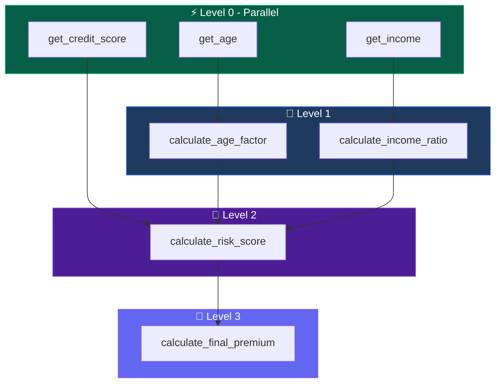

# Features Deep Dive

A comprehensive exploration of Product-FARM's enterprise-grade capabilities, designed for scalability, reliability, and exceptional developer experience.

---

## Template & Cloning System

Product-FARM's template and cloning system enables rapid product development while maintaining data integrity and preventing unauthorized modifications.

### What Are Templates?

Templates are reusable product configurations that define:

- **Product structure** - Components, attributes, and relationships
- **Dynamic enumerations** - Template-specific value sets
- **Template types** - Category classification (e.g., "insurance", "finance", "retail")
- **Base configurations** - Default rules and attribute values

Templates serve as blueprints for creating new products quickly while ensuring consistency across your product catalog.

### Deep Clone vs Selective Clone

Product-FARM supports two cloning strategies:

**Deep Clone**
- Creates a complete copy of the entire product
- Generates new unique IDs for all entities
- Preserves all relationships and dependencies
- Ideal for creating product variants or testing environments

```json
POST /api/products/{id}/clone
{
  "newProductId": "auto-insurance-premium-v2",
  "newProductName": "Auto Insurance Premium V2"
}
```

**Selective Clone**
- Filter what gets cloned using `CloneSelections`
- Choose specific components, datatypes, enumerations, or functionalities
- Reduce clone size and complexity
- Perfect for partial product derivation

```json
POST /api/products/{id}/clone
{
  "newProductId": "auto-insurance-basic",
  "newProductName": "Auto Insurance Basic",
  "selections": {
    "componentIds": ["core", "pricing"],
    "excludeFunctionalities": ["advanced-analytics"]
  }
}
```

### DoS Prevention Limits

To protect system stability, cloning operations enforce these limits:

| Entity Type | Maximum per Clone |
|------------|------------------|
| Abstract Attributes | 10,000 |
| Concrete Attributes | 100,000 |
| Rules | 10,000 |
| Functionalities | 1,000 |

<div class="callout callout-info">
<strong>System Protection:</strong> These limits prevent runaway cloning operations that could impact system performance. Contact your administrator if you need higher limits for specific use cases.
</div>

---

## Performance Caching System

Product-FARM implements a sophisticated caching layer to achieve sub-microsecond evaluation times.

### LRU Cache Architecture

The caching system uses a **Least Recently Used (LRU)** eviction policy with:

- **Write-through caching** - Writes go to both cache and database
- **Bounded memory usage** - Fixed cache sizes prevent memory exhaustion
- **Automatic eviction** - Oldest entries removed when cache is full
- **Cache warming** - Frequently accessed data preloaded on startup

### Configurable Cache Sizes

| Cache Type | Default Size | Maximum |
|-----------|-------------|---------|
| Products | 100 | 1,000 |
| Attributes | 10,000 | 100,000 |
| Rules | 10,000 | 100,000 |
| Compiled Rules | 10,000 | 100,000 |

Configure cache sizes in your deployment configuration:

```yaml
cache:
  products:
    size: 500
  attributes:
    size: 50000
  rules:
    size: 50000
  compiled_rules:
    size: 50000
```

### Performance Impact

| Scenario | Without Cache | With Cache | Improvement |
|----------|--------------|------------|-------------|
| Product Load | ~5ms | ~50μs | 100x |
| Rule Evaluation | ~1.15μs | ~330ns | 3.5x |
| Attribute Lookup | ~500μs | ~10μs | 50x |

<div class="callout callout-performance">
<strong>Performance Tip:</strong> For high-throughput scenarios, increase cache sizes and enable cache warming to ensure hot paths are always cached.
</div>

---

## Tiered Compilation Engine

Product-FARM uses a tiered compilation strategy inspired by JIT compilers to optimize rule evaluation.

### Tier 0: AST Interpretation

Initial rule execution uses Abstract Syntax Tree (AST) interpretation:

- **Immediate execution** - No compilation overhead
- **Evaluation time** - ~1.15μs per rule
- **Memory efficient** - Minimal memory footprint
- **Debug-friendly** - Easy to trace and debug

Best for:
- Rules executed infrequently
- Development and testing
- Initial rule validation

### Tier 1: Bytecode Compilation

Hot rules are automatically promoted to bytecode execution:

- **Compiled execution** - Optimized bytecode VM
- **Evaluation time** - ~330ns per rule
- **3.5x speedup** - Significant performance improvement
- **Cached** - Compiled bytecode stored in cache

Best for:
- Frequently executed rules
- Production workloads
- High-throughput scenarios

### When Promotion Occurs

Rules are promoted to Tier 1 based on:

1. **Execution count** - After N executions (configurable)
2. **Time threshold** - Rules accessed within a time window
3. **Explicit promotion** - API-triggered compilation
4. **Batch compilation** - Compile all rules on product activation

```rust
// Compilation threshold configuration
compilation:
  promotion_threshold: 100  // Promote after 100 executions
  time_window: 60s          // Consider executions in last 60 seconds
  eager_compile: false      // Compile all rules immediately
```

<div class="callout callout-tip">
<strong>Optimization Tip:</strong> For production deployments with predictable workloads, enable `eager_compile` to pre-compile all rules during product activation.
</div>

---

## DAG Execution Engine

The Directed Acyclic Graph (DAG) execution engine automatically manages rule dependencies and enables parallel execution.

### Dependency Detection

The engine analyzes each rule to detect:

- **Input variables** - Variables read by the rule
- **Output variables** - Variables written by the rule
- **Implicit dependencies** - Inferred from expression analysis

```json
{
  "rule_id": "calculate_premium",
  "inputs": ["base_rate", "age_factor", "risk_score"],
  "outputs": ["final_premium"],
  "dependencies": ["calculate_age_factor", "calculate_risk_score"]
}
```

### Level Assignment Algorithm

Rules are assigned to execution levels using topological sort:

1. **Level 0** - Rules with no dependencies (inputs only)
2. **Level 1** - Rules depending only on Level 0 outputs
3. **Level N** - Rules depending on Level N-1 outputs



### Parallel Execution Strategy

Rules within the same level execute in parallel:

- **Thread pool** - Configurable worker threads
- **Work stealing** - Efficient load balancing
- **Level synchronization** - Wait for level completion before next
- **Result aggregation** - Collect outputs for next level

**Throughput comparison:**

| Mode | Throughput |
|------|-----------|
| Sequential (AST) | 870K evals/sec |
| Sequential (Bytecode) | 3M evals/sec |
| Parallel (AST) | 6.5M evals/sec |
| Parallel (Bytecode) | 22M evals/sec |

### Cycle Detection

The engine prevents circular dependencies:

- **Build-time validation** - Detect cycles when rules are created
- **Runtime verification** - Double-check before execution
- **Clear error messages** - Identify which rules form the cycle

```json
{
  "error": "CYCLE_DETECTED",
  "message": "Circular dependency detected",
  "cycle": ["rule_a", "rule_b", "rule_c", "rule_a"]
}
```

<div class="callout callout-warning">
<strong>Design Consideration:</strong> Avoid complex interdependencies between rules. Design rule hierarchies with clear input/output boundaries for optimal parallel execution.
</div>

---

## RBAC & Security

Product-FARM provides fine-grained access control at multiple levels.

### Component-Level Permissions

Control access at the component level:

- **Read** - View component attributes and rules
- **Write** - Modify attributes and rules
- **Delete** - Remove attributes and rules
- **Admin** - Full control including permissions

```json
{
  "component_id": "pricing",
  "permissions": {
    "pricing-team": ["read", "write"],
    "analysts": ["read"],
    "admins": ["read", "write", "delete", "admin"]
  }
}
```

### Template Immutability Control

Mark templates as immutable to prevent modifications:

- **Full immutability** - No changes allowed
- **Partial immutability** - Specific fields locked
- **Time-based locks** - Immutable after activation
- **Override capability** - Admin-only changes

### Product Lifecycle Permissions

Control who can transition products between states:

| State Transition | Required Permission |
|-----------------|-------------------|
| Draft → Pending Approval | `submit` |
| Pending Approval → Active | `approve` |
| Active → Discontinued | `discontinue` |
| Any → Draft (clone) | `clone` |

### Approval Workflows

Configure multi-step approval processes:

1. **Submission** - Product owner submits for review
2. **Technical Review** - Engineering validates rules
3. **Business Review** - Business approves logic
4. **Activation** - Final approval and go-live

```yaml
approval_workflow:
  stages:
    - name: technical_review
      approvers: ["engineering"]
      required: 1
    - name: business_review
      approvers: ["product", "compliance"]
      required: 2
    - name: final_approval
      approvers: ["leadership"]
      required: 1
```

<div class="callout callout-info">
<strong>Audit Trail:</strong> All permission changes and workflow transitions are logged with user, timestamp, and reason for complete auditability.
</div>

---

## API Architecture

Product-FARM provides dual API support for different use cases.

### REST API for Management

Full-featured REST API for product management:

**Endpoints:**
- `GET /api/products` - List products
- `POST /api/products` - Create product
- `GET /api/products/{id}` - Get product details
- `PUT /api/products/{id}` - Update product
- `DELETE /api/products/{id}` - Delete product
- `POST /api/products/{id}/clone` - Clone product
- `POST /api/products/{id}/activate` - Activate product

**Features:**
- OpenAPI specification
- Query parameters for filtering
- Pagination support
- Bulk operations

### gRPC API for Evaluation

High-performance gRPC API for rule evaluation:

```protobuf
service RuleEngine {
  rpc Evaluate(EvaluateRequest) returns (EvaluateResponse);
  rpc EvaluateBatch(EvaluateBatchRequest) returns (EvaluateBatchResponse);
  rpc EvaluateStream(stream EvaluateRequest) returns (stream EvaluateResponse);
}

message EvaluateRequest {
  string product_id = 1;
  map<string, Value> inputs = 2;
  repeated string requested_outputs = 3;
}
```

**Benefits:**
- Binary protocol (efficient serialization)
- HTTP/2 multiplexing
- Streaming support
- Strong typing

### Batch Processing

Evaluate multiple input sets in a single request:

```json
POST /api/products/{id}/evaluate/batch
{
  "inputs": [
    {"age": 25, "income": 50000},
    {"age": 35, "income": 75000},
    {"age": 45, "income": 100000}
  ],
  "outputs": ["premium", "risk_score"]
}
```

### Streaming Support

Real-time evaluation with streaming:

```javascript
const stream = client.evaluateStream();

stream.on('data', (response) => {
  console.log('Result:', response.outputs);
});

// Send inputs as they arrive
dataSource.on('record', (record) => {
  stream.write({ product_id: 'insurance', inputs: record });
});
```

---

## Next Steps

- **[Benchmarks](/BENCHMARKS)** - Detailed performance data
- **[API Reference](/API_REFERENCE)** - Complete API documentation
- **[Architecture](/ARCHITECTURE)** - System design deep-dive
- **[Quick Start](/QUICK_START)** - Get started in 5 minutes
