# How It Works

This document provides a technical deep-dive into how Product-FARM evaluates rules, from the moment a request arrives to the final result being returned.

---

## Overview: The Evaluation Pipeline

When you call the evaluation API, here's what happens under the hood:

```mermaid
flowchart LR
    subgraph Pipeline["⚡ EVALUATION PIPELINE"]
        direction LR
        S1["1️⃣ REQUEST<br/>Client Request<br/><small>JSON/gRPC payload</small>"]
        S2["2️⃣ LOAD<br/>Fetch Rules<br/><small>DGraph query</small>"]
        S3["3️⃣ BUILD<br/>Build DAG<br/><small>Dependency analysis</small>"]
        S4["4️⃣ EXECUTE<br/>Execute Rules<br/><small>Parallel execution</small>"]
        S5["5️⃣ RETURN<br/>Format Response<br/><small>JSON/gRPC response</small>"]

        S1 --> S2 --> S3 --> S4 --> S5
    end

    style Pipeline fill:#0f172a,stroke:#3b82f6,color:#fff
    style S1 fill:#6366f1,stroke:#8b5cf6,color:#fff
    style S2 fill:#1e3a5f,stroke:#3b82f6,color:#fff
    style S3 fill:#1e3a5f,stroke:#3b82f6,color:#fff
    style S4 fill:#065f46,stroke:#10b981,color:#fff
    style S5 fill:#4c1d95,stroke:#8b5cf6,color:#fff
```



---

## Step 1: Request Processing

### REST API Request

```bash
POST /api/products/insurance-premium-v1/evaluate
Content-Type: application/json

{
  "inputs": {
    "customer_age": 45,
    "coverage_amount": 250000,
    "smoker_status": "NON_SMOKER"
  },
  "functionality": "quote"
}
```

### gRPC Request

```protobuf
message EvaluateRequest {
  string product_id = 1;
  string functionality = 2;
  map<string, Value> input_data = 3;
}
```

### What Happens

1. **Parse Request**: Extract product ID, functionality, and input values
2. **Validate Inputs**: Check types match expected datatypes
3. **Load Product**: Retrieve product configuration from cache or database

---

## Step 2: Rule Loading

### DGraph Query

Product-FARM uses DGraph to store and query rules efficiently:

```graphql
query GetProductRules($productId: string) {
  product(func: eq(product_id, $productId)) {
    name
    rules {
      rule_id
      name
      expression
      inputs { name datatype }
      outputs { name datatype }
    }
    attributes {
      name
      datatype
      component
    }
  }
}
```

### Caching Strategy

```mermaid
flowchart LR
    subgraph CachingLayers["🗄️ CACHING LAYERS"]
        direction LR
        REQ["📥 Request"]
        LRU["⚡ LRU Cache<br/><small>Hot Layer</small><br/><small>Hit: ~1µs</small>"]
        DG["💾 DGraph<br/><small>Cold Layer</small><br/><small>Miss: ~1-5ms</small>"]

        REQ --> LRU
        LRU -->|"Cache Miss"| DG
    end

    subgraph Policy["📋 Cache Policy"]
        direction TB
        P1["Product rules: 5 min TTL"]
        P2["Bytecode: Until product changes"]
        P3["Eviction: LRU, 1000 entries"]
    end

    style CachingLayers fill:#0f172a,stroke:#3b82f6,color:#fff
    style Policy fill:#1e3a5f,stroke:#3b82f6,color:#fff
    style REQ fill:#6366f1,stroke:#8b5cf6,color:#fff
    style LRU fill:#065f46,stroke:#10b981,color:#fff
    style DG fill:#4c1d95,stroke:#8b5cf6,color:#fff
```



<div class="callout callout-performance">
<strong>Cache Impact:</strong> Cache hits deliver ~1μs latency vs ~1-5ms for database queries—a 1000-5000x improvement. For production workloads, ensure cache sizes are tuned for your working set.
</div>

---

## Step 3: DAG Construction

### Dependency Analysis

The system analyzes rule inputs and outputs to build a **Directed Acyclic Graph (DAG)**:

```rust
// Pseudocode for DAG construction
fn build_dag(rules: Vec<Rule>) -> DAG {
    let mut dag = DAG::new();

    for rule in rules {
        dag.add_node(rule.id);

        // Find rules that produce our inputs
        for input in rule.inputs {
            if let Some(producer) = find_rule_producing(input) {
                dag.add_edge(producer, rule.id);
            }
        }
    }

    dag.topological_sort()
}
```

### Example DAG

For our insurance premium calculator:


### Execution Levels

| Level | Rules | Dependencies | Execution |
|-------|-------|--------------|-----------|
| 0 | age_factor, base_premium, smoker_factor | Only inputs | **Parallel** |
| 1 | final_premium | Level 0 outputs | **Sequential** after Level 0 |
| 2 | monthly_payment | Level 1 outputs | **Sequential** after Level 1 |

---

## Step 4: Rule Execution

### The JSON Logic Engine

Product-FARM uses a custom JSON Logic implementation with a **tiered compilation** strategy:

```mermaid
flowchart TB
    subgraph Pipeline["⚙️ TIERED COMPILATION PIPELINE"]
        direction TB
        JSON["📝 JSON Logic<br/><small>{\"*\": [...]}</small>"]
        PARSE["🔍 Parse"]
        AST["🌳 AST Tree"]
        CHECK{"eval_count?"}

        subgraph Tier0Path["Tier 0 Path"]
            T0["⚡ Tier 0<br/>AST Eval<br/><small>~1.15µs</small>"]
        end

        subgraph Tier1Path["Tier 1 Path"]
            COMPILE["🔧 Compiler"]
            BC["📦 Bytecode"]
            T1["🚀 Tier 1<br/>VM Exec<br/><small>~330ns</small>"]
        end

        RESULT["✅ Result"]

        JSON --> PARSE
        PARSE --> AST
        AST --> CHECK
        CHECK -->|"< 100 evals"| T0
        CHECK -->|">= 100 evals"| COMPILE
        COMPILE --> BC
        BC --> T1
        T0 --> RESULT
        T1 --> RESULT
    end

    style Pipeline fill:#0f172a,stroke:#3b82f6,color:#fff
    style JSON fill:#6366f1,stroke:#8b5cf6,color:#fff
    style AST fill:#1e3a5f,stroke:#3b82f6,color:#fff
    style CHECK fill:#f59e0b,stroke:#d97706,color:#000
    style T0 fill:#4c1d95,stroke:#8b5cf6,color:#fff
    style T1 fill:#065f46,stroke:#10b981,color:#fff
    style RESULT fill:#065f46,stroke:#10b981,color:#fff
```

### Tier 0: AST Interpretation

- **How it works**: Walk the AST tree, evaluate each node recursively
- **Latency**: ~1.15 microseconds per evaluation
- **Use case**: Rules evaluated < 100 times (cold start, rare rules)

```rust
fn eval_ast(node: &AstNode, context: &Context) -> Value {
    match node {
        AstNode::Var(name) => context.get(name),
        AstNode::Literal(v) => v.clone(),
        AstNode::Op { op, args } => {
            let evaluated: Vec<Value> = args.iter()
                .map(|a| eval_ast(a, context))
                .collect();
            apply_operator(op, evaluated)
        }
    }
}
```

### Tier 1: Bytecode VM

- **How it works**: Compile AST to bytecode, execute on stack-based VM
- **Latency**: ~330 nanoseconds per evaluation (3.5x faster)
- **Use case**: Hot paths, frequently evaluated rules

```rust
// Bytecode instructions
enum Instruction {
    LoadVar(String),      // Push variable onto stack
    LoadConst(Value),     // Push constant onto stack
    Add,                  // Pop two, push sum
    Multiply,             // Pop two, push product
    Compare(CmpOp),       // Pop two, push boolean
    JumpIfFalse(usize),   // Conditional jump
    Return,               // Return top of stack
}

// Compiled bytecode for: base_premium = coverage_amount * 0.02
[
    LoadVar("coverage_amount"),  // stack: [250000]
    LoadConst(0.02),             // stack: [250000, 0.02]
    Multiply,                    // stack: [5000]
    Return,                      // result: 5000
]
```

### Performance Comparison

| Metric | Tier 0 (AST) | Tier 1 (Bytecode) |
|--------|--------------|-------------------|
| Latency | ~1.15µs | ~330ns |
| Throughput | ~870K/sec | ~3M/sec |
| Warmup | None | 100 evaluations |
| Memory | Lower | Higher (bytecode cache) |

<div class="callout callout-tip">
<strong>Optimization Tip:</strong> For production deployments with predictable workloads, configure eager compilation to pre-compile all rules during product activation, ensuring hot paths are ready immediately.
</div>

---

## Step 5: Execution Context

### Variable Resolution

The execution context holds all values needed during evaluation:

```rust
struct ExecutionContext {
    // Input values provided by caller
    inputs: HashMap<String, Value>,

    // Intermediate results from rule execution
    computed: HashMap<String, Value>,

    // Type information for validation
    types: HashMap<String, DataType>,
}

impl ExecutionContext {
    fn get(&self, name: &str) -> Value {
        // 1. Check computed values first
        if let Some(v) = self.computed.get(name) {
            return v.clone();
        }
        // 2. Fall back to inputs
        if let Some(v) = self.inputs.get(name) {
            return v.clone();
        }
        // 3. Error if not found
        panic!("Variable not found: {}", name);
    }

    fn set(&mut self, name: &str, value: Value) {
        self.computed.insert(name.to_string(), value);
    }
}
```

### Type Coercion

Product-FARM handles type coercion automatically:

| Input Type | Target Type | Coercion |
|------------|-------------|----------|
| `integer` | `decimal` | Automatic widening |
| `string` | `enum` | Validated against enum values |
| `decimal` | `currency` | Precision adjustment |
| `null` | any | Use default value |

```rust
fn coerce(value: Value, target: DataType) -> Result<Value> {
    match (value, target) {
        // Integer to Decimal: widen
        (Value::Int(i), DataType::Decimal) =>
            Ok(Value::Decimal(i as f64)),

        // String to Enum: validate
        (Value::String(s), DataType::Enum(values)) => {
            if values.contains(&s) {
                Ok(Value::Enum(s))
            } else {
                Err(Error::InvalidEnumValue(s))
            }
        }

        // Same type: no coercion needed
        (v, t) if v.type_matches(t) => Ok(v),

        // Incompatible types
        _ => Err(Error::TypeMismatch)
    }
}
```

---

## Step 6: Parallel Execution

### Level-Based Parallelism

Rules at the same execution level run in parallel:

```rust
async fn execute_dag(dag: &DAG, context: &mut Context) {
    for level in dag.levels() {
        // All rules in this level can run in parallel
        let futures: Vec<_> = level.rules
            .iter()
            .map(|rule| execute_rule(rule, context))
            .collect();

        // Wait for all rules in this level to complete
        let results = join_all(futures).await;

        // Store results in context for next level
        for (rule, result) in level.rules.iter().zip(results) {
            for output in &rule.outputs {
                context.set(output, result.get(output));
            }
        }
    }
}
```

### Execution Timeline


**Performance Summary:**

| Metric | Value |
|--------|-------|
| **With Parallelism** | max(L0) + L1 + L2 = 0.8 + 0.4 + 0.3 = **1.5µs** |
| **Without Parallelism** | 0.8 + 0.6 + 0.7 + 0.4 + 0.3 = **2.8µs** |
| **Speedup** | **1.87x** |

<div class="callout callout-info">
<strong>Parallel Scaling:</strong> Speedup increases with DAG width. Products with many independent rules at each level see greater parallelization benefits—up to 5.4x for deep DAGs with 100+ rules.
</div>

---

## Step 7: Response Formatting

### Result Structure

```json
{
  "success": true,
  "product_id": "insurance-premium-v1",
  "functionality": "quote",
  "outputs": {
    "base_premium": {
      "value": 5000.00,
      "datatype": "currency"
    },
    "age_factor": {
      "value": 1.2,
      "datatype": "percentage"
    },
    "smoker_factor": {
      "value": 1.0,
      "datatype": "percentage"
    },
    "final_premium": {
      "value": 6000.00,
      "datatype": "currency"
    },
    "monthly_payment": {
      "value": 500.00,
      "datatype": "currency"
    }
  },
  "execution_stats": {
    "total_time_us": 1.5,
    "rules_executed": 5,
    "cache_hits": 3,
    "tier": "bytecode"
  }
}
```

### Error Handling

```json
{
  "success": false,
  "error": {
    "code": "MISSING_INPUT",
    "message": "Required input 'customer_age' was not provided",
    "details": {
      "missing_inputs": ["customer_age"],
      "provided_inputs": ["coverage_amount", "smoker_status"]
    }
  }
}
```

---

## Complete Walkthrough Example

Let's trace a complete evaluation:

### Input

```json
{
  "product_id": "insurance-premium-v1",
  "functionality": "quote",
  "inputs": {
    "customer_age": 45,
    "coverage_amount": 250000,
    "smoker_status": "NON_SMOKER"
  }
}
```

### Step-by-Step Trace

```mermaid
flowchart TB
    subgraph S1["📥 STEP 1: Parse Request"]
        S1_C["<b>Product:</b> insurance-premium-v1<br/><b>Functionality:</b> quote<br/><b>Inputs:</b> customer_age: 45, coverage: 250000, smoker: NON_SMOKER"]
    end

    subgraph S2["📦 STEP 2: Load Rules from Cache"]
        S2_C["<b>Rules loaded:</b> 5<br/>• calculate_age_factor<br/>• calculate_base_premium<br/>• calculate_smoker_factor<br/>• calculate_final_premium<br/>• calculate_monthly_payment"]
    end

    subgraph S3["🌳 STEP 3: Build DAG"]
        S3_C["<b>Level 0:</b> [age_factor, base_premium, smoker_factor] ⚡ parallel<br/><b>Level 1:</b> [final_premium] → depends on L0<br/><b>Level 2:</b> [monthly_payment] → depends on L1"]
    end

    subgraph S4["⚡ STEP 4: Execute Level 0 - Parallel"]
        direction LR
        S4_A["<b>age_factor</b><br/><small>IF age > 60 THEN 1.5...</small><br/>45 > 40? YES<br/><b>→ 1.2</b>"]
        S4_B["<b>base_premium</b><br/><small>coverage × 0.02</small><br/>250000 × 0.02<br/><b>→ 5000.00</b>"]
        S4_C["<b>smoker_factor</b><br/><small>CASE smoker_status...</small><br/>NON_SMOKER<br/><b>→ 1.0</b>"]
    end

    subgraph S5["🔗 STEP 5: Execute Level 1"]
        S5_C["<b>final_premium</b><br/>base × age × smoker<br/>5000 × 1.2 × 1.0<br/><b>→ 6000.00</b>"]
    end

    subgraph S6["🔗 STEP 6: Execute Level 2"]
        S6_C["<b>monthly_payment</b><br/>final ÷ 12<br/>6000 ÷ 12<br/><b>→ 500.00</b>"]
    end

    subgraph S7["✅ STEP 7: Return Response"]
        S7_C["base_premium: 5000.00<br/>age_factor: 1.2<br/>smoker_factor: 1.0<br/>final_premium: 6000.00<br/>monthly_payment: 500.00"]
    end

    S1 --> S2 --> S3 --> S4 --> S5 --> S6 --> S7

    style S1 fill:#6366f1,stroke:#8b5cf6,color:#fff
    style S2 fill:#1e3a5f,stroke:#3b82f6,color:#fff
    style S3 fill:#1e3a5f,stroke:#3b82f6,color:#fff
    style S4 fill:#065f46,stroke:#10b981,color:#fff
    style S5 fill:#4c1d95,stroke:#8b5cf6,color:#fff
    style S6 fill:#4c1d95,stroke:#8b5cf6,color:#fff
    style S7 fill:#065f46,stroke:#10b981,color:#fff
```



---

## Performance Benchmarks

### Single Rule Evaluation

| Complexity | Tier 0 (AST) | Tier 1 (Bytecode) |
|------------|--------------|-------------------|
| Simple arithmetic | 0.8µs | 0.25µs |
| Conditional (3 branches) | 1.2µs | 0.35µs |
| Complex (10+ operations) | 2.5µs | 0.6µs |

### Full Product Evaluation

| Scenario | Rules | Levels | Latency |
|----------|-------|--------|---------|
| Simple quote | 3 | 2 | 1.2µs |
| Standard quote | 6 | 3 | 2.1µs |
| Full underwriting | 15 | 5 | 4.5µs |
| Complex pricing | 30 | 7 | 8.2µs |

### Throughput


---

## API Reference

### REST API

```bash
# Evaluate a functionality
POST /api/products/{product_id}/evaluate
Content-Type: application/json

{
  "functionality": "quote",
  "inputs": {
    "customer_age": 45,
    "coverage_amount": 250000
  }
}
```

### gRPC API

```protobuf
service ProductFarmService {
  rpc Evaluate(EvaluateRequest) returns (EvaluateResponse);
  rpc EvaluateStream(stream EvaluateRequest) returns (stream EvaluateResponse);
}
```

### Batch Evaluation

```bash
POST /api/products/{product_id}/evaluate/batch
Content-Type: application/json

{
  "functionality": "quote",
  "batch": [
    {"customer_age": 25, "coverage_amount": 100000},
    {"customer_age": 45, "coverage_amount": 250000},
    {"customer_age": 65, "coverage_amount": 500000}
  ]
}
```

---

## Next Steps

- [Architecture](ARCHITECTURE) - System design and component details
- [API Reference](API_REFERENCE) - Complete API documentation
- [Quick Start](QUICK_START) - Build your first product
