# Quick Start Guide

Get Product-FARM up and running in 5 minutes, then learn how to build your first rule engine product step-by-step.

---

## Part 0: Environment Setup

Before you begin, you need to install the required dependencies. This section provides step-by-step installation instructions.

### Prerequisites Overview

| Requirement | Version | Purpose |
|-------------|---------|---------|
| **Rust** | 1.75+ | Backend API server |
| **Node.js** | 20+ | Frontend development |
| **DGraph** | 24.0+ | Graph database |
| **Git** | 2.0+ | Version control |

### Install Rust

Rust is required to build and run the backend API server.

**Linux / macOS:**
```bash
# Install Rust using rustup (official installer)
curl --proto '=https' --tlsv1.2 -sSf https://sh.rustup.rs | sh

# Follow the prompts (default installation is recommended)
# Then reload your shell configuration
source $HOME/.cargo/env

# Verify installation
rustc --version
# Expected output: rustc 1.75.0 or higher

# Update to latest stable (if already installed)
rustup update stable
```

**Windows:**
```powershell
# Download and run rustup-init.exe from https://rustup.rs
# Or use winget:
winget install Rustlang.Rustup

# Verify installation
rustc --version
```

### Install Node.js

Node.js is required for the frontend application.

**Using nvm (Recommended for Linux/macOS):**
```bash
# Install nvm (Node Version Manager)
curl -o- https://raw.githubusercontent.com/nvm-sh/nvm/v0.39.7/install.sh | bash

# Reload shell configuration
source ~/.bashrc  # or ~/.zshrc for Zsh

# Install Node.js 20 LTS
nvm install 20
nvm use 20
nvm alias default 20

# Verify installation
node --version
# Expected output: v20.x.x

npm --version
# Expected output: 10.x.x
```

**Using Package Manager:**
```bash
# Ubuntu/Debian
curl -fsSL https://deb.nodesource.com/setup_20.x | sudo -E bash -
sudo apt-get install -y nodejs

# macOS (using Homebrew)
brew install node@20

# Windows (using winget)
winget install OpenJS.NodeJS.LTS
```

### Install DGraph

DGraph is the graph database that stores all product configurations.

**Option 1: Direct Installation (Linux/macOS)**
```bash
# Download and install DGraph
curl -sSL https://get.dgraph.io | bash

# Verify installation
dgraph version
```

**Option 2: Using Docker (Recommended for Development)**
```bash
# Pull the DGraph image
docker pull dgraph/dgraph:latest

# Or use docker-compose (included in the repository)
# The start-all.sh script handles this automatically
```

**Option 3: Manual Download**
```bash
# Linux (amd64)
wget https://github.com/dgraph-io/dgraph/releases/download/v24.0.0/dgraph-linux-amd64.tar.gz
tar -xzf dgraph-linux-amd64.tar.gz
sudo mv dgraph /usr/local/bin/

# macOS (using Homebrew)
brew install dgraph
```

### Verify All Prerequisites

Run these commands to verify everything is installed correctly:

```bash
# Check Rust
rustc --version && cargo --version
# ✓ rustc 1.75.0+ and cargo 1.75.0+

# Check Node.js
node --version && npm --version
# ✓ v20.x.x and 10.x.x

# Check DGraph (if installed directly)
dgraph version
# ✓ Dgraph version v24.x.x

# Check Git
git --version
# ✓ git version 2.x.x
```

### Troubleshooting Prerequisites

**Rust Issues:**
```bash
# If cargo command not found, add to PATH:
export PATH="$HOME/.cargo/bin:$PATH"

# If build fails, ensure you have build essentials:
# Ubuntu/Debian:
sudo apt-get install build-essential pkg-config libssl-dev

# macOS:
xcode-select --install
```

**Node.js Issues:**
```bash
# If nvm command not found, add to shell profile:
export NVM_DIR="$HOME/.nvm"
[ -s "$NVM_DIR/nvm.sh" ] && \. "$NVM_DIR/nvm.sh"

# If npm permissions error:
mkdir ~/.npm-global
npm config set prefix '~/.npm-global'
export PATH=~/.npm-global/bin:$PATH
```

**DGraph Issues:**
```bash
# If DGraph fails to start, check port availability:
lsof -i :5080  # Zero node
lsof -i :8080  # Alpha HTTP
lsof -i :9080  # Alpha gRPC

# Clear DGraph data if corrupted:
rm -rf infrastructure/dgraph-data/*
```

---

## Part 1: Clone and Start Services

### Step 1: Clone the Repository

```bash
git clone https://github.com/ayushmaanbhav/product-farm.git
cd product-farm
```

### Step 2: Start All Services

The easiest way to get started is using the all-in-one start script:

```bash
./start-all.sh
```

This script will start:
- **DGraph Zero** (cluster management) on port 5080
- **DGraph Alpha** (database) on ports 7080, 8080, 9080
- **Backend REST API** on port 8081
- **Frontend** on port 5173

**What happens during startup:**
```
[Starting DGraph Zero...]        ✓ Port 5080
[Starting DGraph Alpha...]       ✓ Ports 7080, 8080, 9080
[Building Backend...]            ✓ Compiling Rust (first run takes 2-3 min)
[Starting Backend API...]        ✓ Port 8081
[Installing Frontend deps...]    ✓ npm install
[Starting Frontend...]           ✓ Port 5173

All services started successfully!
Frontend: http://localhost:5173
API:      http://localhost:8081
```

### Step 3: Open the Dashboard

Navigate to **http://localhost:5173** in your browser. You'll see the Product-FARM dashboard:

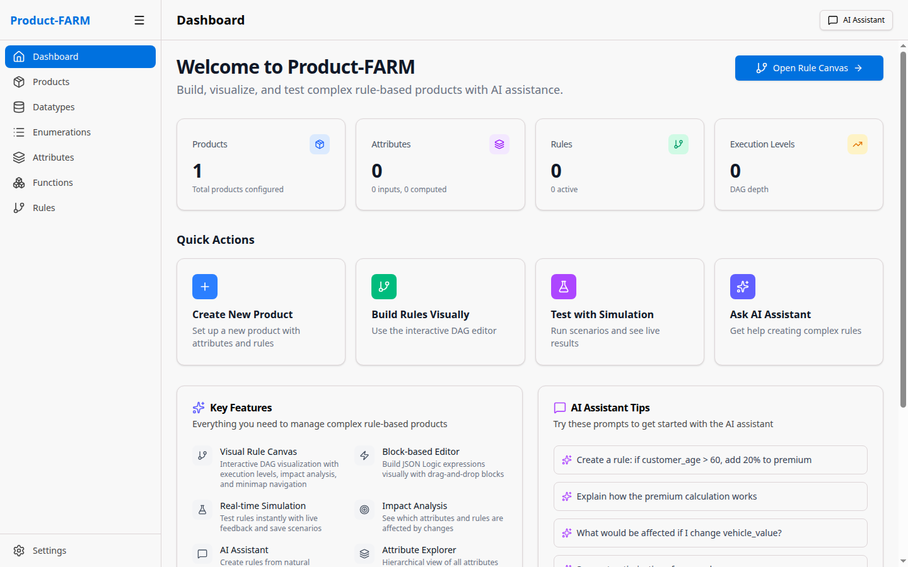

The dashboard provides quick access to all components and shows your recent activity.

### Step 4: Verify Services

Verify all services are running correctly:

```bash
# Check API health
curl http://localhost:8081/health
# Expected: {"status":"healthy"}

# Check DGraph
curl http://localhost:8080/health
# Expected: {"status":"healthy"}

# Check frontend (should return HTML)
curl -I http://localhost:5173
# Expected: HTTP/1.1 200 OK
```

---

## Part 2: Create Custom Datatypes

Datatypes define the structure and validation for your data. Let's create custom datatypes for our insurance product.

### 2.1 Navigate to Datatypes

Click **"Datatypes"** in the left sidebar to see the datatypes management page:


### 2.2 Create a Currency Datatype

Click the **"+ New Datatype"** button to open the creation dialog:


Fill in the details for a currency datatype:

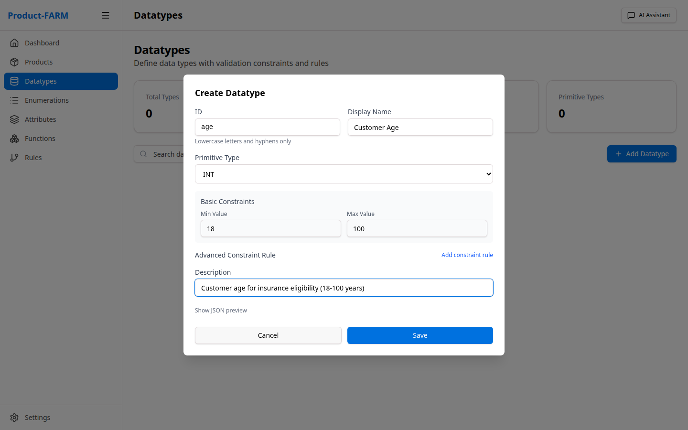

- **Name**: `currency`
- **Base Type**: Select `decimal` from the dropdown
- **Description**: `Monetary values with 2 decimal precision`
- **Constraints**: Set precision to 2 decimal places

### 2.3 View Your Datatypes

After creating datatypes, you'll see them listed:

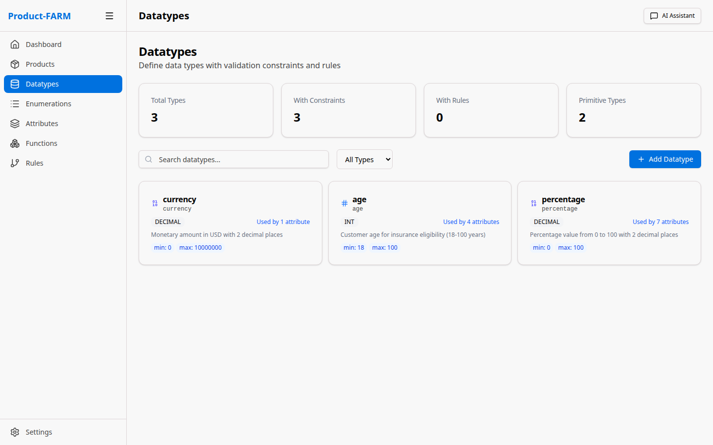

**Create these datatypes for our example:**

| Name | Base Type | Description |
|------|-----------|-------------|
| `currency` | decimal | Monetary values (2 decimal places) |
| `percentage` | decimal | Percentage values (0-100) |
| `age` | integer | Customer age (0-150) |

---

## Part 3: Create Enumerations

Enumerations define fixed sets of values for categorical data.

### 3.1 Navigate to Enumerations

Click **"Enumerations"** in the sidebar:


### 3.2 Create a Risk Level Enumeration

Click **"+ New Enumeration"** to create categorical values:


Fill in the risk level enumeration:

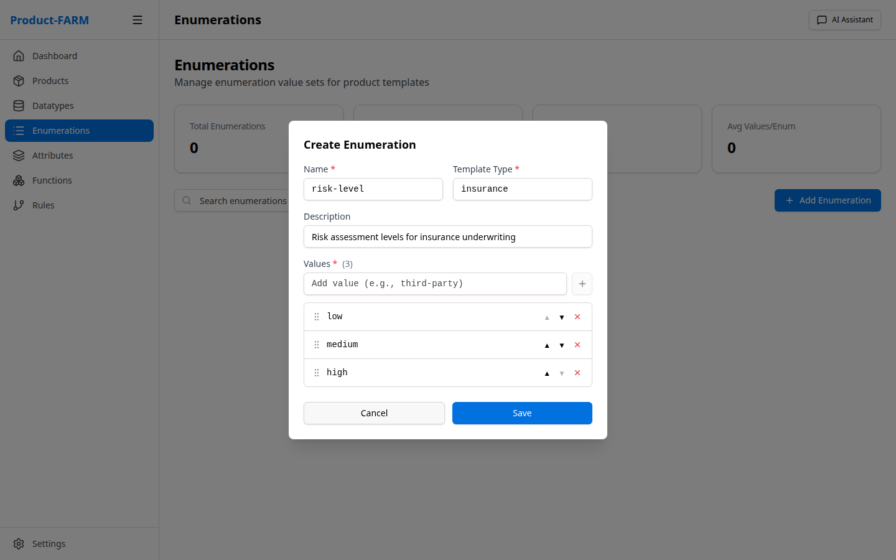

- **Name**: `risk_level`
- **Values**: `LOW`, `MEDIUM`, `HIGH`, `CRITICAL`
- **Description**: `Customer risk classification levels`

### 3.3 View Your Enumerations

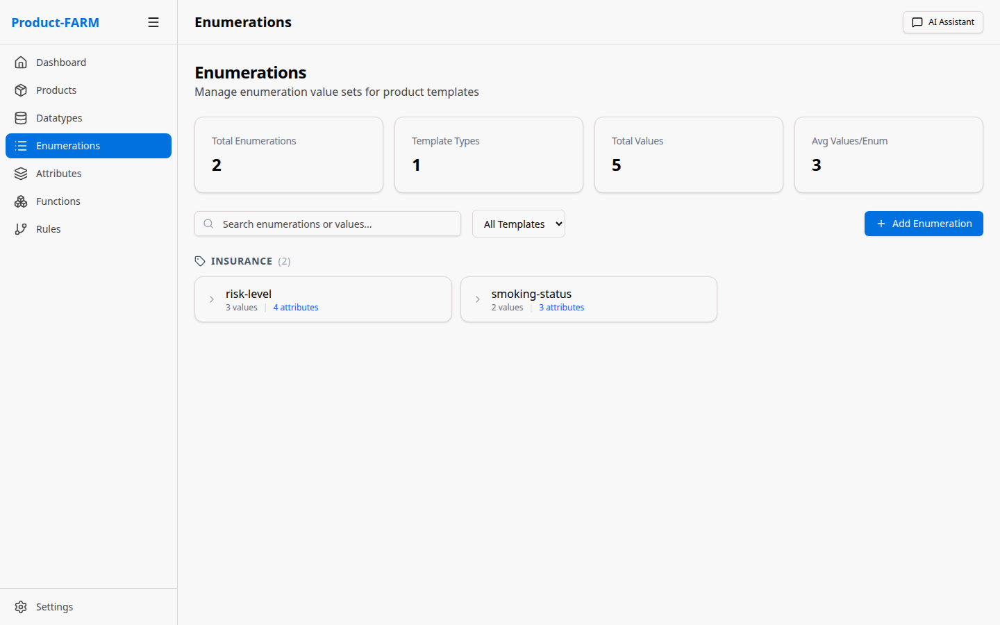

**Create these enumerations for our example:**

| Name | Values | Description |
|------|--------|-------------|
| `risk_level` | LOW, MEDIUM, HIGH, CRITICAL | Risk classification |
| `policy_type` | BASIC, STANDARD, PREMIUM | Policy tier levels |
| `smoker_status` | NON_SMOKER, OCCASIONAL, REGULAR | Smoking status |

---

## Part 4: Create a Product

Products are containers that hold all your business logic components.

### 4.1 Navigate to Products

Click **"Products"** in the sidebar:

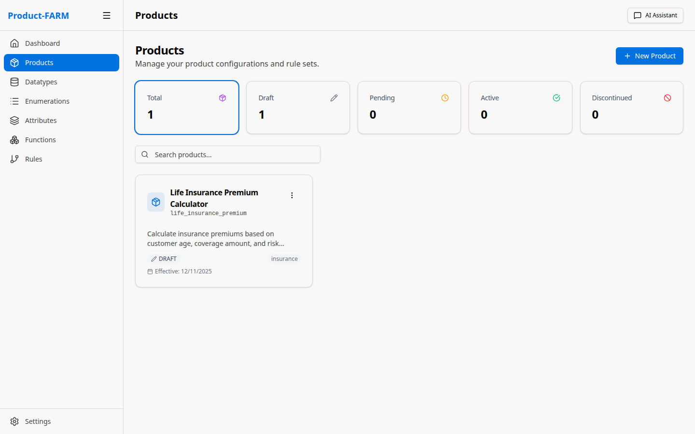

### 4.2 Create New Product

Click **"+ New Product"** to open the creation dialog:


Fill in:
- **Product ID**: `insurance-premium-v1`
- **Name**: `Insurance Premium Calculator`
- **Description**: `Calculate insurance premiums based on customer risk factors`

### 4.3 View Product Details

After creation, click on the product to see its detail view:

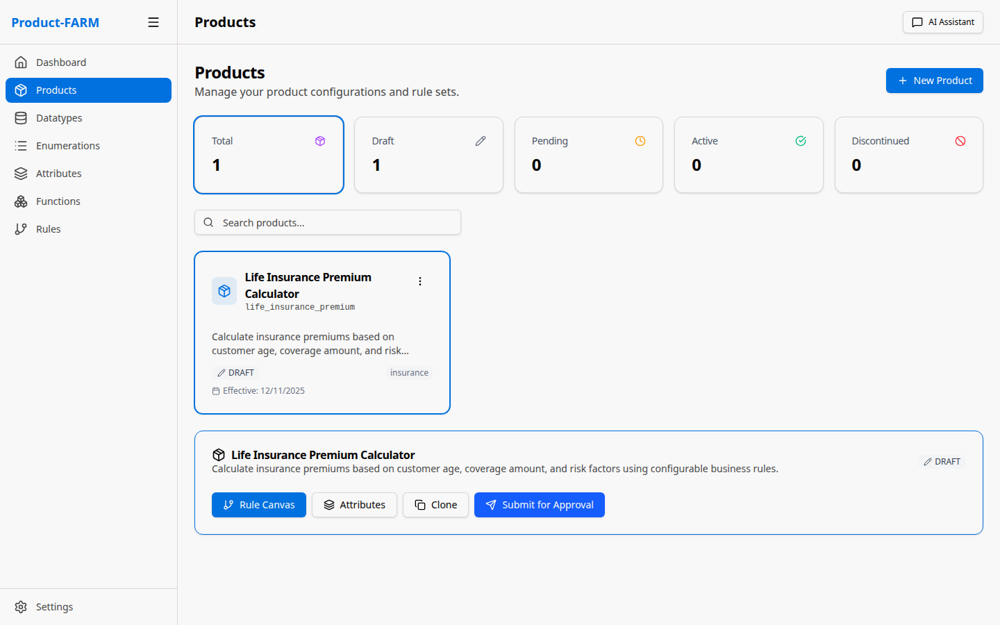

From here you can navigate to:
- **Attributes**: Define input/output variables
- **Rules Canvas**: Create and visualize rules
- **Components**: Manage product components

---

## Part 5: Create Abstract Attributes

Attributes are the variables used in your rules - inputs, outputs, and calculated values.

### 5.1 Navigate to Attributes

Click **"Abstract Attributes"** in the sidebar:


### 5.2 Create Input Attributes

Click **"+ New Attribute"** to create an attribute:


First, select the component type:


Then select the datatype:


Fill in the attribute details:

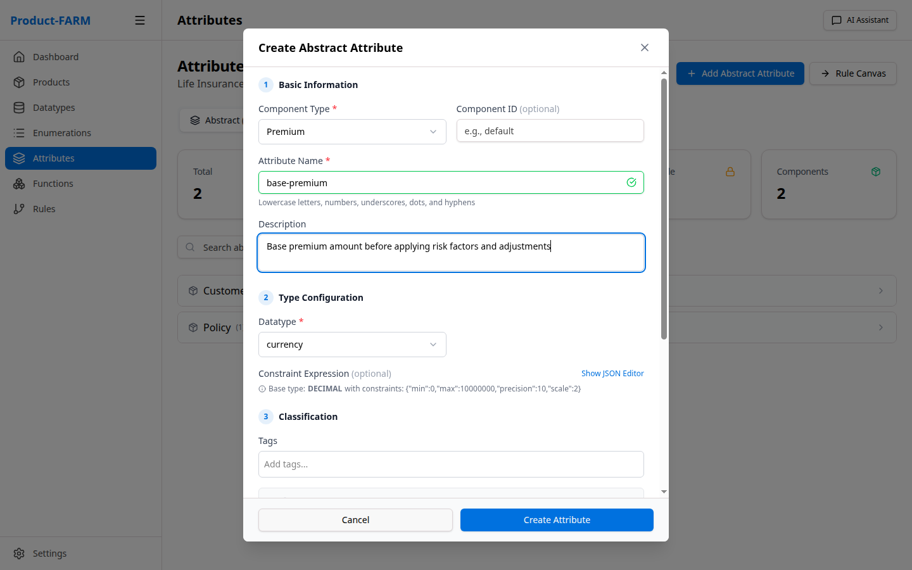

### 5.3 Create All Required Attributes

Create these attributes for the insurance calculator:

**Input Attributes:**

| Name | Component | Datatype | Description |
|------|-----------|----------|-------------|
| `customer_age` | loan | age | Customer's age in years |
| `coverage_amount` | loan | currency | Total coverage amount |
| `smoker_status` | loan | smoker_status | Customer smoking status |
| `policy_type` | loan | policy_type | Selected policy tier |

**Calculated Attributes:**

| Name | Component | Datatype | Description |
|------|-----------|----------|-------------|
| `base_premium` | loan | currency | Base premium before factors |
| `age_factor` | loan | percentage | Age-based multiplier |
| `smoker_factor` | loan | percentage | Smoking-based multiplier |
| `risk_level` | loan | risk_level | Calculated risk classification |

**Output Attributes:**

| Name | Component | Datatype | Description |
|------|-----------|----------|-------------|
| `final_premium` | loan | currency | Final calculated premium |
| `monthly_payment` | loan | currency | Monthly payment amount |

### 5.4 View All Attributes

After creating all attributes, your list should look like this:

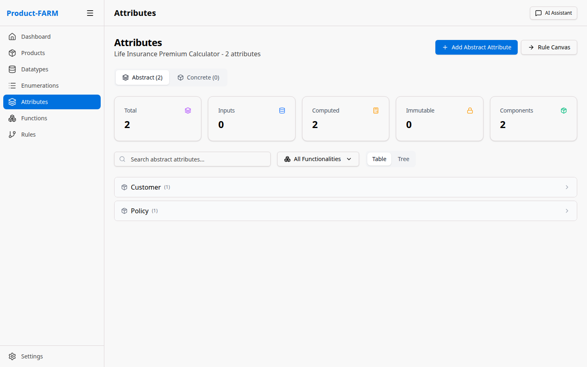

---

## Part 6: Create Rules

Rules define the business logic that transforms inputs into outputs.

### 6.1 Navigate to Rules Canvas

Click **"Rules"** in the sidebar to access the visual rule builder:

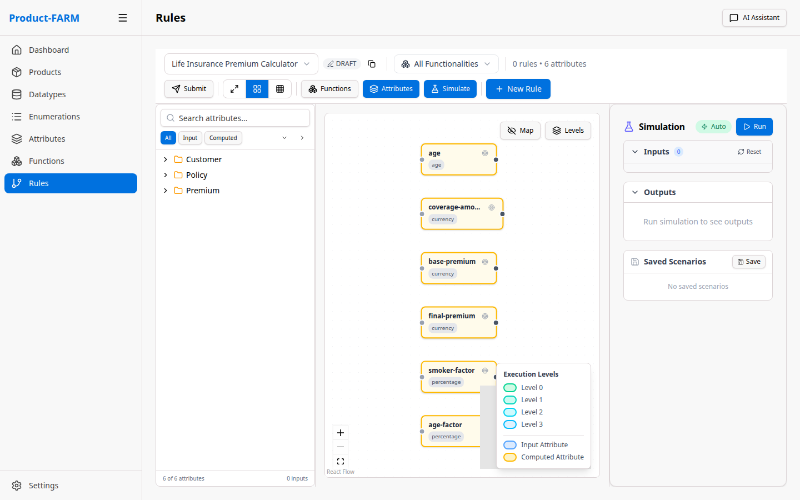

### 6.2 Create a New Rule

Click **"+ New Rule"** to open the rule builder dialog:

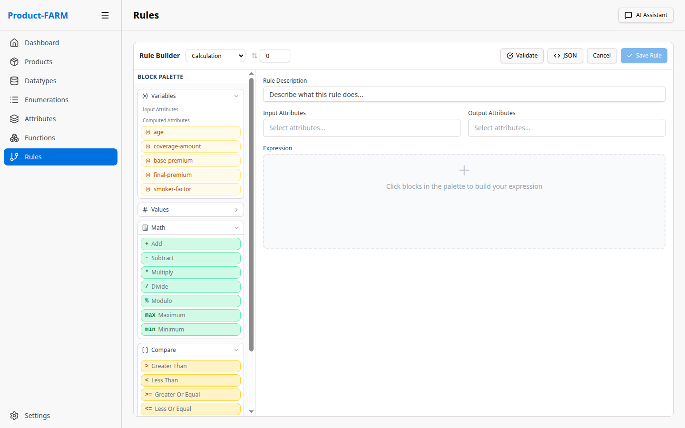

### 6.3 Build Rule Expression

Use the visual expression builder to create your rule logic:


Or switch to JSON mode for complex expressions:


### 6.4 Create All Rules

Create these rules for the insurance calculator:

**Rule 1: Base Premium Calculation**
```json
{
  "name": "calculate_base_premium",
  "rule_type": "CALCULATION",
  "display_expression": "base_premium = coverage_amount * 0.02",
  "expression": {
    "*": [{"var": "coverage_amount"}, 0.02]
  },
  "inputs": ["coverage_amount"],
  "outputs": ["base_premium"]
}
```

**Rule 2: Age Factor**
```json
{
  "name": "calculate_age_factor",
  "rule_type": "CALCULATION",
  "display_expression": "age_factor = IF age > 60 THEN 1.5 ELSE IF age > 40 THEN 1.2 ELSE 1.0",
  "expression": {
    "if": [
      {">": [{"var": "customer_age"}, 60]}, 1.5,
      {">": [{"var": "customer_age"}, 40]}, 1.2,
      1.0
    ]
  },
  "inputs": ["customer_age"],
  "outputs": ["age_factor"]
}
```

**Rule 3: Smoker Factor**
```json
{
  "name": "calculate_smoker_factor",
  "rule_type": "CALCULATION",
  "display_expression": "smoker_factor = CASE smoker_status WHEN REGULAR 1.8 WHEN OCCASIONAL 1.3 ELSE 1.0",
  "expression": {
    "if": [
      {"==": [{"var": "smoker_status"}, "REGULAR"]}, 1.8,
      {"==": [{"var": "smoker_status"}, "OCCASIONAL"]}, 1.3,
      1.0
    ]
  },
  "inputs": ["smoker_status"],
  "outputs": ["smoker_factor"]
}
```

**Rule 4: Risk Level Classification**
```json
{
  "name": "classify_risk_level",
  "rule_type": "CLASSIFICATION",
  "display_expression": "risk_level = CLASSIFY based on age and smoker status",
  "expression": {
    "if": [
      {"and": [{">": [{"var": "customer_age"}, 60]}, {"==": [{"var": "smoker_status"}, "REGULAR"]}]}, "CRITICAL",
      {"or": [{">": [{"var": "customer_age"}, 60]}, {"==": [{"var": "smoker_status"}, "REGULAR"]}]}, "HIGH",
      {"or": [{">": [{"var": "customer_age"}, 40]}, {"==": [{"var": "smoker_status"}, "OCCASIONAL"]}]}, "MEDIUM",
      "LOW"
    ]
  },
  "inputs": ["customer_age", "smoker_status"],
  "outputs": ["risk_level"]
}
```

**Rule 5: Final Premium Calculation**
```json
{
  "name": "calculate_final_premium",
  "rule_type": "CALCULATION",
  "display_expression": "final_premium = base_premium * age_factor * smoker_factor",
  "expression": {
    "*": [
      {"var": "base_premium"},
      {"var": "age_factor"},
      {"var": "smoker_factor"}
    ]
  },
  "inputs": ["base_premium", "age_factor", "smoker_factor"],
  "outputs": ["final_premium"]
}
```

**Rule 6: Monthly Payment**
```json
{
  "name": "calculate_monthly_payment",
  "rule_type": "CALCULATION",
  "display_expression": "monthly_payment = final_premium / 12",
  "expression": {
    "/": [{"var": "final_premium"}, 12]
  },
  "inputs": ["final_premium"],
  "outputs": ["monthly_payment"]
}
```

### 6.5 View Rules in Canvas

After creating rules, the canvas shows them with dependencies:

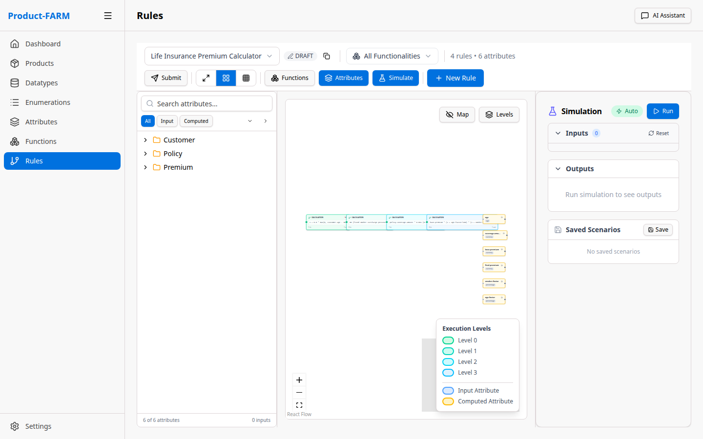

---

## Part 7: Visualize the Rule DAG

The DAG (Directed Acyclic Graph) visualization shows how rules depend on each other and execute in parallel.

### 7.1 View Full DAG

Click **"View DAG"** or expand the canvas to see the full dependency graph:

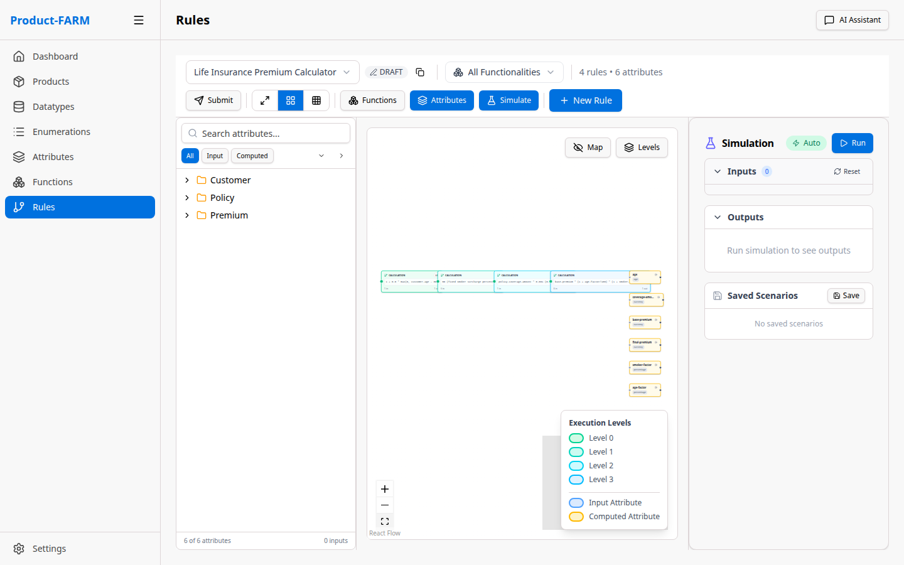

The DAG shows:
- **Input nodes** (green): Where data enters the system
- **Rule nodes** (blue): Processing logic
- **Output nodes** (purple): Final calculated values
- **Dependency arrows**: Data flow between rules

### 7.2 Understanding Parallel Execution

Rules at the same level execute in parallel:

```
Level 0 (Parallel):
├── calculate_base_premium (inputs: coverage_amount)
├── calculate_age_factor (inputs: customer_age)
├── calculate_smoker_factor (inputs: smoker_status)
└── classify_risk_level (inputs: customer_age, smoker_status)

Level 1 (After Level 0):
└── calculate_final_premium (inputs: base_premium, age_factor, smoker_factor)

Level 2 (After Level 1):
└── calculate_monthly_payment (inputs: final_premium)
```

---

## Part 8: Test Your Product

### 8.1 Using the Simulation Panel

Click **"Simulate"** to test your rules with sample data:

```json
{
  "customer_age": 55,
  "coverage_amount": 500000,
  "smoker_status": "OCCASIONAL",
  "policy_type": "STANDARD"
}
```

**Expected Output:**
```json
{
  "base_premium": 10000.00,
  "age_factor": 1.2,
  "smoker_factor": 1.3,
  "risk_level": "MEDIUM",
  "final_premium": 15600.00,
  "monthly_payment": 1300.00
}
```

### 8.2 Using the REST API

```bash
# Evaluate the product
curl -X POST http://localhost:8081/api/products/insurance-premium-v1/evaluate \
  -H "Content-Type: application/json" \
  -d '{
    "inputs": {
      "customer_age": 55,
      "coverage_amount": 500000,
      "smoker_status": "OCCASIONAL",
      "policy_type": "STANDARD"
    }
  }'
```

### 8.3 Using the gRPC API

```bash
grpcurl -plaintext -d '{
  "product_id": "insurance-premium-v1",
  "input_data": {
    "customer_age": {"int_value": 55},
    "coverage_amount": {"decimal_value": "500000"},
    "smoker_status": {"string_value": "OCCASIONAL"}
  }
}' localhost:50051 product_farm.ProductFarmService/Evaluate
```

---

## Stopping Services

To stop all services:

```bash
./stop-all.sh
```

Or manually:
```bash
pkill -f "product-farm-api"
pkill -f "vite"
pkill -f "dgraph"
```

---

## Troubleshooting

### Port Already in Use

```bash
# Find process using port
lsof -i :8081

# Kill the process
kill -9 <PID>
```

### DGraph Not Starting

```bash
# Clear data and restart
rm -rf infrastructure/dgraph-data/*
./start-all.sh
```

### Backend Build Errors

```bash
cd backend
cargo clean
cargo build
```

### Frontend Dependencies

```bash
cd frontend
rm -rf node_modules
npm install
```

---

## Next Steps

Congratulations! You've built a complete insurance premium calculator with:
- ✅ Custom datatypes and enumerations
- ✅ Input, calculated, and output attributes
- ✅ Multiple rules with dependencies
- ✅ Automatic parallel execution via DAG

Now explore more:

### Understand the Product
- [Why Product-FARM](WHY) - Learn why this product was created
- [Core Concepts](CONCEPTS) - Deep dive into terminology and entities

### Technical Deep-Dives
- [How It Works](HOW_IT_WORKS) - Understand rule evaluation internals
- [Architecture Guide](ARCHITECTURE) - System design and components

### More Resources
- [Use Cases](USE_CASES) - Real-world implementation examples
- [Roadmap](ROADMAP) - Future features and vision
- [API Reference](API_REFERENCE) - Complete API documentation
