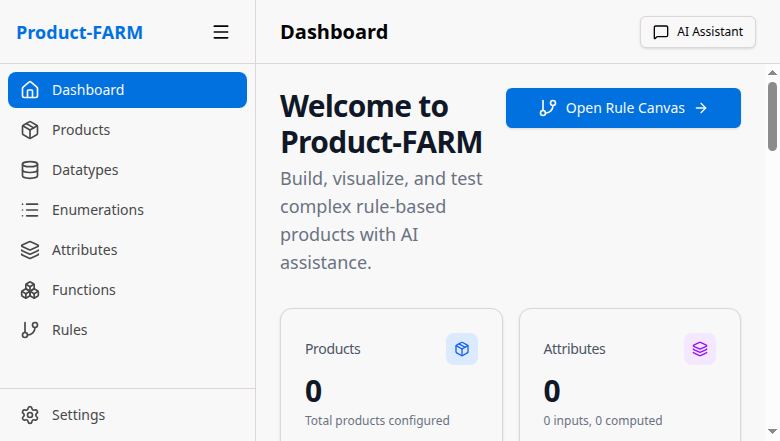

# Quick Start Guide

Get Product-FARM up and running in 5 minutes.

## Prerequisites

Before you begin, ensure you have the following installed:

| Requirement | Version | Installation |
|-------------|---------|--------------|
| **Rust** | 1.75+ | [rustup.rs](https://rustup.rs) |
| **Node.js** | 20+ | [nodejs.org](https://nodejs.org) |
| **Git** | 2.0+ | [git-scm.com](https://git-scm.com) |

## Step 1: Clone the Repository

```bash
git clone https://github.com/ayushmaanbhav/product-farm.git
cd product-farm
```

## Step 2: Start All Services

The easiest way to get started is using the all-in-one start script:

```bash
./start-all.sh
```

This script will start:
- **DGraph Zero** (cluster management) on port 5080
- **DGraph Alpha** (database) on ports 7080, 8080, 9080
- **Backend REST API** on port 8081
- **Frontend** on port 5173

You'll see output like:
```
[INFO] Starting DGraph Zero...
[OK] DGraph Zero started (PID: 12345)
[INFO] Starting DGraph Alpha...
[OK] DGraph Alpha is healthy
[INFO] Starting Backend...
[OK] Backend HTTP is listening on port 8081
[INFO] Starting Frontend...
[OK] Frontend is listening on port 5173
[OK] All services started successfully!
```

## Step 3: Open the Application

Navigate to **http://localhost:5173** in your browser.

You'll see the Product-FARM dashboard:



## Step 4: Create Your First Product

### 4.1 Navigate to Products

Click **"Products"** in the sidebar or the **"Create New Product"** quick action.

### 4.2 Create a New Product

1. Click **"New Product"**
2. Select **"From Scratch"**
3. Fill in the details:
   - **Name**: `insurance-premium-v1`
   - **Template Type**: `INSURANCE`
   - **Description**: `Calculate insurance premiums based on customer data`
4. Click **"Create"**

### 4.3 Add Attributes

Navigate to the **Attributes** tab and create these attributes:

| Name | Component | Type | Description |
|------|-----------|------|-------------|
| `customer_age` | CUSTOMER | INT | Customer's age |
| `coverage_amount` | POLICY | DECIMAL | Coverage amount in dollars |
| `smoker` | CUSTOMER | BOOL | Whether customer smokes |
| `base_premium` | CALCULATED | DECIMAL | Base premium calculation |
| `final_premium` | OUTPUT | DECIMAL | Final premium amount |

### 4.4 Create Rules

Navigate to the **Rules** tab and create these rules:

**Rule 1: Base Premium**
```json
{
  "rule_type": "CALCULATION",
  "display_expression": "base_premium = coverage_amount * 0.02",
  "expression": {
    "*": [{"var": "coverage_amount"}, 0.02]
  },
  "inputs": ["coverage_amount"],
  "outputs": ["base_premium"]
}
```

**Rule 2: Age Factor**
```json
{
  "rule_type": "CALCULATION",
  "display_expression": "age_factor = IF age > 60 THEN 1.2 ELSE 1.0",
  "expression": {
    "if": [
      {">": [{"var": "customer_age"}, 60]},
      1.2,
      1.0
    ]
  },
  "inputs": ["customer_age"],
  "outputs": ["age_factor"]
}
```

**Rule 3: Final Premium**
```json
{
  "rule_type": "CALCULATION",
  "display_expression": "final_premium = base_premium * age_factor",
  "expression": {
    "*": [{"var": "base_premium"}, {"var": "age_factor"}]
  },
  "inputs": ["base_premium", "age_factor"],
  "outputs": ["final_premium"]
}
```

## Step 5: Test with Simulation

1. Click **"Simulate"** in the Rules page
2. Enter test inputs:
   ```json
   {
     "customer_age": 65,
     "coverage_amount": 250000,
     "smoker": false
   }
   ```
3. Click **"Run Simulation"**
4. See the results:
   ```json
   {
     "base_premium": 5000,
     "age_factor": 1.2,
     "final_premium": 6000
   }
   ```

## Step 6: Explore the DAG

Click on the **"Rule Canvas"** to see your rules visualized as a dependency graph:

```
  coverage_amount   customer_age
        │                │
        ▼                ▼
  ┌───────────┐    ┌───────────┐
  │   Rule 1  │    │   Rule 2  │     Level 0 (parallel)
  │base_premium│   │ age_factor│
  └─────┬─────┘    └─────┬─────┘
        │                │
        └────────┬───────┘
                 ▼
           ┌───────────┐
           │   Rule 3  │              Level 1
           │final_prem │
           └───────────┘
```

## Using the AI Assistant

Product-FARM includes an AI assistant to help you create rules using natural language.

### Example Prompts

Click the **"AI Assistant"** button and try these prompts:

1. **"Create a rule that adds 20% to the premium if the customer is over 60"**

2. **"Explain how the premium calculation works"**

3. **"What would be affected if I change the coverage_amount?"**

## API Usage

### REST API

```bash
# Create a product
curl -X POST http://localhost:8081/api/products \
  -H "Content-Type: application/json" \
  -d '{
    "name": "my-product",
    "template_type": "INSURANCE",
    "description": "My first product"
  }'

# Evaluate rules
curl -X POST http://localhost:8081/api/products/my-product/evaluate \
  -H "Content-Type: application/json" \
  -d '{
    "inputs": {
      "customer_age": 65,
      "coverage_amount": 250000
    }
  }'
```

### gRPC API

```bash
# Using grpcurl
grpcurl -plaintext -d '{
  "product_id": "my-product",
  "input_data": {
    "customer_age": {"int_value": 65},
    "coverage_amount": {"decimal_value": "250000"}
  }
}' localhost:50051 product_farm.ProductFarmService/Evaluate
```

## Stopping Services

To stop all services:

```bash
./stop-all.sh
```

Or manually:
```bash
pkill -f "product-farm-api"
pkill -f "vite"
pkill -f "dgraph"
```

## Manual Setup (Alternative)

If you prefer to start services manually:

### Terminal 1: DGraph

```bash
cd infrastructure

# Start Zero (cluster manager)
./dgraph zero --my=localhost:5080 --replicas=1 --raft="idx=1" &

# Wait for Zero to initialize
sleep 5

# Start Alpha (database)
./dgraph alpha --my=localhost:7080 --zero=localhost:5080 &
```

### Terminal 2: Backend

```bash
cd backend
cargo run -p product-farm-api -- 8081
```

### Terminal 3: Frontend

```bash
cd frontend
npm install
npm run dev
```

## Troubleshooting

### Port Already in Use

If a port is already in use:

```bash
# Find process using port
lsof -i :8081

# Kill the process
kill -9 <PID>
```

### DGraph Not Starting

1. Check if DGraph data directory exists:
   ```bash
   ls -la infrastructure/dgraph-data/
   ```

2. Clear data and restart:
   ```bash
   rm -rf infrastructure/dgraph-data/*
   ./start-all.sh
   ```

### Backend Build Errors

```bash
cd backend
cargo clean
cargo build
```

### Frontend Dependencies

```bash
cd frontend
rm -rf node_modules
npm install
```

## Next Steps

- Read the [Architecture Guide](ARCHITECTURE.md) to understand the system design
- Explore [Use Cases](USE_CASES.md) for real-world examples
- Check the [API Reference](API_REFERENCE.md) for detailed endpoint documentation
- Review the [Backend README](../backend/README.md) for development details

## Getting Help

- **GitHub Issues**: Report bugs or request features
- **Documentation**: Check the `/docs` folder for detailed guides
- **AI Assistant**: Use the in-app AI assistant for help with rules
