# Roadmap & Vision

Product-FARM is designed to become the **central nervous system** for product configuration across your entire organization. Here's where we are and where we're heading.

---

## Current Capabilities (v1.0)

### Core Rule Engine
- ✅ JSON Logic expression support
- ✅ Tiered compilation (AST + Bytecode VM)
- ✅ Sub-microsecond evaluation latency
- ✅ DAG-based parallel execution
- ✅ Full type system with custom datatypes

### Product Management
- ✅ Product lifecycle (Draft → Active → Discontinued)
- ✅ Version control for products
- ✅ Component-based organization
- ✅ Abstract and concrete attributes

### APIs
- ✅ REST API (Axum framework)
- ✅ gRPC API (Tonic framework)
- ✅ Batch evaluation support
- ✅ Health check and metrics endpoints

### User Interface
- ✅ Visual rule builder
- ✅ DAG visualization canvas
- ✅ Real-time rule simulation
- ✅ AI-powered assistant

### Data Storage
- ✅ DGraph graph database
- ✅ LRU caching layer
- ✅ File-based configuration backup

---

## Planned Features

### Phase 1: Enterprise Data Import/Export

#### Mass Import from Excel/CSV

Import entire product configurations from spreadsheets—perfect for migrating existing rule systems or bulk updates.

```mermaid
flowchart LR
    subgraph Workflow["📥 EXCEL IMPORT WORKFLOW"]
        direction LR
        S1["📤 Upload<br/>Excel"]
        S2["🔍 Parse &<br/>Preview"]
        S3["✅ Validate<br/>Rules"]
        S4["💾 Import<br/>to System"]

        S1 --> S2 --> S3 --> S4
    end

    subgraph Formats["📄 Supported Formats"]
        F1[".xlsx - Excel 2007+"]
        F2[".csv - Comma-separated"]
        F3[".json - Structured JSON"]
        F4[".yaml - YAML config"]
    end

    style Workflow fill:#0f172a,stroke:#3b82f6,color:#fff
    style Formats fill:#1e3a5f,stroke:#3b82f6,color:#fff
    style S1 fill:#6366f1,stroke:#8b5cf6,color:#fff
    style S2 fill:#1e3a5f,stroke:#3b82f6,color:#fff
    style S3 fill:#065f46,stroke:#10b981,color:#fff
    style S4 fill:#065f46,stroke:#10b981,color:#fff
```



**Example Excel Format:**

| Rule Name | Expression | Inputs | Outputs | Description |
|-----------|------------|--------|---------|-------------|
| base_premium | coverage * 0.02 | coverage_amount | base_premium | Calculate base |
| age_factor | IF(age>60,1.5,IF(age>40,1.2,1.0)) | customer_age | age_factor | Age multiplier |
| final_premium | base * age_factor | base_premium, age_factor | final_premium | Final calc |

**Capabilities:**
- Drag-and-drop file upload
- Real-time validation preview
- Conflict detection and resolution
- Partial import support
- Rollback on failure

#### Export to Multiple Formats

Export product configurations for backup, migration, or documentation.

```bash
# Export entire product
GET /api/products/{id}/export?format=excel

# Export specific components
GET /api/products/{id}/export?format=json&components=premium,risk

# Export for documentation
GET /api/products/{id}/export?format=markdown
```

**Export Formats:**
- Excel (.xlsx) with multiple sheets
- JSON (complete or filtered)
- YAML (human-readable)
- Markdown (documentation)
- PDF (printable reports)

---

### Phase 2: Microservices Ecosystem

#### Product-FARM as Central Hub

Transform Product-FARM into the **source of truth** for all product logic across your microservices ecosystem.

```mermaid
flowchart TB
    subgraph PF["🎯 PRODUCT-FARM (Source of Truth)"]
        PFC["📦 Products<br/>⚡ Rules<br/>⚙️ Configurations"]
    end

    subgraph Services["🔧 MICROSERVICES"]
        direction LR
        PS["💰 PRICING<br/>SERVICE<br/><small>pricing, discount, tax</small>"]
        US["📋 UNDERWRITING<br/>SERVICE<br/><small>underwriting, risk, eligibility</small>"]
        CS["📝 CLAIMS<br/>SERVICE<br/><small>claims, settlement, validation</small>"]
    end

    subgraph Channels["🌐 CONSUMER CHANNELS"]
        direction LR
        WP["Web Portal"]
        MA["Mobile App"]
        PA["Partner API"]
        AG["Agents"]
    end

    PF --> PS
    PF --> US
    PF --> CS
    PS --> Channels
    US --> Channels
    CS --> Channels

    style PF fill:#6366f1,stroke:#8b5cf6,color:#fff
    style Services fill:#1e3a5f,stroke:#3b82f6,color:#fff
    style Channels fill:#065f46,stroke:#10b981,color:#fff
```



#### Service Integration Patterns

**SDK Libraries**
```rust
// Rust SDK
use product_farm_sdk::Client;

let client = Client::new("http://product-farm:8081");
let result = client.evaluate("insurance-premium-v1", "quote", inputs).await?;
```

```typescript
// TypeScript SDK
import { ProductFarmClient } from '@product-farm/sdk';

const client = new ProductFarmClient('http://product-farm:8081');
const result = await client.evaluate('insurance-premium-v1', 'quote', inputs);
```

```python
# Python SDK
from product_farm import Client

client = Client("http://product-farm:8081")
result = client.evaluate("insurance-premium-v1", "quote", inputs)
```

**gRPC Streaming**
```protobuf
// High-throughput batch processing
service ProductFarmService {
  // Bidirectional streaming for batch evaluation
  rpc EvaluateBatch(stream EvaluateRequest) returns (stream EvaluateResponse);

  // Server-sent events for rule updates
  rpc WatchRuleChanges(WatchRequest) returns (stream RuleChangeEvent);
}
```

---

### Phase 3: Event-Driven Architecture

#### Webhooks & Notifications

Get notified when rules change, products are deployed, or evaluations fail.

```mermaid
flowchart LR
    subgraph Events["📡 EVENTS"]
        direction TB
        E1["product.created"]
        E2["product.updated"]
        E3["product.activated"]
        E4["product.deprecated"]
        E5["rule.created"]
        E6["rule.updated"]
        E7["evaluation.failed"]
        E8["evaluation.slow"]
    end

    subgraph Webhooks["🔔 WEBHOOK ENDPOINTS"]
        W1["Slack"]
        W2["Teams"]
        W3["PagerDuty"]
        W4["Custom HTTP"]
    end

    subgraph Queues["📬 MESSAGE QUEUES"]
        Q1["Kafka"]
        Q2["RabbitMQ"]
        Q3["AWS SQS"]
    end

    Events --> Webhooks
    Events --> Queues

    style Events fill:#6366f1,stroke:#8b5cf6,color:#fff
    style Webhooks fill:#065f46,stroke:#10b981,color:#fff
    style Queues fill:#1e3a5f,stroke:#3b82f6,color:#fff
```



**Webhook Configuration**
```json
{
  "webhooks": [
    {
      "url": "https://slack.com/api/webhooks/xyz",
      "events": ["product.activated", "evaluation.failed"],
      "secret": "whsec_...",
      "retry_policy": {
        "max_retries": 3,
        "backoff": "exponential"
      }
    }
  ]
}
```

---

### Phase 4: Advanced AI Capabilities

#### Natural Language Rule Creation

Describe rules in plain English; AI converts them to JSON Logic.

```mermaid
sequenceDiagram
    participant U as 👤 User
    participant AI as 🤖 AI Assistant

    U->>AI: Create a discount rule that gives 15% off<br/>for customers who have been with us<br/>more than 3 years AND have made<br/>at least 5 purchases this year

    AI->>AI: Parse natural language

    AI->>U: I've created the loyalty discount rule:

    Note right of AI: Name: loyalty_discount<br/>Type: CALCULATION<br/><br/>Expression:<br/>IF (years_as_customer > 3<br/>AND annual_purchases >= 5)<br/>THEN price * 0.85<br/>ELSE price<br/><br/>Inputs: years_as_customer,<br/>annual_purchases, price<br/>Output: discounted_price

    U->>AI: [Create Rule] [Modify] [Test]
```



#### Intelligent Optimization

AI analyzes your rules and suggests optimizations.

```mermaid
flowchart TB
    subgraph Analysis["🔍 AI OPTIMIZATION SUGGESTIONS"]
        direction TB
        subgraph Header["Analysis of: insurance-premium-v1"]
            H1["⚡ Performance Issues Found"]
        end

        subgraph Issues["Issues Detected"]
            I1["1️⃣ <b>calculate_complex_factor</b><br/>50K evals, only 3 distinct values<br/>→ Convert to lookup table (3x faster)"]
            I2["2️⃣ <b>validate_age + check_age_range</b><br/>Redundant rules detected<br/>→ Merge into single rule"]
            I3["3️⃣ <b>DAG Level 4</b><br/>Single rule blocking parallelism<br/>→ Restructure for parallel execution"]
        end

        subgraph Result["📈 Estimated Improvement"]
            R1["2.1x faster evaluation"]
        end

        Actions["[Apply All] [Review Each] [Dismiss]"]
    end

    style Analysis fill:#0f172a,stroke:#3b82f6,color:#fff
    style Header fill:#6366f1,stroke:#8b5cf6,color:#fff
    style Issues fill:#4a1a1a,stroke:#ef4444,color:#fff
    style Result fill:#065f46,stroke:#10b981,color:#fff
```



#### Rule Testing & Simulation

AI generates test cases and validates rule behavior.


---

### Phase 5: Enterprise Features

#### Multi-Tenant Support

Isolate products and rules by tenant for SaaS deployments.

```mermaid
flowchart TB
    subgraph Platform["🏢 PRODUCT-FARM PLATFORM"]
        direction TB

        subgraph Tenants["Multi-Tenant Architecture"]
            direction LR
            subgraph TA["🔹 TENANT A"]
                TA1["Products: 5<br/>Rules: 45<br/>Users: 10<br/><b>Plan: Basic</b>"]
            end
            subgraph TB["🔸 TENANT B"]
                TB1["Products: 12<br/>Rules: 120<br/>Users: 50<br/><b>Plan: Pro</b>"]
            end
            subgraph TC["🔹 TENANT C"]
                TC1["Products: 3<br/>Rules: 28<br/>Users: 5<br/><b>Plan: Basic</b>"]
            end
        end

        subgraph Features["Platform Features"]
            direction LR
            F1["🔒 Isolation: Complete data separation"]
            F2["💰 Billing: Per-evaluation metering"]
            F3["📊 Limits: Configurable per tenant"]
        end
    end

    style Platform fill:#0f172a,stroke:#3b82f6,color:#fff
    style TA fill:#1e3a5f,stroke:#3b82f6,color:#fff
    style TB fill:#6366f1,stroke:#8b5cf6,color:#fff
    style TC fill:#1e3a5f,stroke:#3b82f6,color:#fff
    style Features fill:#065f46,stroke:#10b981,color:#fff
```



#### Role-Based Access Control (RBAC)

Fine-grained permissions for teams and users.

| Role | Permissions |
|------|-------------|
| **Viewer** | Read products, rules, view evaluations |
| **Editor** | Create/edit draft products, run simulations |
| **Publisher** | Submit products for approval, manage lifecycle |
| **Admin** | Approve products, manage users, configure system |
| **Super Admin** | Manage tenants, billing, platform configuration |

#### Audit & Compliance

Complete audit trail for regulatory compliance.

```json
{
  "audit_events": [
    {
      "event_id": "evt_82734",
      "timestamp": "2024-01-15T14:32:00Z",
      "actor": {
        "user_id": "usr_456",
        "email": "jane.smith@company.com",
        "ip_address": "192.168.1.100"
      },
      "action": "RULE_UPDATED",
      "resource": {
        "type": "rule",
        "id": "calculate_premium",
        "product_id": "insurance-premium-v1"
      },
      "changes": {
        "field": "expression",
        "old_value": "base * 1.2",
        "new_value": "base * 1.25"
      },
      "metadata": {
        "reason": "Q1 pricing adjustment",
        "ticket": "JIRA-4521"
      }
    }
  ]
}
```

---

## Long-Term Vision

### The Product Platform

Product-FARM evolves into a **complete product platform** where:

```mermaid
flowchart TB
    subgraph Vision["🎯 THE PRODUCT PLATFORM VISION"]
        direction TB

        subgraph Comparison["Today vs Tomorrow"]
            direction LR
            subgraph Today["❌ Today's State"]
                T1["Rules in code"]
                T2["Logic in spreadsheets"]
                T3["Inconsistent calculations"]
                T4["Slow changes"]
                T5["No audit trail"]
                T6["Developer bottleneck"]
            end
            subgraph Tomorrow["✅ Tomorrow's Vision"]
                V1["Rules in Product-FARM"]
                V2["Visual rule builder"]
                V3["Single source of truth"]
                V4["Real-time updates"]
                V5["Complete compliance"]
                V6["Business self-service"]
            end
        end

        subgraph Capabilities["The Product Platform Serves As"]
            direction LR
            C1["📦 PRODUCT CATALOG<br/><small>Central registry</small>"]
            C2["🧮 CALCULATION ENGINE<br/><small>Sub-µs latency</small>"]
            C3["📋 CONFIGURATION STORE<br/><small>All configs</small>"]
            C4["🔍 AUDIT SYSTEM<br/><small>Every change tracked</small>"]
            C5["🤖 AI ASSISTANT<br/><small>Create & optimize</small>"]
            C6["🔄 INTEGRATION HUB<br/><small>REST, gRPC, events</small>"]
        end
    end

    Today -.->|Transform| Tomorrow

    style Vision fill:#0f172a,stroke:#3b82f6,color:#fff
    style Today fill:#4a1a1a,stroke:#ef4444,color:#fff
    style Tomorrow fill:#065f46,stroke:#10b981,color:#fff
    style Capabilities fill:#1e3a5f,stroke:#3b82f6,color:#fff
```



### Impact Metrics

When fully realized, the Product Platform delivers:

| Metric | Before | After | Improvement |
|--------|--------|-------|-------------|
| Time to change rule | 2-3 weeks | 2-3 hours | **50x faster** |
| Calculation consistency | ~80% | 100% | **Zero discrepancies** |
| Audit compliance | Manual | Automatic | **100% coverage** |
| Developer involvement | Every change | Configuration only | **90% reduction** |
| Time to market | Months | Days | **10x faster** |

---

## Contributing to the Roadmap

Product-FARM is open source. We welcome contributions and feedback!

### How to Contribute

1. **Feature Requests**: Open an issue on GitHub
2. **Bug Reports**: Include reproduction steps
3. **Code Contributions**: Submit a pull request
4. **Documentation**: Help improve our docs

### Community

- **GitHub**: [github.com/ayushmaanbhav/product-farm](https://github.com/ayushmaanbhav/product-farm)
- **Discussions**: GitHub Discussions for questions and ideas

---

## Timeline

| Phase | Focus | Target |
|-------|-------|--------|
| **v1.0** | Core Engine + UI | ✅ Released |
| **v1.1** | Excel Import/Export | Q2 2025 |
| **v1.2** | SDK Libraries | Q2 2025 |
| **v2.0** | Event System + Webhooks | Q3 2025 |
| **v2.1** | Advanced AI Features | Q4 2025 |
| **v3.0** | Multi-Tenant + Enterprise | 2026 |

---

## Get Started Today

Don't wait for future features—start using Product-FARM now!

<div class="cta-buttons" markdown="1">

[Quick Start Guide](QUICK_START) - Get running in 5 minutes

[Core Concepts](CONCEPTS) - Understand the fundamentals

[Architecture](ARCHITECTURE) - Technical deep-dive

</div>
