```mermaid
flowchart LR
    subgraph Product["🏦 INSURANCE PRODUCT"]
        direction TB
        subgraph Inputs["📥 INPUTS"]
            I1["customer_age: INT"]
            I2["coverage: DECIMAL"]
            I3["smoker: BOOL"]
            I4["bmi: DECIMAL"]
            I5["coverage_type: ENUM"]
            I6["policy_count: INT"]
        end

        subgraph Calculated["⚙️ CALCULATED"]
            C1["base_premium"]
            C2["age_factor"]
            C3["smoker_factor"]
            C4["bmi_factor"]
            C5["type_multiplier"]
            C6["discount_factor"]
        end

        subgraph Output["📤 OUTPUT"]
            O1["final_premium: DECIMAL"]
        end
    end

    Inputs --> Calculated --> Output

    style Product fill:#0f172a,stroke:#3b82f6,color:#fff
    style Inputs fill:#1e3a5f,stroke:#3b82f6,color:#fff
    style Calculated fill:#4c1d95,stroke:#8b5cf6,color:#fff
    style Output fill:#065f46,stroke:#10b981,color:#fff
```

```mermaid
flowchart LR
    subgraph Strategy["📈 TRADING STRATEGY"]
        direction TB
        subgraph MarketData["📊 MARKET DATA"]
            M1["price: DECIMAL"]
            M2["rsi_14: DECIMAL"]
            M3["sma_50: DECIMAL"]
            M4["sma_200: DECIMAL"]
            M5["volume: INT"]
            M6["avg_volume: INT"]
            M7["account_size: DECIMAL"]
        end

        subgraph Calculated["⚙️ CALCULATED"]
            C1["oversold: BOOL"]
            C2["overbought: BOOL"]
            C3["above_trend: BOOL"]
            C4["volume_spike: BOOL"]
            C5["risk_pct: DECIMAL"]
        end

        subgraph Outputs["📤 OUTPUTS"]
            O1["entry_signal: ENUM<br/>(BUY, SELL, HOLD)"]
            O2["position_size: DECIMAL"]
        end
    end

    MarketData --> Calculated --> Outputs

    style Strategy fill:#0f172a,stroke:#3b82f6,color:#fff
    style MarketData fill:#1e3a5f,stroke:#3b82f6,color:#fff
    style Calculated fill:#4c1d95,stroke:#8b5cf6,color:#fff
    style Outputs fill:#065f46,stroke:#10b981,color:#fff
```

# Use Cases

Product-FARM is a domain-agnostic rule engine that can power various business applications. This document provides detailed examples across different industries.

## Table of Contents

- [Insurance Premium Calculation](#insurance-premium-calculation)
- [Trading Signal Generation](#trading-signal-generation)
- [Loan Eligibility Assessment](#loan-eligibility-assessment)
- [E-commerce Pricing Engine](#e-commerce-pricing-engine)
- [Healthcare Risk Scoring](#healthcare-risk-scoring)
- [Custom Use Cases](#custom-use-cases)

---

## Insurance Premium Calculation

Calculate insurance premiums based on customer demographics, coverage options, and risk factors.

### Business Requirements

- Base premium calculated from coverage amount
- Age-based risk adjustments
- Lifestyle factors (smoking, BMI)
- Coverage type multipliers
- Multi-policy discounts

### Data Model



### Rules Configuration

**Rule 1: Base Premium**
```json
{
  "rule_type": "BASE_CALCULATION",
  "display_expression": "base_premium = coverage × 0.02",
  "expression": {
    "*": [{"var": "coverage"}, 0.02]
  },
  "inputs": ["coverage"],
  "outputs": ["base_premium"]
}
```

**Rule 2: Age Factor**
```json
{
  "rule_type": "RISK_FACTOR",
  "display_expression": "age_factor = IF age > 70 THEN 1.5 ELSE IF age > 60 THEN 1.2 ELSE IF age > 50 THEN 1.1 ELSE 1.0",
  "expression": {
    "if": [
      {">": [{"var": "customer_age"}, 70]}, 1.5,
      {">": [{"var": "customer_age"}, 60]}, 1.2,
      {">": [{"var": "customer_age"}, 50]}, 1.1,
      1.0
    ]
  },
  "inputs": ["customer_age"],
  "outputs": ["age_factor"]
}
```

**Rule 3: Smoker Factor**
```json
{
  "rule_type": "RISK_FACTOR",
  "display_expression": "smoker_factor = IF smoker THEN 1.5 ELSE 1.0",
  "expression": {
    "if": [{"var": "smoker"}, 1.5, 1.0]
  },
  "inputs": ["smoker"],
  "outputs": ["smoker_factor"]
}
```

**Rule 4: BMI Factor**
```json
{
  "rule_type": "RISK_FACTOR",
  "display_expression": "bmi_factor = IF bmi > 35 THEN 1.3 ELSE IF bmi > 30 THEN 1.15 ELSE 1.0",
  "expression": {
    "if": [
      {">": [{"var": "bmi"}, 35]}, 1.3,
      {">": [{"var": "bmi"}, 30]}, 1.15,
      1.0
    ]
  },
  "inputs": ["bmi"],
  "outputs": ["bmi_factor"]
}
```

**Rule 5: Coverage Type Multiplier**
```json
{
  "rule_type": "PRODUCT_CONFIG",
  "display_expression": "type_multiplier based on coverage_type enum",
  "expression": {
    "if": [
      {"==": [{"var": "coverage_type"}, "COMPREHENSIVE"]}, 1.5,
      {"==": [{"var": "coverage_type"}, "STANDARD"]}, 1.2,
      {"==": [{"var": "coverage_type"}, "BASIC"]}, 1.0,
      1.0
    ]
  },
  "inputs": ["coverage_type"],
  "outputs": ["type_multiplier"]
}
```

**Rule 6: Multi-Policy Discount**
```json
{
  "rule_type": "DISCOUNT",
  "display_expression": "discount = IF policies >= 3 THEN 0.85 ELSE IF policies >= 2 THEN 0.90 ELSE 1.0",
  "expression": {
    "if": [
      {">=": [{"var": "policy_count"}, 3]}, 0.85,
      {">=": [{"var": "policy_count"}, 2]}, 0.90,
      1.0
    ]
  },
  "inputs": ["policy_count"],
  "outputs": ["discount_factor"]
}
```

**Rule 7: Final Premium**
```json
{
  "rule_type": "FINAL_CALCULATION",
  "display_expression": "final_premium = base × age × smoker × bmi × type × discount",
  "expression": {
    "*": [
      {"var": "base_premium"},
      {"var": "age_factor"},
      {"var": "smoker_factor"},
      {"var": "bmi_factor"},
      {"var": "type_multiplier"},
      {"var": "discount_factor"}
    ]
  },
  "inputs": ["base_premium", "age_factor", "smoker_factor", "bmi_factor", "type_multiplier", "discount_factor"],
  "outputs": ["final_premium"]
}
```

### Execution DAG


### Example Evaluation

**Input:**
```json
{
  "customer_age": 65,
  "coverage": 250000,
  "smoker": false,
  "bmi": 28,
  "coverage_type": "STANDARD",
  "policy_count": 2
}
```

**Execution:**

| Level | Rule | Calculation | Result |
|-------|------|-------------|--------|
| **0 (parallel)** | Rule 1 | 250000 × 0.02 | base_premium = 5000 |
| **0** | Rule 2 | age 65 > 60 | age_factor = 1.2 |
| **0** | Rule 3 | smoker false | smoker_factor = 1.0 |
| **0** | Rule 4 | bmi 28 ≤ 30 | bmi_factor = 1.0 |
| **0** | Rule 5 | STANDARD | type_multiplier = 1.2 |
| **0** | Rule 6 | 2 policies | discount_factor = 0.90 |
| **1** | Rule 7 | 5000 × 1.2 × 1.0 × 1.0 × 1.2 × 0.90 | **final_premium = 6480** |

**Output:**
```json
{
  "base_premium": 5000,
  "age_factor": 1.2,
  "smoker_factor": 1.0,
  "bmi_factor": 1.0,
  "type_multiplier": 1.2,
  "discount_factor": 0.90,
  "final_premium": 6480
}
```

---

## Trading Signal Generation

Generate buy/sell signals based on technical indicators and market conditions.

### Business Requirements

- RSI-based oversold/overbought detection
- Moving average trend confirmation
- Volume spike detection
- Multi-condition entry/exit signals
- Position sizing based on risk

### Data Model



### Rules Configuration

**Rule 1: Oversold Detection**
```json
{
  "rule_type": "INDICATOR",
  "display_expression": "oversold = RSI < 30",
  "expression": {
    "<": [{"var": "rsi_14"}, 30]
  },
  "inputs": ["rsi_14"],
  "outputs": ["oversold"]
}
```

**Rule 2: Overbought Detection**
```json
{
  "rule_type": "INDICATOR",
  "display_expression": "overbought = RSI > 70",
  "expression": {
    ">": [{"var": "rsi_14"}, 70]
  },
  "inputs": ["rsi_14"],
  "outputs": ["overbought"]
}
```

**Rule 3: Trend Confirmation**
```json
{
  "rule_type": "INDICATOR",
  "display_expression": "above_trend = price > SMA50 AND SMA50 > SMA200",
  "expression": {
    "and": [
      {">": [{"var": "price"}, {"var": "sma_50"}]},
      {">": [{"var": "sma_50"}, {"var": "sma_200"}]}
    ]
  },
  "inputs": ["price", "sma_50", "sma_200"],
  "outputs": ["above_trend"]
}
```

**Rule 4: Volume Spike**
```json
{
  "rule_type": "INDICATOR",
  "display_expression": "volume_spike = volume > 1.5 × avg_volume",
  "expression": {
    ">": [
      {"var": "volume"},
      {"*": [{"var": "avg_volume"}, 1.5]}
    ]
  },
  "inputs": ["volume", "avg_volume"],
  "outputs": ["volume_spike"]
}
```

**Rule 5: Entry Signal**
```json
{
  "rule_type": "SIGNAL",
  "display_expression": "BUY if oversold AND above_trend AND volume_spike, SELL if overbought AND NOT above_trend, else HOLD",
  "expression": {
    "if": [
      {"and": [
        {"var": "oversold"},
        {"var": "above_trend"},
        {"var": "volume_spike"}
      ]}, "BUY",
      {"and": [
        {"var": "overbought"},
        {"!": [{"var": "above_trend"}]}
      ]}, "SELL",
      "HOLD"
    ]
  },
  "inputs": ["oversold", "overbought", "above_trend", "volume_spike"],
  "outputs": ["entry_signal"]
}
```

**Rule 6: Position Size**
```json
{
  "rule_type": "RISK_MANAGEMENT",
  "display_expression": "position_size = IF signal = BUY THEN account × 2% / price ELSE 0",
  "expression": {
    "if": [
      {"==": [{"var": "entry_signal"}, "BUY"]},
      {"/": [
        {"*": [{"var": "account_size"}, 0.02]},
        {"var": "price"}
      ]},
      0
    ]
  },
  "inputs": ["entry_signal", "account_size", "price"],
  "outputs": ["position_size"]
}
```

### Example Evaluation

**Input:**
```json
{
  "price": 150.50,
  "rsi_14": 28,
  "sma_50": 148.00,
  "sma_200": 145.00,
  "volume": 2500000,
  "avg_volume": 1500000,
  "account_size": 100000
}
```

**Output:**
```json
{
  "oversold": true,
  "overbought": false,
  "above_trend": true,
  "volume_spike": true,
  "entry_signal": "BUY",
  "position_size": 13.29
}
```

---

## Loan Eligibility Assessment

Evaluate loan applications based on credit scores, income, and debt ratios.

### Business Requirements

- Credit score thresholds
- Income requirements
- Debt-to-income ratio limits
- Employment verification
- Maximum loan amount calculation

### Rules Configuration

**Rule 1: Credit Score Check**
```json
{
  "rule_type": "ELIGIBILITY",
  "expression": {
    "if": [
      {">=": [{"var": "credit_score"}, 750]}, "EXCELLENT",
      {">=": [{"var": "credit_score"}, 700]}, "GOOD",
      {">=": [{"var": "credit_score"}, 650]}, "FAIR",
      {">=": [{"var": "credit_score"}, 600]}, "POOR",
      "REJECTED"
    ]
  },
  "inputs": ["credit_score"],
  "outputs": ["credit_tier"]
}
```

**Rule 2: Income Verification**
```json
{
  "rule_type": "ELIGIBILITY",
  "expression": {
    "and": [
      {">=": [{"var": "annual_income"}, 30000]},
      {">=": [{"var": "employment_months"}, 24]}
    ]
  },
  "inputs": ["annual_income", "employment_months"],
  "outputs": ["income_verified"]
}
```

**Rule 3: Debt-to-Income Ratio**
```json
{
  "rule_type": "CALCULATION",
  "expression": {
    "/": [
      {"var": "monthly_debt"},
      {"/": [{"var": "annual_income"}, 12]}
    ]
  },
  "inputs": ["monthly_debt", "annual_income"],
  "outputs": ["dti_ratio"]
}
```

**Rule 4: DTI Check**
```json
{
  "rule_type": "ELIGIBILITY",
  "expression": {
    "<=": [{"var": "dti_ratio"}, 0.43]
  },
  "inputs": ["dti_ratio"],
  "outputs": ["dti_acceptable"]
}
```

**Rule 5: Final Eligibility**
```json
{
  "rule_type": "DECISION",
  "expression": {
    "and": [
      {"!=": [{"var": "credit_tier"}, "REJECTED"]},
      {"var": "income_verified"},
      {"var": "dti_acceptable"}
    ]
  },
  "inputs": ["credit_tier", "income_verified", "dti_acceptable"],
  "outputs": ["eligible"]
}
```

**Rule 6: Max Loan Amount**
```json
{
  "rule_type": "CALCULATION",
  "expression": {
    "if": [
      {"var": "eligible"},
      {"*": [
        {"var": "annual_income"},
        {"if": [
          {"==": [{"var": "credit_tier"}, "EXCELLENT"]}, 5,
          {"==": [{"var": "credit_tier"}, "GOOD"]}, 4,
          {"==": [{"var": "credit_tier"}, "FAIR"]}, 3,
          2
        ]}
      ]},
      0
    ]
  },
  "inputs": ["eligible", "annual_income", "credit_tier"],
  "outputs": ["max_loan_amount"]
}
```

### Example Evaluation

**Input:**
```json
{
  "credit_score": 720,
  "annual_income": 75000,
  "employment_months": 36,
  "monthly_debt": 2000
}
```

**Output:**
```json
{
  "credit_tier": "GOOD",
  "income_verified": true,
  "dti_ratio": 0.32,
  "dti_acceptable": true,
  "eligible": true,
  "max_loan_amount": 300000
}
```

---

## E-commerce Pricing Engine

Dynamic pricing based on customer segments, inventory, and promotions.

### Rules Configuration

**Rule 1: Customer Segment Discount**
```json
{
  "rule_type": "DISCOUNT",
  "expression": {
    "if": [
      {"==": [{"var": "customer_tier"}, "PLATINUM"]}, 0.20,
      {"==": [{"var": "customer_tier"}, "GOLD"]}, 0.15,
      {"==": [{"var": "customer_tier"}, "SILVER"]}, 0.10,
      0.0
    ]
  },
  "inputs": ["customer_tier"],
  "outputs": ["tier_discount"]
}
```

**Rule 2: Inventory-Based Pricing**
```json
{
  "rule_type": "PRICING",
  "expression": {
    "if": [
      {"<": [{"var": "stock_level"}, 10]}, 1.10,
      {"<": [{"var": "stock_level"}, 50]}, 1.05,
      {">": [{"var": "stock_level"}, 200]}, 0.95,
      1.0
    ]
  },
  "inputs": ["stock_level"],
  "outputs": ["inventory_factor"]
}
```

**Rule 3: Promotional Price**
```json
{
  "rule_type": "PRICING",
  "expression": {
    "*": [
      {"var": "base_price"},
      {"var": "inventory_factor"},
      {"-": [1, {"var": "tier_discount"}]},
      {"-": [1, {"var": "promo_discount"}]}
    ]
  },
  "inputs": ["base_price", "inventory_factor", "tier_discount", "promo_discount"],
  "outputs": ["final_price"]
}
```

---

## Healthcare Risk Scoring

Calculate patient risk scores for preventive care.

### Rules Configuration

**Rule 1: Age Risk**
```json
{
  "rule_type": "RISK_FACTOR",
  "expression": {
    "if": [
      {">": [{"var": "age"}, 70]}, 30,
      {">": [{"var": "age"}, 60]}, 20,
      {">": [{"var": "age"}, 50]}, 10,
      5
    ]
  },
  "inputs": ["age"],
  "outputs": ["age_risk_score"]
}
```

**Rule 2: Condition Risk**
```json
{
  "rule_type": "RISK_FACTOR",
  "expression": {
    "+": [
      {"if": [{"var": "has_diabetes"}, 25, 0]},
      {"if": [{"var": "has_hypertension"}, 20, 0]},
      {"if": [{"var": "has_heart_disease"}, 30, 0]},
      {"if": [{"var": "smoker"}, 15, 0]}
    ]
  },
  "inputs": ["has_diabetes", "has_hypertension", "has_heart_disease", "smoker"],
  "outputs": ["condition_risk_score"]
}
```

**Rule 3: Total Risk Score**
```json
{
  "rule_type": "CALCULATION",
  "expression": {
    "min": [
      {"+": [
        {"var": "age_risk_score"},
        {"var": "condition_risk_score"},
        {"var": "lifestyle_risk_score"}
      ]},
      100
    ]
  },
  "inputs": ["age_risk_score", "condition_risk_score", "lifestyle_risk_score"],
  "outputs": ["total_risk_score"]
}
```

**Rule 4: Risk Category**
```json
{
  "rule_type": "CLASSIFICATION",
  "expression": {
    "if": [
      {">=": [{"var": "total_risk_score"}, 75]}, "HIGH",
      {">=": [{"var": "total_risk_score"}, 50]}, "MODERATE",
      {">=": [{"var": "total_risk_score"}, 25]}, "LOW",
      "MINIMAL"
    ]
  },
  "inputs": ["total_risk_score"],
  "outputs": ["risk_category"]
}
```

---

## Custom Use Cases

Product-FARM's domain-agnostic design supports any rule-based business logic:

### Potential Applications

| Industry | Use Case | Key Features |
|----------|----------|--------------|
| **Real Estate** | Property valuation | Location factors, market trends, comparable analysis |
| **HR** | Salary calculation | Experience, skills, market rates, performance |
| **Manufacturing** | Quality scoring | Defect rates, process metrics, tolerances |
| **Logistics** | Shipping cost | Weight, distance, zones, speed |
| **Gaming** | Player matchmaking | Skill ratings, latency, preferences |
| **Marketing** | Lead scoring | Engagement, demographics, behavior |

### Building Your Own Use Case

1. **Define Inputs**: What data do you have?
2. **Define Outputs**: What decisions/calculations do you need?
3. **Map Dependencies**: Which outputs depend on which inputs?
4. **Write Rules**: Express logic as JSON Logic
5. **Test with Simulation**: Verify with sample data
6. **Deploy**: Use REST or gRPC API to integrate

### JSON Logic Quick Reference

```json
// Arithmetic
{"*": [{"var": "a"}, {"var": "b"}]}           // a × b
{"+": [{"var": "a"}, {"var": "b"}]}           // a + b
{"/": [{"var": "a"}, {"var": "b"}]}           // a ÷ b

// Comparison
{">": [{"var": "a"}, 10]}                     // a > 10
{">=": [{"var": "a"}, {"var": "b"}]}          // a >= b
{"==": [{"var": "a"}, "value"]}               // a == "value"

// Logic
{"and": [{"var": "a"}, {"var": "b"}]}         // a AND b
{"or": [{"var": "a"}, {"var": "b"}]}          // a OR b
{"!": [{"var": "a"}]}                         // NOT a

// Conditional
{"if": [condition, then, else]}               // IF-THEN-ELSE
{"if": [cond1, val1, cond2, val2, default]}   // Multi-branch

// Arrays
{"in": ["value", {"var": "array"}]}           // value in array
{"all": [{"var": "array"}, {">": [{"var": ""}, 0]}]}  // All > 0
```

---

## Summary

Product-FARM excels at:

- **Complex Calculations**: Multi-step formulas with dependencies
- **Decision Trees**: Multi-branch conditional logic
- **Risk Assessment**: Factor-based scoring systems
- **Dynamic Pricing**: Context-aware price calculations
- **Eligibility Checks**: Multi-criteria qualification

The visual DAG editor and AI assistant make it easy to create and maintain these rule systems without writing code.
