# Why Product-FARM?

## The Problem We Solve

Every software product has business logic. Pricing calculations, eligibility rules, risk assessments, approval workflows—these rules define how your product behaves. But how are these rules typically managed?

### The Current Reality

<div class="problem-grid">

**Scattered Across Code**
```java
// Hidden in service layer
if (customer.age > 65 && customer.income < 50000) {
    premium = basePremium * 1.5;
} else if (customer.riskScore > 7) {
    premium = basePremium * 1.3;
}
// ... 500 more lines scattered across 20 files
```

**Buried in Spreadsheets**
```text
Excel files passed between teams
- v1_final.xlsx
- v1_final_FINAL.xlsx
- v1_final_FINAL_approved_v2.xlsx
No version control. No audit trail.
```

**Lost in Configuration Files**
```yaml
# config/pricing_rules.yaml
# Last modified: ???
# By whom: ???
# Why: ???
rules:
  - condition: "age > 65"
    action: "multiply 1.5"
```

</div>

### The Consequences

| Problem | Impact |
|---------|--------|
| **Fragmented Logic** | Business rules scattered across codebases, spreadsheets, and documents |
| **No Single Source of Truth** | Different systems calculate differently, causing inconsistencies |
| **Change is Risky** | Modifying rules requires code deployments; one mistake affects production |
| **No Visibility** | Business teams can't see or understand the actual rules running |
| **No Audit Trail** | When rules change, there's no record of who changed what and why |
| **Slow Time-to-Market** | Every rule change requires developer involvement and release cycles |

---

## The Solution: Product-FARM

Product-FARM is a **centralized rule engine platform** that transforms how you manage business logic.

```mermaid
flowchart TB
    subgraph before["❌ BEFORE: Rules Scattered Everywhere"]
        direction LR
        Code["💻 Code"] <--> Spreadsheets["📊 Spreadsheets"]
        Spreadsheets <--> Config["⚙️ Config"]
        Config <--> Docs["📄 Docs"]
    end

    subgraph after["✅ AFTER: Single Source of Truth"]
        direction TB
        PF["🎯 Product-FARM<br/>Rule Engine"]
        PF --> MS["🔧 Microservices"]
        PF --> WA["🌐 Web Apps"]
        PF --> MA["📱 Mobile Apps"]
    end

    before -.->|"Transform"| after

    style before fill:#4a1a1a,stroke:#ef4444,color:#fff
    style after fill:#1a3a1a,stroke:#10b981,color:#fff
    style PF fill:#6366f1,stroke:#8b5cf6,color:#fff
```



---

## Core Benefits

### 1. Visual Rule Management

Create and modify business rules through an intuitive visual interface—no coding required.


- **Drag-and-drop** rule construction
- **Visual DAG** showing rule dependencies
- **Real-time validation** to catch errors before deployment

### 2. Single Source of Truth

All business rules live in one place. Every system, every team, every calculation uses the same logic.


### 3. Complete Audit Trail

Every change is tracked. Know who changed what, when, and why.

```json
{
  "change_id": "chg_892734",
  "timestamp": "2024-01-15T14:32:00Z",
  "user": "jane.smith@company.com",
  "action": "UPDATE_RULE",
  "rule_name": "calculate_premium",
  "previous_value": "base * 1.2",
  "new_value": "base * 1.25",
  "reason": "Q1 pricing adjustment per JIRA-4521"
}
```

### 4. Lightning-Fast Execution

Built in Rust with a tiered compilation engine for maximum performance.

| Tier | Technology | Latency | Use Case |
|------|------------|---------|----------|
| **Tier 0** | AST Interpretation | ~1.15µs | Initial evaluations |
| **Tier 1** | Bytecode VM | ~330ns | Hot paths (3.5x faster) |

### 5. Parallel Rule Execution

Rules are organized in a **Directed Acyclic Graph (DAG)** and executed in parallel where possible.


### 6. AI-Powered Assistance

Built-in AI assistant helps create rules, debug issues, and optimize performance.

```yaml
User: "Create a rule that gives 10% discount for customers
       who have been with us more than 5 years"

AI: I'll create a loyalty discount rule for you:

    Name: apply_loyalty_discount
    Expression: IF years_as_customer > 5 THEN price * 0.9 ELSE price
    Inputs: [years_as_customer, price]
    Outputs: [discounted_price]
```

---

## Comparison: Product-FARM vs. Alternatives

### Feature Matrix

| Capability | Hardcoded Rules | Spreadsheets | Generic Rule Engines | **Product-FARM** |
|------------|-----------------|--------------|---------------------|------------------|
| **Visual Rule Builder** | ❌ | ❌ | Partial | ✅ Full drag-and-drop |
| **Version Control** | Via git (code only) | ❌ | Partial | ✅ Built-in immutable |
| **Audit Trail** | ❌ | ❌ | Partial | ✅ Complete history |
| **Performance** | Varies | N/A | ~10-50μs | ✅ ~330ns (bytecode) |
| **Business User Access** | ❌ | ✅ | Partial | ✅ Full access |
| **DAG Execution** | ❌ | ❌ | ❌ | ✅ Automatic parallel |
| **AI Assistance** | ❌ | ❌ | ❌ | ✅ Natural language |
| **Type Safety** | Language-dependent | ❌ | Partial | ✅ Full type system |
| **Template Cloning** | Manual copy | File copy | Limited | ✅ Deep/selective clone |
| **LRU Caching** | Custom build | N/A | Some | ✅ Built-in (10K rules) |
| **Horizontal Scale** | Limited | ❌ | Varies | ✅ DGraph distributed |
| **gRPC Support** | Custom build | ❌ | Some | ✅ Native + streaming |
| **Component RBAC** | ❌ | ❌ | Basic | ✅ Fine-grained |
| **Batch Evaluation** | Custom build | N/A | Some | ✅ Native + parallel |
| **Microservice Ready** | ❌ | ❌ | Varies | ✅ API-first design |

### Performance Comparison

| Metric | Hardcoded | Spreadsheets | Other Engines | **Product-FARM** |
|--------|-----------|--------------|---------------|------------------|
| Single Evaluation | ~50ns | N/A | ~10-50μs | **~330ns** |
| Throughput (single) | ~20M/sec | N/A | ~100K/sec | **3M/sec** |
| Throughput (parallel) | Varies | N/A | ~1M/sec | **22M/sec** |
| Memory per rule | ~1KB | N/A | ~50KB | **~12KB** |
| Compilation | At build | N/A | Runtime | **Tiered JIT** |

### Operational Comparison

| Aspect | Hardcoded | Spreadsheets | Other Engines | **Product-FARM** |
|--------|-----------|--------------|---------------|------------------|
| Time to change rule | Days/weeks | Minutes | Hours | **Minutes** |
| Deployment required | Yes | No | Varies | **No** |
| Rollback capability | Git revert | Manual | Limited | **Instant** |
| Testing approach | Unit tests | Manual | Some | **Built-in simulation** |
| Change approval | Code review | Email | Varies | **Workflow built-in** |

<div class="callout callout-performance">
<strong>Bottom Line:</strong> Product-FARM delivers 30-150x better performance than generic rule engines while providing features that hardcoded solutions can't match—visual building, instant deployment, and complete auditability.
</div>

---

## Who Is Product-FARM For?

### Product Managers
- Define business logic without writing code
- Visualize how rules interact and affect outcomes
- Test scenarios before going live
- Track changes and understand their impact

### Business Analysts
- Translate business requirements into executable rules
- Validate rules against expected outcomes
- Document rule logic in a structured format
- Collaborate with technical teams effectively

### Developers
- Focus on building features, not maintaining rule spaghetti
- Integrate via REST or gRPC APIs
- Trust that business logic is correct and consistent
- Deploy rule changes without code releases

### Compliance & Audit Teams
- Complete audit trail of all rule changes
- Understand exactly how decisions are made
- Verify regulatory compliance
- Generate reports on rule behavior

---

## Real-World Impact

### Before Product-FARM

```text
Time to change a pricing rule: 2-3 weeks
- Write ticket (1 day)
- Developer picks up (3-5 days)
- Code, test, review (3-5 days)
- Deploy to staging (1-2 days)
- UAT (3-5 days)
- Production deploy (1-2 days)

Risk of errors: HIGH
Visibility: LOW
```

### After Product-FARM

```text
Time to change a pricing rule: 2-3 hours
- Update rule in visual editor (30 min)
- Test with simulation (30 min)
- Review and approve (1 hour)
- Automatic deployment (instant)

Risk of errors: LOW (type-checked, validated)
Visibility: COMPLETE (full audit trail)
```

---

## The Vision

Product-FARM isn't just a rule engine—it's the foundation for a **product-centric architecture** where:

1. **Products are First-Class Citizens**: Every business capability is modeled as a product with clear inputs, outputs, and rules

2. **Microservices Consume Products**: Services don't implement business logic—they consume it from Product-FARM

3. **Consistency Across Channels**: Web, mobile, API, batch—all use the same rules

4. **Business and Tech Aligned**: Both teams work from the same source of truth

```mermaid
flowchart TB
    PF["🎯 Product-FARM<br/>(Source of Truth)"]

    subgraph services["Microservices Layer"]
        PS["💰 Pricing<br/>Service"]
        US["📋 Underwriting<br/>Service"]
        CS["📝 Claims<br/>Service"]
    end

    subgraph channels["Consumer Channels"]
        WA["🌐 Web App"]
        MA["📱 Mobile App"]
        API["🔗 Partner API"]
    end

    PF --> PS
    PF --> US
    PF --> CS

    PS --> WA
    PS --> MA
    PS --> API
    US --> WA
    US --> MA
    CS --> WA

    style PF fill:#6366f1,stroke:#8b5cf6,color:#fff
    style services fill:#1e3a5f,stroke:#3b82f6,color:#fff
    style channels fill:#1a3a1a,stroke:#10b981,color:#fff
```



---

## Get Started

Ready to transform how you manage business logic?

<div class="cta-buttons" markdown="1">

[Quick Start Guide](QUICK_START) - Get running in 5 minutes

[Core Concepts](CONCEPTS) - Understand the fundamentals

[Architecture](ARCHITECTURE) - Technical deep-dive

</div>

---

## Summary

Product-FARM exists because **business logic deserves better than scattered code and spreadsheets**.

We believe that:
- Rules should be **visible** to everyone who needs them
- Changes should be **tracked** and **auditable**
- Business users should be able to **participate** in rule management
- Performance should never be **compromised** for usability
- Systems should have a **single source of truth**

That's why we built Product-FARM.
